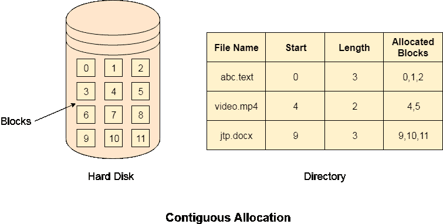

# 连续分配

> 原文：<https://www.javatpoint.com/os-contiguous-allocation>

如果以文件的所有逻辑块获得硬盘中的连续物理块的方式将块分配给文件，那么这种分配方案被称为连续分配。

在下图中，目录中有三个文件。表格中提到了每个文件的起始块和长度。我们可以在表中检查连续块是否根据需要分配给每个文件。

## 优势

1.  实现起来很简单。
2.  我们将获得出色的阅读表现。
3.  支持对文件的随机访问。

## 不足之处

1.  磁盘将变得碎片化。
2.  文件可能很难增长。