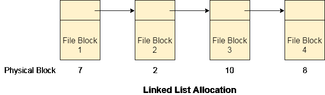

# 链表分配

> 原文：<https://www.javatpoint.com/os-linked-list-allocation>

链表分配解决了连续分配的所有问题。在链表分配中，每个文件都被认为是磁盘块的链表。但是，分配给特定文件的磁盘块不需要在磁盘上连续。分配给文件的每个磁盘块都包含一个指针，该指针指向分配给同一文件的下一个磁盘块。

## 优势

1.  链接分配没有外部碎片。
2.  可以利用任何空闲块来满足文件块请求。
3.  只要空闲块可用，文件就可以继续增长。
4.  目录条目将只包含起始块地址。

## 不足之处

1.  不提供随机访问。
2.  指针需要磁盘块中的一些空间。
3.  链表中的任何指针都不能被破坏，否则文件会被破坏。
4.  需要遍历每个区块。