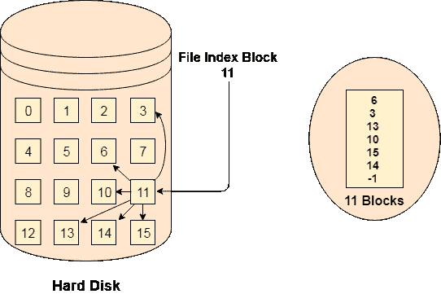

# 索引分配

> 原文：<https://www.javatpoint.com/os-indexed-allocation>

## FAT 的限制

现有技术的局限导致了新技术的发展。到目前为止，我们已经看到了各种各样的分配方法；他们每个人都有几个优点和缺点。

文件分配表试图解决尽可能多的问题，但导致了一个缺点。块数越多，FAT 的大小就越大。

因此，我们需要为文件分配表分配更多的空间。因为文件分配表需要缓存，所以缓存中不可能有这么多空间。这里我们需要一种新技术来解决这些问题。

## 指数化分配方案

索引分配方案不是维护所有磁盘指针的文件分配表，而是将所有磁盘指针存储在一个称为索引块的块中。索引块不保存文件数据，但保存指向分配给该特定文件的所有磁盘块的指针。目录条目将只包含索引块地址。

## 优势

1.  支持直接访问
2.  坏的数据块只会导致该数据块丢失。

## 不足之处

1.  错误的索引块可能会导致整个文件丢失。
2.  文件的大小取决于索引块可以容纳的指针数量。
3.  拥有一个小文件的索引块完全是浪费。
4.  更多指针开销