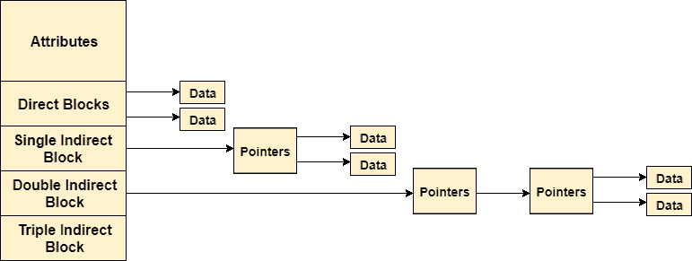

# 节点

> 吴奇珍:t0]https://www . javatppoint . com/OS-inode

在基于 UNIX 的操作系统中，每个文件都由一个索引节点进行索引。Inode 是随着文件系统的创建而创建的特殊磁盘块。文件系统中文件或目录的数量取决于文件系统中信息节点的数量。

信息节点包括以下信息

1.  文件的属性(权限、时间戳、所有权详细信息等)
2.  包含指向文件前 12 个块的指针的多个直接块。
3.  指向索引块的单个间接指针。如果文件不能完全由直接块索引，那么使用单个间接指针。
4.  指向磁盘块的双间接指针，该磁盘块是指向作为索引块的磁盘块的指针的集合。如果文件太大，无法完全由直接块和单个间接指针进行索引，则使用双索引指针。
5.  指向指针集合的磁盘块的三重索引指针。每个指针分别指向一个磁盘块，该磁盘块还包含一组指针，这些指针分别指向一个包含指向文件块的指针的索引块。

