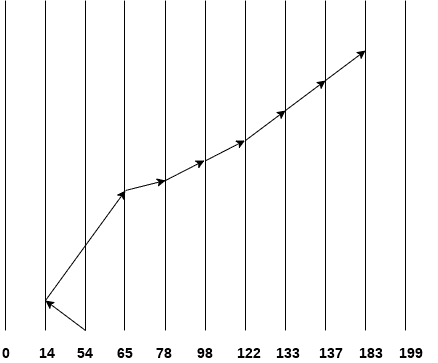
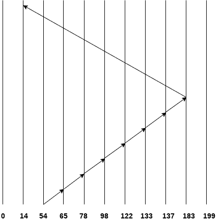

# 查看日程安排

> 原文：<https://www.javatpoint.com/os-look-and-c-look-scheduling>

在某种程度上，它类似于 SCAN 调度算法，不同之处在于，在该调度算法中，当不再有该方向的请求时，磁盘的臂停止向内(或向外)移动。该算法试图克服扫描算法的开销，扫描算法迫使磁盘臂在一个方向上移动直到结束，而不管该方向上是否存在任何请求。

### 例子

对于包含 100 个磁道的磁盘，请考虑以下磁盘请求序列

98, 137, 122, 183, 14, 133, 65, 78

头部指针从 54 开始向左移动。使用 LOOK 调度查找气缸中的气缸盖移动次数。

交叉气缸数= 40 + 51 + 13 + +20 + 24 + 11 + 4 + 46 = 209

## c 外观调度

C Look 算法在某种程度上类似于 C-SCAN 算法。在该算法中，磁盘的臂向外移动以服务请求，直到它到达最高请求柱面，然后它跳到最低请求柱面而不服务任何请求，然后它再次开始向外移动以服务剩余的请求。

它与 C SCAN 算法的不同之处在于，C SCAN 强制磁盘臂移动到最后一个柱面，而不考虑是否需要在该柱面上处理任何请求。

### 例子

对于包含 100 个磁道的磁盘，请考虑以下磁盘请求序列

98, 137, 122, 183, 14, 133, 65, 78

头部指针从 54 开始向左移动。使用 C LOOK 调度查找气缸中的气缸盖移动次数。

交叉气缸数= 11 + 13 + 20 + 24 + 11 + 4 + 46 + 169 = 298