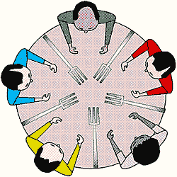
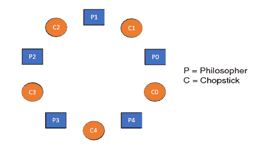

# 用餐哲学家问题

> 原文：<https://www.javatpoint.com/os-dining-philosophers-problem>

用餐哲学家的问题是经典的同步问题，它说五个哲学家围坐在一张圆形的桌子旁，他们的工作是交替思考和吃饭。一碗面条和五根筷子被放在桌子的中央，给每个哲学家。吃东西，一个哲学家需要他的右筷子和左筷子。只有哲学家的左右筷子都有，哲学家才能吃饭。如果哲学家的左右筷子都不可用，那么哲学家放下他们的(左或右)筷子，重新开始思考。

用餐哲学家演示了一大类并发控制问题，因此这是一个经典的同步问题。



**<u>五位哲学家围坐在桌子旁</u>**

**用餐哲人问题** -用下面的代码来理解用餐哲人问题吧，我们已经用了图 1 作为参考，让你准确理解问题。五位哲学家分别由 P0、P1、P2、P3 和 P4 代表，五根筷子由 C0、C1、C2、C3 和 C4 代表。



```

Void Philosopher
 {
 while(1)
  {
   take_chopstick[i];
   take_chopstick[ (i+1) % 5] ;
   . .
   . EATING THE NOODLE
   .
   put_chopstick[i] );
   put_chopstick[ (i+1) % 5] ;
   .
   . THINKING
  }
}

```

让我们讨论一下上面的代码:

假设哲学家 P0 想吃东西，它会进入哲学家()函数，执行**take _ cult[I]；**通过这样做它握住 **C0 筷子**之后它执行**拿 _ 筷子[(I+1)% 5]；**通过这样做，它可以握住 **C1 筷子**(因为 i =0，所以(0 + 1) % 5 = 1)

同样假设现在哲学家 P1 想吃东西，它将进入哲学家()功能，并执行**拿筷子[I]；**通过这样做它握住 **C1 筷子**之后它执行**拿 _ 筷子[(I+1)% 5]；**通过这样做，它可以握住 **C2 筷子**(因为 i =1，所以(1 + 1) % 5 = 2)

但实际上筷子 C1 是不可用的，因为它已经被哲学家 P0，因此上面的代码产生问题，并产生种族条件。

### 哲学家就餐问题的解决方案

我们用一个信号量来表示一根筷子，这确实是哲学家就餐问题的一个解决方案。等待和信号操作将用于解决就餐哲学家问题，用于挑选筷子等待操作可以执行，而用于释放筷子信号信号量可以执行。

信号量:信号量是 S 中的一个整数变量，除了初始化之外，它只被两个标准的原子操作访问——等待和信号，它们的定义如下:

```

1\. wait( S )
{
while( S <= 0) ;
S--;
}

2\. signal( S )
{
S++;
}

```

从以上对等待的定义可以清楚地看出，如果 S 的值< = 0，那么它将进入一个无限循环(因为分号；while 循环之后)。而信号的作用是增加 s 的值

筷子的结构是一个信号量数组，如下图所示

```

semaphore C[5];

```

最初，旗语 C0、C1、C2、C3 和 C4 的每个元素都被初始化为 1，因为筷子放在桌子上，没有被任何哲学家拿起。

让我们通过使用信号量操作等待和信号来修改哲学家进餐问题的上述代码，期望的代码看起来像

```

void Philosopher
 {
 while(1)
  {
   Wait( take_chopstickC[i] );
   Wait( take_chopstickC[(i+1) % 5] ) ;
   . .
   . EATING THE NOODLE
   .
   Signal( put_chopstickC[i] );
   Signal( put_chopstickC[ (i+1) % 5] ) ;
   .
   . THINKING
  }
}

```

在上面的代码中，第一次等待操作是在 take_chopstickC[i]和 take_chopstickC [ (i+1) % 5]上执行的。这说明哲学家我已经从它的左右拿起了筷子。进食功能在此之后执行。

哲学家 I 完成进食后，在 take _ ChopSickc[I]和 take _ ChopSickc[(I+1)% 5]上执行信号操作。这说明我吃过的哲学家，把左右筷子都放下了。最后，哲学家又开始思考了。

### 让我们理解上面的代码是如何解决哲学家就餐问题的？

设 I 的值= 0(初始值)，假设哲学家 P0 想吃饭，它会进入哲学家()函数，执行**Wait(take _ chopstickC[I])；**通过这样做，它持有 **C0 筷子**并将信号量 C0 减少到 0 **，**之后它执行**等待(take _ chopstickC[(I+1)% 5])；**通过这样做，它保持 **C1 筷子**(因为 i =0，所以(0 + 1) % 5 = 1)并将信号量 C1 减少到 0

同样，假设现在哲学家 P1 想吃饭，它会进入哲学家()函数，执行**Wait(take _ chopstick[I])；**通过这样做，它将试图握住 **C1 筷子**但无法做到**，**由于哲学家 P0 已经将信号量 C1 的值设置为 0，因此它将进入一个无限循环，因为哲学家 P1 将无法拿起筷子 C1，而如果哲学家 P2 想吃东西，它将进入哲学家()函数，并执行**Wait(take _ chopstickC[I])；**通过这样做，它持有 **C2 筷子**并将信号量 C2 减少到 0，之后，它执行**等待(take _ chopstickC[(I+1)% 5])；**通过这样做，它握住 **C3 筷子**(因为 i =2，所以(2 + 1) % 5 = 3)，并将信号量 C3 减少到 0。

因此，上面的代码为哲学家就餐问题提供了一个解决方案，只有当哲学家的左右筷子都可用时，哲学家才能吃饭，否则哲学家需要等待。同样，两个独立的哲学家可以同时吃饭(即哲学家 **P0 和 P2，P1 和 P3 & P2 和 P4** 可以同时吃饭，因为它们都是独立的过程，并且它们遵循上述吃饭哲学家问题的约束)

### 用餐哲学家问题的上述解决方案的缺点

从上述哲学家就餐问题的解决方案中，我们证明了没有两个相邻的哲学家可以在同一时间点就餐。上述解决方案的缺点是，该解决方案会导致死锁情况。如果所有的哲学家同时拿起他们的左筷子，就会出现这种情况，导致僵局的情况，没有一个哲学家能吃饭。

为了避免死锁，一些解决方案如下-

*   桌子上哲学家的最大数量不应该超过四个，在这种情况下，筷子 C4 将提供给哲学家 P3，所以 P3 将开始吃饭，在他的吃饭程序结束后，他将放下他的筷子 C3 和 C4，即信号量 C3 和 C4 现在将增加到 1。现在拿着筷子 C2 的哲学家 P2 也将有筷子 C3，因此同样，他会在吃完东西后放下筷子，让其他哲学家也能吃东西。
*   偶数位置的哲学家应该先拿右筷子，再拿左筷子，而奇数位置的哲学家应该先拿左筷子，再拿右筷子。
*   只有在筷子(左筷子和右筷子)同时可用的情况下，哲学家才被允许拿起筷子
*   四位启蒙哲学家(P0、P1、P2 和 P3)都应该先拿左筷子，然后拿右筷子，而最后一位哲学家 P4 应该先拿右筷子，然后拿左筷子。这将迫使 P4 首先拿起他的右筷子，因为 P4 的右筷子是 C0，它已经被哲学家 P0 拿着，它的值被设置为 0，即 C0 已经是 0，因此 P4 将陷入无限循环，筷子 C4 仍然是空的。因此，哲学家 P3 让 C3 和 C4 的筷子都可以用，所以它会开始吃饭，吃完后会放下它的筷子，让其他人吃，这样就消除了僵局的问题。

这个问题的设计是为了说明避免死锁的挑战，系统的死锁状态是系统不可能有任何进展的状态。考虑一个建议，其中每个哲学家被指示如下行为:

*   哲学家被指示思考，直到左叉可用，当它可用时，握住它。
*   哲学家被指示思考，直到正确的叉子可用，当它可用时，握住它。
*   哲学家被指示在两把叉子都有时吃饭。
*   然后，先放下右叉
*   然后，把左边的叉子放下
*   从头开始重复。

* * *