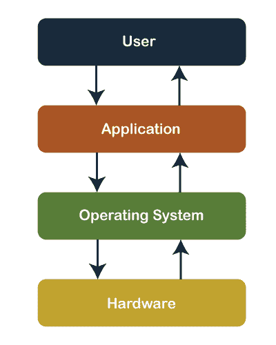
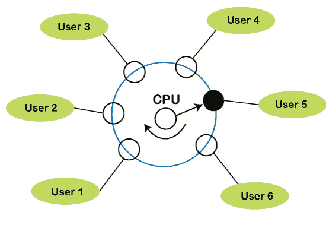
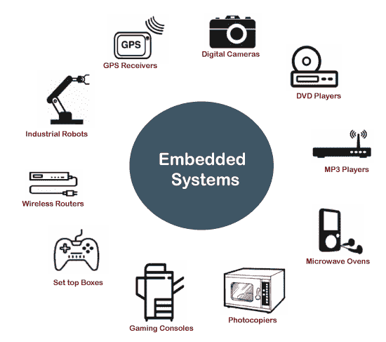
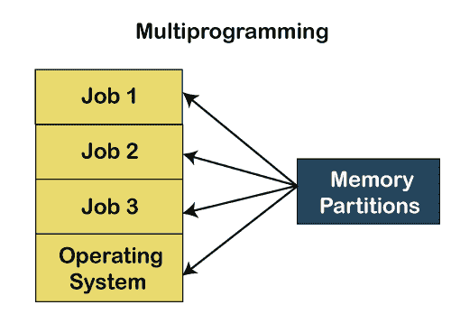
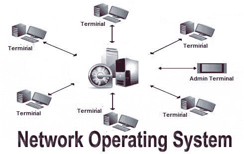
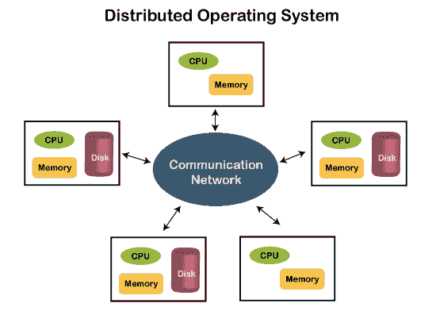

# 操作系统的历史

> 原文：<https://www.javatpoint.com/history-of-operating-system>

### 操作系统

操作系统是作为计算系统和最终用户之间的接口的系统程序。操作系统创造了一个环境，在这个环境中，用户可以运行任何程序，或者以舒适和组织良好的方式与软件或应用程序进行通信。

此外，操作是管理和控制应用程序、软件资源和计算机硬件的执行的软件程序。它还有助于管理软件/硬件资源，如文件管理、内存管理、输入/输出和许多外围设备，如磁盘驱动器、打印机等。这些就是现在比较流行的操作系统: [Linux OS](https://www.javatpoint.com/linux-tutorial) 、 [Windows OS](https://www.javatpoint.com/windows) 、Mac OS、VMS、OS/400 等。

### 操作系统的功能

*   [处理器管理](https://www.javatpoint.com/os-process-management-introduction)
*   充当资源经理
*   [内存管理](https://www.javatpoint.com/os-memory-management-introduction)
*   文件管理
*   安全
*   设备管理
*   [输入设备](https://www.javatpoint.com/input-devices) / [输出设备](https://www.javatpoint.com/output-devices)
*   [死锁预防](https://www.javatpoint.com/os-deadlock-prevention)
*   时间管理
*   与系统软件或硬件协调

### 操作系统的类型

1.  批处理操作系统
2.  分时操作系统
3.  嵌入式操作系统
4.  多道程序操作系统
5.  网络操作系统
6.  分布式操作系统
7.  多处理操作系统
8.  实时操作系统

### 批处理操作系统

在批处理操作系统中，用户和计算机之间没有直接的交互。因此，用户需要准备作业并保存离线模式以穿孔卡片或纸带或磁带。创建工作后，将其移交给计算机操作员；然后操作员排序或创建类似类型的批次，如 B2、B3 和 B4。现在，计算机操作员将批处理提交到中央处理器中，以逐个执行作业。之后，CPU 开始执行作业，当所有作业完成后，计算机操作员向用户提供输出。

### 分时操作系统

它是一种操作系统，允许我们将位于不同位置的许多人连接起来，一次共享和使用一个特定的系统。分时操作系统是多道程序设计的逻辑扩展，用户可以通过它同时运行多个任务。此外，它为每个用户提供了他的终端，用于影响系统上当前运行的程序或处理器的输入或输出。它表示 CPU 的时间在许多用户进程之间共享。或者，多个用户同时共享的处理器时间被称为分时。

### 嵌入式操作系统

嵌入式操作系统是用于计算机系统嵌入式硬件配置的专用操作系统。这些操作系统设计用于专用设备，如自动取款机(ATMs)、飞机系统、数字家庭助理和物联网(IoT)设备。

### 多道程序操作系统

由于中央处理器利用率不足，以及等待输入/输出资源直到该中央处理器保持空闲。说明系统资源使用不当。因此，操作系统引入了一个被称为多道程序设计的新概念。多程序操作系统是指两个或多个进程或程序同时激活，由同一计算机系统一个接一个地执行这些进程的概念。当一个程序处于运行模式并使用中央处理器时，另一个程序或文件同时使用输入/输出资源，或者等待另一个系统资源变得可用。它提高了系统资源的利用率，从而提高了系统吞吐量。这种系统被称为多道程序操作系统。

### 网络操作系统

网络操作系统是操作系统的一个重要类别，它使用交换机、路由器或防火墙等网络设备在服务器上运行，以处理数据、应用程序和其他网络资源。它提供自治操作系统之间的连接，称为网络操作系统。网络操作系统对于在多台计算机之间共享数据、文件、硬件设备和打印机资源以相互通信也很有用。

**网络操作系统类型**

*   **对等网络操作系统:**这种类型的网络操作系统允许用户使用局域网在两台或多台计算机之间共享文件、资源。
    T3】
*   **客户端-服务器网络操作系统:**它是一种网络操作系统，允许用户通过公共服务器或资源中心访问资源、功能和应用程序。客户端工作站可以访问网络中心的所有资源。多个客户端可以从不同的位置通过网络访问和共享不同类型的资源。
    T3】

### 分布式操作系统

分布式操作系统提供了一种环境，在这种环境中，多个独立的中央处理器或处理器通过物理上分离的计算节点相互通信。每个节点都包含与全局聚合操作系统通信的特定软件。借助分布式系统，程序员或开发人员可以轻松访问任何操作系统和资源来执行计算任务，并实现一个共同的目标。它是网络操作系统的扩展，有助于通过网络与其他用户进行高度连接通信。

### 多处理操作系统

它是指在单个计算机系统中使用两个或多个中央处理器的操作系统类型。然而，这些多处理器系统或并行操作系统被用来提高计算机系统的效率。使用多处理器系统时，它们共享计算机总线、时钟、内存和输入或输出设备，以便在中央处理器中同时执行进程或程序以及资源管理。

### 实时操作系统

实时操作系统是一种重要的操作系统，用于为应用程序提供服务和数据处理资源，在这些应用程序中，处理和响应输入/输出所需的时间间隔应该非常小，而不会延迟实时系统。例如，管理自动汽车、交通信号、核反应堆或飞机的现实情况需要立即响应，以在指定的时间延迟内完成任务。因此，对于嵌入式系统、武器系统、机器人、科学研究和实验以及各种实时对象，实时操作系统必须快速响应。

实时操作系统的类型:

*   **硬实时系统**
    这些类型的操作系统与那些需要在规定时限内完成关键任务的操作系统一起使用。如果响应时间很长，系统不会接受，或者可能会面临系统故障等严重问题。在一个硬实时系统中，二级存储器要么是有限的，要么是缺失的，所以这些系统将数据存储在只读存储器中。
*   **软实时系统**
    软实时系统是一种限制较少的系统，可以接受操作系统带来的软硬件资源延迟。在软实时系统中，关键任务优先处理不太重要的任务，并且该优先级保持活动状态，直到任务完成。此外，还为特定作业设置了时间限制，这使得可以接受的后续任务的时间延迟更短。例如，计算机音频或视频、虚拟现实、预订系统、海底等项目。

### 几代操作系统

**第一代(1940 年至 50 年代初)**

当第一台电子计算机在 1940 年被开发出来时，它是在没有任何操作系统的情况下被创造出来的。在早期，用户可以完全访问计算机，并用绝对机器语言为每个任务编写程序。程序员在计算机生成过程中只能执行和求解简单的数学计算，这种计算不需要操作系统。

**第二代(1955 - 1965)**

第一个操作系统(OS)创建于 20 世纪 50 年代初，被称为 **GMOS。通用汽车公司已经为 T2 的 IBM T3 电脑开发了操作系统。第二代操作系统基于单流批处理系统，因为它分组或分批收集所有相似的作业，然后使用穿孔卡将作业提交给操作系统，以完成机器中的所有作业。每次作业完成时(正常或异常)，控制权转移到操作系统，操作系统在完成一个作业后被清除，然后继续读取并启动穿孔卡中的下一个作业。此后，新机器被称为大型机，它们非常大，由专业操作员使用。**

**第三代(1965 - 1980)**

在 20 世纪 60 年代后期，操作系统设计者非常有能力开发一种新的操作系统，它可以在一个名为多道程序设计的计算机程序中同时执行多项任务。**多道程序设计**的引入在开发操作系统方面发挥了非常重要的作用，通过在一台计算机上同时执行不同的任务，允许一个 CPU 每次都很忙。在第三代期间，小型机有了新的发展，从 1961 年的 DEC PDP-1 开始显著增长。这些 PDP 导致了第四代个人电脑的产生。

**第四代(1980 年至今)**

第四代操作系统与个人电脑的发展有关。然而，个人计算机与第三代开发的小型计算机非常相似。当时个人电脑的成本非常高；小型计算机的成本只有一小部分。与创造个人电脑相关的一个主要因素是微软和视窗操作系统的诞生。微软在 1975 年创造了第一个**窗口**操作系统。在引入微软视窗操作系统后，比尔·盖茨和保罗·艾伦有了将个人电脑提升到一个新水平的愿景。因此，他们在 1981 年推出了**MS-DOS**；然而，这个人很难理解它神秘的命令。如今，Windows 已经成为最流行、最常用的操作系统技术。而后，Windows 发布了 Windows 95、Windows 98、Windows XP 等各种操作系统以及最新的操作系统 Windows 7。目前，大多数 Windows 用户使用 Windows 10 操作系统。除了 Windows 操作系统之外，苹果是另一个流行的操作系统，建于 20 世纪 80 年代，这个操作系统是由苹果的联合创始人史蒂夫·乔布斯开发的。他们把操作系统命名为 Macintosh OS 或 Mac OS。

### 操作系统的优势

*   有助于资源的监控和规范。
*   它可以很容易地操作，因为它有一个基本的图形用户界面来与您的设备通信。
*   它用于创建用户和计算机应用程序或硬件之间的交互。
*   计算机系统的性能取决于中央处理器。
*   任何进程或程序的响应时间和吞吐时间都很快。
*   它可以共享不同的资源，如传真、打印机等。
*   它还为各种类型的应用程序提供了一个论坛，如系统和网络应用程序。

### 操作系统的缺点

*   它只允许几个任务同时运行。
*   如果操作系统中出现任何错误；存储的数据可能会被销毁。
*   对于操作系统来说，提供针对病毒的全面安全保护是一项非常困难的任务或工作，因为任何威胁或病毒都可能在系统中随时发生。
*   未经原用户许可，未知用户可以轻松使用任何系统。
*   操作系统成本的成本非常高。

* * *