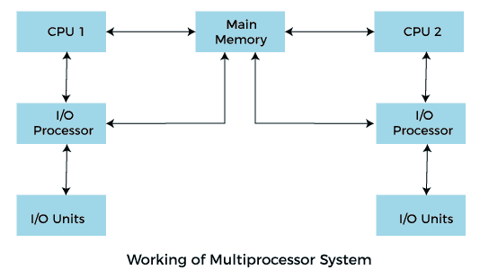
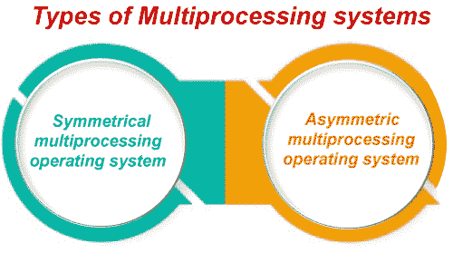
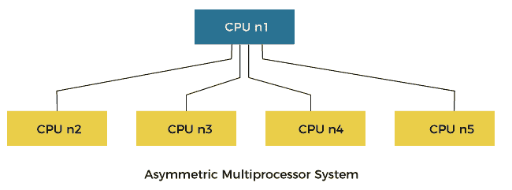

# 多处理操作系统

> 原文：<https://www.javatpoint.com/multiprocessing-operating-system>

在操作系统中，为了提高性能，可以在一个称为多处理器操作系统的计算机系统中使用多个中央处理器。

多个中央处理器相互连接，因此可以在它们之间划分作业，以加快执行速度。当一项工作完成时，所有中央处理器的结果被收集和编译，以给出最终的输出。作业需要共享主内存，它们之间也可能共享其他系统资源。多个 CPU 也可以用来同时运行多个作业。

**例如:** [UNIX](https://www.javatpoint.com/linux-tutorial) 操作系统是应用最广泛的多处理系统之一。

**典型多处理系统的基本组织如图所示。**

**为了有效地使用多处理操作系统，计算机系统必须具备以下条件:**

*   主板能够在多处理操作系统中处理多个处理器。
*   处理器也能够用于多处理系统。

### 多处理操作系统的优点是:

*   **可靠性提高:**由于采用了多处理系统，处理任务可以分布在多个处理器中。这增加了可靠性，就像一个处理器发生故障一样；任务可以交给另一个处理器来完成。
*   **始终增加:**随着几个处理器的增加，可以在更少的时间内完成更多的工作
*   **规模经济:**由于多处理器系统共享外围设备、二级存储设备和电源，因此它们比单处理器系统相对便宜。

### 多处理操作系统的缺点

*   多处理操作系统更加复杂，因为它同时处理多个处理器。

### 多处理系统的类型

*   对称多处理操作系统
*   不对称多处理操作系统

### 对称多处理操作系统；

在对称多处理系统中，每个处理器执行操作系统的相同副本，做出自己的决定，并与其他进程合作，以平滑系统的整个功能。 [CPU](https://www.javatpoint.com/central-processing-unit) 调度策略非常简单。用户提交的任何新作业都可以分配给负担最小的任何处理器。这也导致了一个系统，在这个系统中，所有处理器在任何时候的负担都是一样的。

对称多处理[操作系统](https://www.javatpoint.com/os-tutorial)也被称为“共享万物”系统，因为处理器共享内存和输入输出总线或数据路径。在这个系统中，处理器通常不超过 16 个。

**对称多处理操作系统的特点:**

*   在这个系统中，任何处理器都可以运行任何作业或进程。
*   在这种情况下，任何处理器都会启动输入和输出操作。

**对称多处理操作系统的优势:**

*   这些系统是容错的。几个处理器的故障不会导致整个系统停止运行。

**对称多处理操作系统的缺点:**

*   很难在处理器之间合理平衡工作负载。
*   管理多个处理器需要专门的同步方案。

### 不对称多处理操作系统

在非对称多处理系统中，处理器之间存在主从关系。

此外，一个处理器可以充当主处理器或监管处理器，而其他处理器如下所示处理。

**上图中，**非对称处理系统显示 CPU n1 作为监督者，其功能控制其他后续处理器。

在这种类型的系统中，每个处理器都被分配一个特定的任务，并且有一个指定的主处理器来控制其他处理器的活动。

**例如**，我们有一个数学协处理器，可以比主 [CPU](https://www.javatpoint.com/cpu-full-form) 更好地处理数学作业。同样，我们有一个 MMX 处理器，专门用来处理多媒体相关的工作。同样，我们有一个图形处理器，比主处理器更好地处理图形相关的工作。当用户提交新作业时，操作系统必须决定哪个处理器可以更好地执行该作业，然后为该处理器分配新到达的作业。该处理器充当主机并控制系统。所有其他处理器都会寻找主控器来获取指令或执行预定义的任务。将工作分配给其他处理器是主处理器的责任。

**非对称多处理操作系统的优势:**

*   在这种类型的系统中，输入和输出操作或应用程序的执行在某些情况下可能更快，因为许多处理器可用于单个作业。

**非对称多处理操作系统的缺点:**

*   在这种多处理操作系统中，处理器的负担是不均衡的。一个处理器可能有很长的作业队列，而另一个处理器可能闲置。
*   在这个系统中，如果处理特定工作的过程失败，整个系统就会瘫痪。

* * *