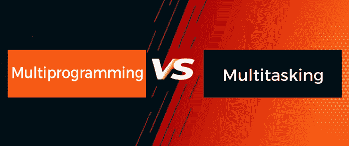

# 多道程序设计和多任务处理的区别

> 原文：<https://www.javatpoint.com/multiprogramming-vs-multitasking>

操作系统是控制计算机硬件和其他软件程序的软件的重要组成部分。可以说是中间人。用户不能直接用机器语言向 CPU 发出命令，CPU 也不能直接与用户通信。因此，需要一个中间人来沟通和翻译用户和中央处理器之间的所有交互。

除了执行管理外围设备、在屏幕上显示输出以及跟踪数据和文件等基本任务之外，操作系统还执行更高级别的功能，如多道程序和多任务处理。

在本文中，您将了解多道程序设计和多任务处理之间的区别。但是在讨论差异之前，您需要了解多道程序设计和多任务处理。

## 什么是多道程序设计？

多道程序操作系统可以在单处理器机器上运行几个程序。如果单个应用程序必须在多道程序操作系统中等待输入/输出传输，其他程序总是准备好使用中央处理器。因此，许多作业可以共享 CPU 的时间。然而，在多道程序操作系统中，并没有预先定义它们的作业会同时执行。

如果一个程序正在被执行，它被称为**一个“进程”、“作业”或“任务”**。与串行和批处理系统相比，同时执行程序有助于提高系统资源利用率和系统吞吐量性能。

### 多道程序设计的优点和缺点

多道程序设计有各种各样的优缺点。其中一些如下:

**优势**

1.  它提供了高 CPU 利用率。
2.  它的响应时间更短。
3.  它可以为作业分配优先级。

**缺点**

1.  它的调度实现并不容易。
2.  这需要更多的管理。

## 什么是多任务处理？

多任务处理意味着同时处理多项任务，例如一边听音乐一边使用电脑。此外，使用浏览器，在互联网上搜索一些东西，创建一个 word 文档，这是你的任务。似乎所有的任务都在同时发生。不是所有的任务都同时发生；处理器在它们之间以如此快的速度移动，以至于我们相信它们是同时发生的。

多任务处理类似于多道程序设计，即在指定的时间段内将中央处理器分配给一个进程，即**“时间段”或“时间片”**，之后中央处理器“上下文切换”到另一个进程。它同时运行各种程序。

电脑需要巨大的内存来执行多任务处理(内存或内存)。它的主要目标是改善中央处理器的响应时间。用户可以在多任务处理过程中使用系统，例如，在打印过程中键入一封信。

多任务处理是一个非常复杂的系统。它基于时间片原则，为每个要完成的活动分配固定的时间。当程序需要高水平的并行性时，它特别有用。它为每个程序提供了固定的运行时间。

### 多任务处理的优点和缺点

多任务处理有各种各样的优点和缺点。其中一些如下:

**优势**

1.  它提供逻辑并行性。
2.  它提供了更短的响应时间。
3.  它提供了 CPU 利用率。

**缺点**

1.  它不能在低速处理器上执行。
2.  做这项工作需要大量的存储内存。

## 多道程序设计和多任务处理的主要区别

多道程序设计和多任务之间有各种主要区别。其中一些如下:

1.  多道程序设计主要用于通过将应用程序组织成总是有一个程序要执行来最大化 CPU 利用率。另一方面，多任务处理旨在通过在多个用户之间共享计算资源来提高反应时间。
2.  多道程序设计主要集中在增加中央处理器的使用上。程序是有组织的，所以 CPU 永远不会空闲；它将总是一个接一个地执行一个程序。另一方面，多任务处理试图提高 CPU 的反应时间。
3.  多道程序设计建立在上下文切换的概念上，这是一种允许中央处理器在使用单处理器机器时从一个进程转换到另一个进程的常见过程。过程控制块(印刷电路板)保留活动过程的状态，以便中央处理器从同一位置恢复。另一方面，多任务处理是基于时间共享的，它在相同的时间内为每个活动或过程完成任务。
4.  这两个术语具有几乎相同的含义，并且是现代操作系统中使用的通用术语，尽管它们服务于不同的目的。多道程序设计主要依赖于计算机长时间存储程序以减少 CPU 空闲时间的能力。调度算法用于分配进程。操作系统一次运行一个程序的一部分，然后是另一个程序的一部分，等等。另一方面，中央处理器允许许多进程通过分时并行操作，并在多任务操作系统中正确执行它们。
5.  多道程序设计需要最长时间来执行任何进程，而多任务处理需要最短时间来执行任何进程。
6.  多道程序设计可以在具有少量随机存取存储器或只读存储器的计算机上完成；它不需要巨大的内存。另一方面，多任务处理需要大量内存存储来同时完成所有作业或进程。

## 多道程序设计和多任务处理之间的直接比较

在这里，多道程序设计和多任务之间有各种各样的面对面的比较。其中一些如下:

| 特征 | 多道程序设计 | 多任务处理 |
| **基础** | 它允许多个程序同时使用中央处理器。 | 多道程序系统的补充也允许用户交互。 |
| **机构** | 基于上下文切换机制。 | 基于分时机制。 |
| **目标** | 它有助于减少/减少 CPU 空闲时间，并尽可能提高吞吐量。 | 它对于同时运行多个进程非常有用，可以有效提高 CPU 和系统吞吐量。 |
| **执行** | 在多程序系统中，当一个作业或进程完成其执行或切换到一个输入/输出任务时，系统会暂时挂起该进程。它从进程调度池(等待队列)中选择另一个进程来运行。 | 在多处理系统中，通过在固定时间内分配中央处理器，多个进程可以同时运行。 |
| **中央处理器切换** | 在多用户环境中，中央处理器在程序/进程之间快速切换。 | 在单用户环境中，中央处理器在各种程序的进程之间切换。 |
| **计时** | 执行该过程需要最长时间。 | 执行该过程所需的时间最少。 |

## 结论

现代操作系统的两个方面是多道程序和多任务处理。多道程序设计是将几个进程记录在内存中，然后在单个处理器上逐个执行的行为。多任务处理类似于多道程序设计，在特定的时间内，中央处理器被分配给一个进程。它利用同一系统上的多个 CPU 同时运行多个程序。

* * *