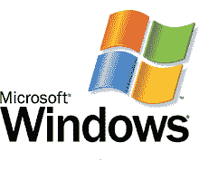
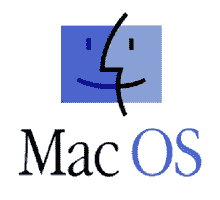
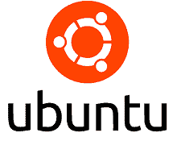
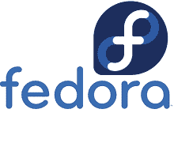
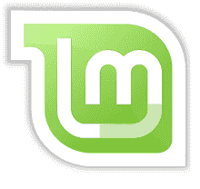
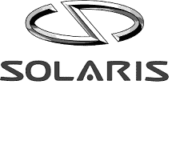
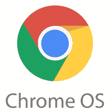
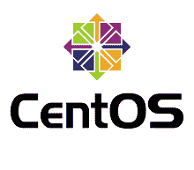

# 最新的操作系统

> 原文：<https://www.javatpoint.com/latest-operating-systems>

在本文中，您将了解最新的操作系统。但是在讨论最新的操作系统之前，你需要了解操作系统及其重要性。

## 什么是操作系统？

[**操作系统(OS)**](https://www.javatpoint.com/os-tutorial) 是管理和控制计算机软硬件资源，为计算机程序提供通用服务的系统软件组件。它是允许您的计算机运行的基本应用程序和工具的集合。例如，它充当程序和计算机硬件之间的某种中介。它还促进了后者的功能，如输入/输出和内存分配。

操作系统通常预装在我们购买的计算机上。大多数人使用计算机附带的操作系统，尽管计算机上的操作系统可能会升级或更改。最常见的操作系统是**微软 Windows、Mac OS X** 和 [**Linux**](https://www.javatpoint.com/linux-tutorial) 。现代操作系统中使用图形用户界面，它允许用户使用鼠标来选择图标、按钮和菜单。

操作系统不仅存在于计算机上，也存在于包含计算机的设备上，如手机、视频游戏机、网络服务器和超级计算机。

## 操作系统的用途

操作系统包含并处理计算机或移动设备可能运行的所有应用程序和程序。这意味着处理设备的软件和硬件操作。操作系统有多种用途。其中一些如下:

### 踢

引导是打开系统并启动系统的过程。

### 数据安全

一个好的操作系统包括保护你的数据和计算机程序的功能。安全功能已经到位，可以防范危险的网络攻击。

### 进程管理

构建操作系统是为了将资源分配给各种计算机进程，包括共享信息、同步信息和保护信息。

### 加载和执行

操作系统将加载或开始一个程序，然后执行它来打开和运行。

### 磁盘管理

它控制计算机中的所有设备，包括光盘驱动器、硬盘、闪存驱动器。它还可以用于分割磁盘、格式化系统驱动器和执行其他功能。

### 内存管理

它管理和协调计算机应用程序，同时分配程序空间。

### 设备控制

操作系统允许用户打开或关闭对设备的访问，如光盘、u 盘、移除设备、数据传输设备等。

### 用户界面

它是操作系统的重要组成部分，允许用户进入系统并获取信息。它也被称为用户界面。它可以通过使用书面命令、代码和其他格式来完成。

## 顶级操作系统

当今的系统中有各种各样的操作系统。其中一些如下:

1.  [微软视窗](#Windows)
2.  柔软
3.  [Ubuntu](#Ubuntu)
4.  [Linux Fedora](#LinuxFedora)
5.  [Linux 为](#LinuxMint)
6.  [初级操作系统](#Elementary)
7.  Solaris
8.  [Solus](#Solus)
9.  [铬 OS](#Chrome)
10.  [CentOS](#CentOS)

* * *

## 微软视窗软件

如果你正在寻找一个操作系统，你可能听说过[微软视窗](https://www.javatpoint.com/windows)的名字。它是世界上最著名的操作系统之一。微软视窗通常被称为视窗。它是由微软创建和销售的多个专有图形操作系统系列的集合。它允许您存储文件、玩游戏、观看视频、运行软件和访问互联网。其快速导航和用户友好的布局使其成为顶级的个人电脑操作系统之一。为了确保安全，微软视窗系统包括防病毒和防火墙。

微软视窗的第一个版本，1.0 版本，于 1983 年 11 月 10 日发布。随后，十几个版本的视窗被发布，包括当前版本的视窗 10。2017 年，Windows 10 发布，它有几个版本，包括 Windows 10 Home 和 Pro。

### 微软视窗的优缺点

微软视窗有各种各样的优点和缺点。其中一些如下:

**优势**

1.  它通过内置的防病毒软件提供高级别的保护。
2.  微软视窗是初学者最好的操作系统。
3.  它是一个快速启动的操作系统，具有更好的应用程序加载时间。

**缺点**

1.  如果你安装了各种软件；使用这个操作系统你会面临很多问题。
2.  与以前的版本不同，Windows 10 不是来自 windows media center。
3.  Windows 10 因收集用户数据而受到一些批评。所以，隐私可能是一个问题。
4.  它对恶意软件和病毒非常敏感。

* * *

## 苹果

MacOS 是苹果公司自 2001 年以来开发和销售的一系列图形操作系统。它是苹果电脑的主要操作系统。最初的版本，非正式地称为经典的 Mac OS，发布于 1984 年，最终版本是 1999 年发布的 Mac OS 9。Mac OS X 10.0 是第一个桌面版本，于 2001 年 3 月推出，随后在当年晚些时候进行了第一次更新，即 10.1。最新版本是 2020 年 11 月发布的 MacOS Big Sur。升级包括全系统黑暗模式和一系列从 iOS 移植的新应用，包括苹果新闻。继微软视窗系统之后，苹果操作系统是桌面、笔记本电脑、家用电脑和网络使用市场上第二受欢迎的桌面操作系统。

这个操作系统是为在苹果电脑上运行而设计的。它配有各种预装的应用程序。它还允许用户从苹果应用商店下载软件。黑暗模式是这个操作系统的一个突出特点。它降低了整体光线和亮度，使眼睛更舒适。动态桌面是另一个以类似方式提供帮助的工具。为了安全起见，macOS 要求应用程序在使用相机、麦克风、地理位置或联系人之前需要征得许可。它还包括一个 Safari 广告拦截器。无论如何，它是极其安全的。因此，如果你正在寻找最棒、最快的操作系统，那么 macOS 是笔记本电脑(MacBooks)和个人电脑(iMac)的理想选择。

### 苹果电脑的优缺点

MacOS 有各种各样的优缺点。其中一些如下:

**优势**

1.  它提供了一个简单易用的用户友好界面。
2.  它是笔记本电脑和个人电脑最快的操作系统。
3.  它带有各种预装的应用程序。
4.  它为操作系统提供定期的安全更新。
5.  它还具有使工作空间和多任务之间的转换更容易的功能。

**缺点**

1.  它仅适用于 MacBook 和 iMac。
2.  MacOS 设备比 Windows 设备更贵。
3.  Windows 的游戏和应用程序比 macOS 多。

* * *

## 人的本质

Ubuntu 是笔记本电脑和个人电脑的另一个最佳操作系统。这是一个免费的开源操作系统，包含防火墙和病毒防护软件。该操作系统通过提供 50 种语言的完整翻译版本，使其更易于使用。Ubuntu 被认为是目前最快的免费操作系统之一。桌面界面简单且组织良好。它还包括各种预安装的应用程序，包括办公套件、浏览器和媒体应用程序。更多的应用和游戏可以在 Ubuntu 软件中心找到。最新的 LTS 版本提供五年的免费安全和维护更新。在 Linux 发行版中，它被认为是笔记本电脑或计算机最伟大的操作系统，尤其是对开发人员来说。

### Ubuntu 的优缺点

Ubuntu 有各种各样的优缺点。其中一些如下:

**优势**

1.  其 LTS 版本提供五年的免费安全和维护更新。
2.  它被开发者使用。
3.  它是笔记本电脑和电脑最快的操作系统。
4.  由于社区大，它很容易解决这个问题。
5.  它是免费的，并且有一些基本的预装应用程序。

**缺点**

1.  您必须找到几种流行软件的替代品，例如 Adobe 或 Microsoft 产品，因为它们不提供支持。

* * *

## Linux Fedora

这是一个基于 Linux 的操作系统，与 Ubuntu 的开源功能相竞争。这是一个可靠的、用户友好的操作系统，可以在任何笔记本电脑或台式机上运行。它是程序员广泛使用的强大操作系统。这是另一个免费的 Linux 发行版。自 2003 年以来，Fedora 项目一直致力于此。许多基于 Linux 的操作系统以速度快而闻名。Fedora 也是最伟大的笔记本电脑和台式机操作系统之一。

它附带了几个预装的开源软件。您也可以使用它来安装第三方软件。用户界面是专门为消除干扰和帮助集中注意力而设计的。它通过跟踪所有系统活动来保护用户。默认情况下，它还带有防火墙，用户可以快速更改防火墙设置。

### Linux Fedora 的优缺点

Linux Fedora 有各种各样的优缺点。其中一些如下:

**优势**

1.  它非常轻便，访问速度也很快。
2.  它的生命周期更短，更有能力集成新技术。
3.  它附带了许多预装的应用程序，但它主要集中在自由软件上。

**缺点**

1.  由于其社区较小，可能存在一些软件支持问题。
2.  它对初学者不是特别友好。

* * *

## Linux 作为

Linux Mint 是一个基于 Ubuntu 的社区驱动的 Linux 发行版，附带了几个免费的开源软件。它附带了几个免费的预装应用程序。它还包括开箱即用的全媒体支持。它非常光滑、优雅，而且使用简单。

Linux Mint 的最新版本是 Linux Mint 20，它有三个版本。肉桂版本是现代的，有几个新功能。第二个是 MATE。高速行驶时更稳定。MATE 是一个 Linux 发行版，被认为是最快的发行版之一。最后，Xfce 比 MATE 更轻巧稳定。他们最受欢迎的版本是肉桂。

### Linux 造币厂的优缺点

Linux Mint 有各种各样的优缺点。其中一些如下:

**优势**

1.  它是安全可靠的，因为它采用了谨慎的软件更新方法。
2.  有各种可用的桌面环境。
3.  它提供全面的多媒体支持。

**缺点**

1.  如前所述，它对软件升级采取了谨慎的方法，如果您希望使用更新的应用程序，这可能是一个问题。
2.  没有设备管理器。

* * *

## 基本操作系统

基本操作系统是一个基于 Ubuntu LTS 的 Linux 操作系统，以其吸引人的用户界面而闻名。该操作系统也有类似于 macOS 的外观，使其成为一个可行的替代方案。由于其稳定性和性能，许多用户认为它是笔记本电脑的最佳操作系统。

除此之外，它还具有出色的安全性和隐私功能。如果应用程序询问您的位置，您将会收到通知。基本操作系统也会清理临时文件以节省空间。它包括一组您将需要的基本应用程序，如浏览器、媒体应用程序、日历等。更多的应用程序可以通过 AppCenter 下载。最新的基本操作系统是 5.1 赫拉，它有一个屏幕迎宾器，对引导新用户非常有用。

### 基本操作系统的优缺点

基本操作系统有各种各样的优点和缺点。其中一些如下:

**优势**

1.  它建立在 LTS 的乌班图上。
2.  它通过基本调整提供定制选择。
3.  它提供了像 MacOS 一样的手感，所以它可能是一个不错的选择。

**缺点**

1.  新版本和更新需要很长时间才能到达。
2.  缓慢的更新可能会导致新程序出现问题。

* * *

## 操作系统

Solaris 是基于 UNIX 的专有操作系统。它的设计强调简洁。它允许您用一个命令更新整个云安装，以便于维护。如果您正在寻找对云友好的产品，Solaris 可能是您电脑的理想操作系统。除此之外，这个操作系统以其可扩展性而闻名。

Solaris 操作系统也非常安全。用户和流程权限管理通过要求用户和应用程序具备完成其职责所需的最低能力来减少黑客威胁。它包括用于网络安全的内置防火墙。最新版本的 Solaris 11.4 包括系统网络界面。该程序允许您跟踪和查看有关当前和历史系统行为的数据。

### Solaris 的优点和缺点

Solaris 有各种各样的优点和缺点。其中一些如下:

**优势**

1.  它提供备份和恢复实用程序。
2.  它提供了很好的病毒防护。
3.  它支持 ZFS 文件系统，该系统可以保护数据并在处理大量数据时表现良好。

**缺点**

1.  与 Linux 操作系统相比，缺乏硬件支持。
2.  它没有社区支持。

* * *

## Solus

Solus 是一个基于 Linux 内核的操作系统，其设计旨在提供更好的家庭计算体验。它附带预装的关键应用程序。该操作系统有多个版本，每个版本都有不同的桌面界面。这是一个选择的本土虎皮鹦鹉桌面环境，MATE 或 KDE 等离子，GNOME 作为桌面环境。

它允许用户管理通知、媒体设备和其他功能。GNOME 易于使用，并且具有很高的可访问性。MATE 是更传统的桌面，迎合高级用户。最后，Plasma 面向从事或修改各方面工作的用户。有些功能可以定制，如主题、时钟等。它为个人电脑和笔记本电脑提供了多种选择。

### 解决方案的优缺点

Solus 有各种各样的优点和缺点。其中一些如下:

**优势**

1.  用户可以定期升级，不必担心他们的操作系统会走到生命的尽头。
2.  该操作系统旨在使初学者和高级用户都能简单使用。
3.  用户可以选择他们想要安装的更新。

**缺点**

1.  它的软件开发过程比较慢。

* * *

## 铬作业系统

[Chrome](https://www.javatpoint.com/what-is-google-chrome) OS 是众所周知的最快的操作系统之一。这款 Chromebook 操作系统也非常安全、可靠、使用简单。沙盒是它的安全特性之一。这意味着不同的软件是分开维护的，因此如果一个元素被感染，系统的其他部分仍然是安全的。它还内置了防病毒程序。

这个基于 Linux 内核的操作系统的主要用户界面是谷歌浏览器。Chrome OS 只支持 web 功能，不运行系统检查，是目前最快的操作系统之一。它兼容安卓和 Linux 应用。

### Chrome 操作系统的优缺点

[Chrome](https://www.javatpoint.com/google-chrome) OS 有各种优缺点。其中一些如下:

**优势**

1.  它支持安卓应用。
2.  它的设备比 macOS 设备便宜。
3.  它重量轻，速度快。
4.  它是笔记本电脑和电脑最快的操作系统。
5.  您不必担心，因为操作系统会自动将您的数据备份到云中。

**缺点**

1.  大多数应用程序都可以在线获得。因此，大多数工作都依赖于互联网。
2.  它也极其有限，不适合高级用户。
3.  Chrome 操作系统收集数据可能是一个隐私问题。

* * *

## CentOS

[CentOS](https://www.javatpoint.com/centos) 是又一个社区驱动的自由开源软件平台，支持强大的平台管理。它非常适合寻找一个简单地帮助他们完成编码任务的操作系统的开发人员。这并不是说它没有什么可以提供给那些只想在日常工作中使用它的人。

### CentOS 的特点

CentOS 有各种各样的特性。其中一些如下:

1.  它提供了最强大的安全功能，如进程和用户权限控制，使您能够保护关键任务数据。
2.  当今许多操作系统仍然缺乏先进的网络、兼容性和安全功能。
3.  它通过解决数百个硬件和软件问题来实现无缝交换。

* * *