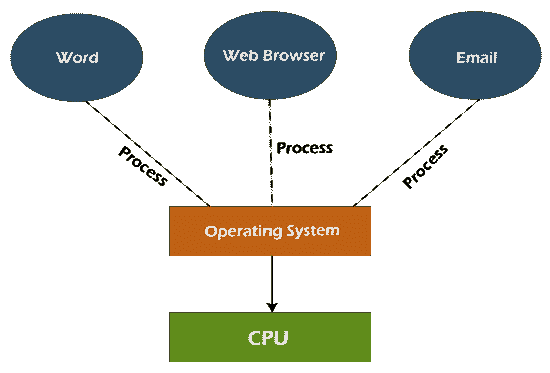

# 多任务处理

> 原文：<https://www.javatpoint.com/multitasking-operating-system>

现代计算机系统中使用的多任务术语。它是多道程序系统的逻辑扩展，能够同时执行多个程序。在操作系统中，多任务处理允许用户同时执行多个计算机任务。多个任务也称为共享类似处理资源的进程，如**中央处理器**。操作系统会跟踪您在这些作业中的位置，并允许您在不丢失数据的情况下在它们之间进行转换。

早期的[操作系统](https://www.javatpoint.com/os-tutorial)虽然没有完全支持多任务处理，但可以同时执行各种程序。因此，单个软件在完成某项活动时可能会消耗计算机的整个 CPU。基本的操作系统功能，如文件复制，阻止用户完成其他任务，如打开和关闭窗口。幸运的是，因为现代操作系统具有完整的多任务处理能力，许多程序可以并发运行，而不会相互干扰。此外，许多操作系统进程可以同时运行。

## 多任务处理的类型

多任务处理主要有两种类型。这些措施如下:

1.  **抢先多任务**
2.  **协同多任务**

### 抢先多任务处理

抢先多任务是分配给计算机操作系统的一项特殊任务。它决定了一个任务在分配另一个任务使用操作系统之前花费的时间。因为操作系统控制整个进程，所以被称为**‘抢占’**。

抢先式多任务在桌面操作系统中使用。 **Unix** 是第一个使用这种多任务处理方法的操作系统。 **Windows NT** 和 **Windows 95** 是最早使用抢占式多任务处理的 Windows 版本。有了 **OS X** ，麦金塔获得了主动式多任务处理。当另一个程序接管[中央处理器](https://www.javatpoint.com/cpu-full-form)的时候，这个操作系统会通知程序。

### 协同多任务处理

术语**‘非抢先多任务’**指的是合作多任务。协同多任务的主要目的是在释放[中央处理器](https://www.javatpoint.com/central-processing-unit)的同时运行当前任务，以允许另一个进程运行。本任务使用**任务产量()**执行。当调用 **taskYIELD()** 函数时，执行上下文切换。

Windows 和 MacOS 使用了协同多任务处理。在将中央处理器移交给操作系统之前，一个窗口程序将通过执行一些简短的工作来响应一条消息，直到该程序接收到另一条消息。只要所有程序在编写时都考虑到其他程序并且没有错误，它就能完美地工作。

## 多任务处理的优缺点

多任务处理的各种优缺点如下:

### 优势

多任务处理的各种优势如下:

**管理多个用户**

这种操作系统更适合同时支持多个用户，多个应用可以流畅运行，不影响系统性能。

**虚拟内存**

最大的虚拟内存系统存在于多任务操作系统中。因为虚拟内存，任何程序都不需要很长的等待时间来完成它的任务；如果出现这个问题，这些程序将被移动到虚拟内存中。

**可靠性好**

多任务操作系统给了几个用户更多的灵活性，因此他们更快乐。每个用户可以在其上同时执行单个或多个程序。

**安全存储器**

http://I . imgur . com/evxt 1 . png http://I . imgur . com/ghcel . png http://I . imgur . com/cxtge . png http://I . imgur . com/cyf9u . png http://I . imgur . com/nkrhq . png http://I . imgur . com/u1rf1 . png http://I . imgur . com/jaolo . png http://I . img

**时间共享**

所有任务都被分配了指定的时间，这样它们就不必等待中央处理器。

**后台处理**

多任务操作系统为后台进程提供了更好的运行环境。这些后台程序对大多数用户来说是不可见的，但是它们有助于防火墙、防病毒软件等其他程序运行良好。

**优化计算机资源**

多任务操作系统可以管理各种计算机资源，如[输入/输出设备](https://www.javatpoint.com/input-device-vs-output-device)、[内存](https://www.javatpoint.com/ram)、[硬盘](https://www.javatpoint.com/hdd)、中央处理器等。

**使用多个程序**

用户可以同时运行许多程序，如互联网浏览器、游戏、微软 Excel、PowerPoint 和其他实用程序。

### 不足之处

多任务处理的各种缺点如下:

**处理器边界**

系统运行程序的速度可能会很慢，因为它们的处理器速度很慢，当处理许多程序时，它们的反应时间可能会增加。为了解决这个问题，需要更多的处理能力。

**记忆边界**

由于多个程序同时运行，计算机的性能可能会变慢，因为加载多个程序时主内存会过载。因为 CPU 无法为每个程序提供不同的时间，所以反应时间会增加。这个问题的主要原因是它使用了低容量内存。因此， [RAM](https://www.javatpoint.com/ram-full-form) 的容量可以提高，以提供解决方案。

**中央处理器加热**

在多任务环境中，多个处理器同时忙于完成任何任务，因此中央处理器产生更多热量。

* * *