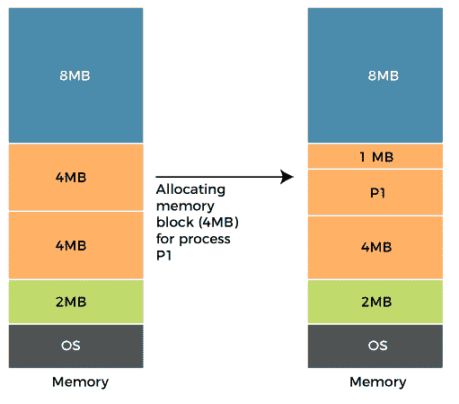
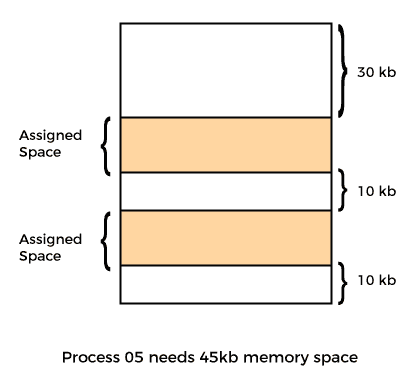

# 操作系统中的碎片

> 原文：<https://www.javatpoint.com/fragmentation-in-operating-system>

碎片化是操作系统中不需要的问题，在操作系统中，进程从内存中加载和卸载，并且空闲内存空间被碎片化。由于内存块较小，无法将进程分配给内存块，并且内存块保持未使用状态。

每当进程进入**内存**时，连续内存分配都会为进程分配空间。这些**内存**空间通过固定分区或动态分区来划分。随着进程从内存中加载和卸载，这些区域被分割成小块内存，无法分配给后续进程。

在本文中，您将了解碎片及其类型。

## 什么是碎片化？

碎片化是[操作系统](https://www.javatpoint.com/os-tutorial)中不需要的问题，其中进程从内存中加载和卸载，并且空闲内存空间被碎片化。由于内存块较小，无法将进程分配给内存块，并且内存块保持未使用状态。还需要了解的是，当程序从内存中加载和删除时，它们会在内存中产生空闲空间或漏洞。这些小块无法分配给新到达的进程，导致内存使用效率低下。

碎片化的条件取决于内存分配系统。随着进程从内存中加载和卸载，这些区域被分割成小块内存，无法分配给传入的进程。叫做**碎裂**。

## 碎片的原因

用户进程从主内存加载和卸载，进程保存在主内存的内存块中。许多空间在进程加载和交换后仍然存在，由于它们的大小，另一个进程无法加载。主内存是可用的，但是由于主内存进程的动态分配，它的空间不足以加载另一个进程。

## 碎片的类型

操作系统中主要有两种类型的碎片。这些措施如下:

1.  **内部碎裂**
2.  **外部碎片**

### 内部碎片

当一个进程被分配给一个内存块时，如果该进程小于请求的内存量，则在给定的内存块中创建一个空闲空间。因此，内存块的空闲空间未被使用，导致**内部**碎片。

**例如:**

假设内存中的内存分配是使用固定分区(即固定大小的内存块)完成的。 **2MB、4MB、4MB** 和 **8MB** 是可用尺寸。操作系统使用内存的一部分。

让我们假设一个大小为 **3MB** 的进程 **P1** 到达，并被给予一个内存块 **4MB** 。因此，该块中的 **1MB** 空闲空间未被使用，不能用于将内存分配给另一个进程。被称为**内部碎裂**。

**如何避免内部碎片化？**

由于存储块的大小固定，可能会出现内部碎片的问题。可以通过动态分区为进程分配空间来解决这个问题。动态分区只分配进程请求的空间量。因此，没有内部碎片。

### 外部碎片

当动态内存分配方法分配了一些内存，但留下少量内存不可用时，就会发生外部碎片。如果有太多的外部碎片，可用内存的数量会大大减少。有足够的内存空间来完成请求，但它不是连续的。被称为**外部**碎裂。

**例如:**

让我们以外部碎片为例。在上图中，可以看到有足够的空间 **(50 KB)** 运行一个进程 **(05)(需要 45KB)** ，但是内存不连续。您可以使用压缩、分页和分段来使用空闲空间来执行进程。

**如何去除外部碎片？**

当您连续向进程分配内存时，会出现此问题。它是在分页和分段中完成的，内存被分配给不连续的进程。因此，如果删除此条件，外部碎片可能会减少。

压缩是另一种消除外部碎片的方法。当动态分区用于内存分配时，通过将所有空闲内存合并到一个大块中，可以减少外部碎片。较大的内存块用于根据新进程的要求分配空间。这种方法也称为碎片整理。

## 碎片化的优点和缺点

碎片化有各种利弊。其中一些如下:

### 优势

碎片化有各种各样的好处。其中一些如下:

**快速数据写入**

支持数据碎片化的系统中的数据写入可能比重新组织数据存储以实现连续数据写入更快。

**故障减少**

如果不支持碎片的系统中没有足够的顺序空间，写入将会失败。

**存储优化**

碎片化系统可能会通过利用每个可用的存储块来更好地利用存储设备。

### 不足之处

碎片化有各种各样的缺点。其中一些如下:

**需要定期碎片整理**

碎片较多的存储设备的性能会随着时间的推移而下降，因此需要进行耗时的碎片整理操作。

**较慢的读取时间**

随着存储设备变得更加碎片化，读取非顺序文件所需的时间可能会增加。

## 结论

简而言之，内部和外部碎片都是导致内存浪费或空内存空间的自然过程。然而，这两种情况下的问题都不能完全克服，尽管使用上面提供的解决方案可以在一定程度上减少这些问题。

* * *