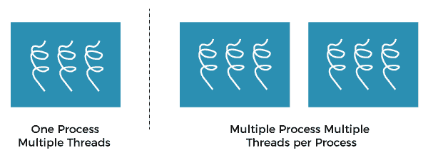
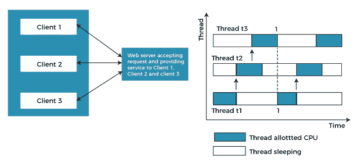
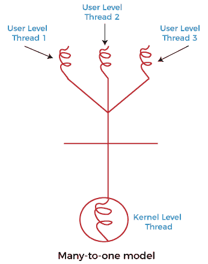
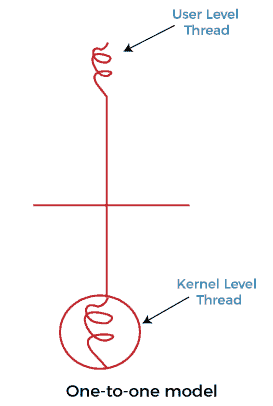
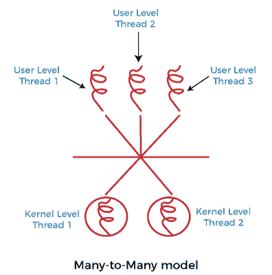

# 操作系统中的多线程模型

> 原文：<https://www.javatpoint.com/multithreading-models-in-operating-system>

在本文中，我们将了解操作系统中的多线程模型。

## 多线程模型:

多线程允许应用程序将其任务分成单独的线程。在多线程中，同一个进程或任务可以通过线程的数量来完成，或者我们可以说多线程中执行任务的线程不止一个。利用多线程，可以实现多任务处理。

单线程系统的主要缺点是一次只能执行一个任务，因此为了克服这种单线程的缺点，存在允许执行多个任务的多线程。

**例如:**

在上面的例子中，client1、client2 和 client3 正在访问 web 服务器，没有任何等待。在多线程中，几个任务可以同时运行。

在[操作系统](https://www.javatpoint.com/os-tutorial)中，线程分为用户级线程和内核级线程。用户级线程在内核之上以独立的形式处理，因此在没有任何内核支持的情况下进行管理。另一方面，操作系统直接管理内核级线程。然而，用户级线程和内核级线程之间必须有某种形式的关系。

**存在三个已建立的多线程模型，对这些关系进行分类，它们是:**

*   多对一多线程模型
*   一对一多线程模型
*   多对多多线程模型

### 多对一多线程模型:

多对一模型将多个用户级线程映射到一个内核线程。这种类型的关系有助于一个有效的上下文切换环境，即使在没有线程支持的简单内核上也很容易实现。

这种模型的缺点是，由于在任何给定时间只有一个内核级线程调度，因此这种模型不能利用多线程进程或多处理器系统提供的硬件加速。在这种情况下，所有的线程管理都在用户空间中完成。如果阻塞来了，这个模型阻塞整个系统。

在上图中，多对一模型将所有用户级线程关联到单个内核级线程。

### 一对一多线程模型

一对一模型将单个用户级线程映射到单个内核级线程。这种类型的关系便于多个线程并行运行。然而，这种好处也伴随着它的缺点。每个新用户线程的生成都必须包括创建一个相应的内核线程，这会导致开销，这会妨碍父进程的性能。Windows 系列和 Linux 操作系统试图通过限制线程数量的增长来解决这个问题。

在上图中，一个模型将一个用户级线程与一个内核级线程相关联。

### 多对多模型多线程模型

在这种类型的模型中，有几个用户级线程和几个内核级线程。创建的内核线程数量取决于特定的应用程序。开发人员可以在这两个级别创建同样多的线程，但可能不一样。多对多模式是另外两种模式的折衷。在这个模型中，如果任何线程进行阻塞系统调用，内核可以调度另一个线程执行。此外，随着多线程的引入，复杂性不再像以前的模型那样存在。虽然这种模型允许创建多个内核线程，但是这种模型无法实现真正的并发。这是因为内核一次只能调度一个进程。

多线程模型的多对多版本将几个用户级线程与上图中相同或少得多的内核级线程相关联。

* * *