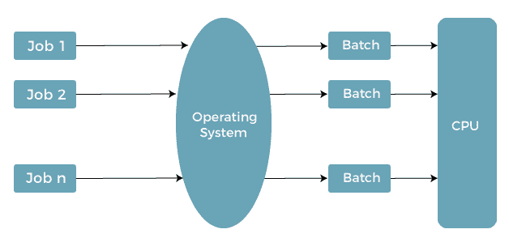

# 批处理操作系统

> 原文：<https://www.javatpoint.com/batch-operating-system>

最初，计算机是从控制台运行的超大型机器。一般来说，磁带驱动器或读卡器用于输入，磁带驱动器、穿孔卡和行式打印机用于输出。用户与系统没有直接的接口，作业的执行是在批处理系统中完成的。这些系统被称为批处理操作系统，用户必须单独准备一个作业来执行它。

在**20 世纪 50 年代**和**20 世纪 60 年代**没有发达的操作系统、复杂的计算机架构或二级存储设备。相反，大型主机被用来处理数据，穿孔卡片或磁带作为输入和输出。当时的主要问题是缺少硬盘。

在 20 世纪 50 年代初，通用汽车研究实验室(GMRL) 推出了第一个**单流**批处理系统。它一次只执行一个作业，数据是成批或成组发送的。批处理操作系统消除了安装时间问题。

在本文中，您将了解批处理[操作系统](https://www.javatpoint.com/os-tutorial)、类型、工作原理及其优缺点。

## 什么是批处理操作系统？

批处理在 20 世纪 70 年代非常流行。这些作业是分批执行的。人们过去有一台叫做**主机**的电脑。使用批处理操作系统的用户不直接与计算机交互。每个用户使用类似穿孔卡的离线设备准备他们的工作，并将其提交给计算机操作员。具有相似需求的作业被分组并作为一个组执行，以加快处理速度。一旦程序员把他们的程序留给操作员，他们就把有相似需求的程序分批次排序。

批处理操作系统将执行类似功能的作业分组。这些作业组被视为一个批处理并同时执行。具有该操作系统的计算机系统执行以下批处理活动:

1.  作业是由一系列预设命令、数据和程序组成的单一单元。
2.  处理按照收到的顺序进行，即先到先得。
3.  这些作业存储在内存中，无需手动信息即可执行。
4.  当作业成功运行时，操作系统释放其内存。

## 批处理操作系统的类型

批处理操作系统主要有两种类型。这些措施如下:

1.  **简单批量系统**
2.  **多程序批处理系统**

### 简单批量系统

在简单的批处理操作系统中，用户没有直接与计算机系统交互来执行作业。然而，用户需要准备一份包括程序、控制信息和控制卡上的工作性质数据的工作。工作然后被提交给电脑操作员，他通常是以打卡的形式。程序的输出包括结果、寄存器和内存转储，以防程序出错。经过一段可能需要几天、几小时和几分钟的时间后，输出才会出现。

它的主要作用是将控制权从一项工作转移到另一项工作。具有相似需求的作业被汇集在一起，并通过处理器进行处理，以提高处理速度。程序中使用这些操作符来创建具有相似需求的批次。当批次可用时，计算机会逐一运行它们。该系统通常读取一系列作业，每个作业都有其控制卡和预定义的作业任务。

### 多程序分批系统

假脱机处理许多已经被读取并等待在磁盘上运行的作业。包含作业池的磁盘允许操作系统选择下一个要运行的作业，以最大限度地提高 CPU 利用率。磁带或卡片上的作业不能以不同的顺序运行。作业按顺序运行，因为它们是以先到先得的方式执行的。当各种作业存储在直接访问设备上时，作业调度就像磁盘一样成为可能。多程序设计是作业调度的重要特征。对于重叠输入/输出，假脱机和脱机操作有其局限性。一般来说，单个用户无法维护所有的输入/输出设备，而 CPU 会一直购买。

在多程序批处理系统中，作业被分组，这样 CPU 一次只执行一个作业，以提高 CPU 利用率。操作系统一次在内存中维护各种作业。操作系统选择一个作业，并开始在内存中执行它。最后，作业必须等待任务完成，例如在输入/输出操作中装载磁带。在多道程序设计系统中，不要因为操作系统切换到另一个任务而无所事事。当作业处于等待状态，并且当前作业已完成时，将返回 CPU。

## 为什么使用批处理操作系统？

批处理操作系统对中央处理器的压力较小，并且包含最少的用户交互，这就是为什么你现在仍然可以使用它们。批处理操作系统的另一个好处是，可以在不与计算机交互的情况下完成大量重复的任务，以通知系统您需要在完成该任务后执行。

旧的批处理操作系统没有交互性，这意味着用户在执行程序时没有与程序交互。现代批处理操作系统现在支持交互。例如，您可以安排作业，当指定的时间到达时，计算机会向处理器确认时间已到。

## 批处理操作系统是如何工作的？

操作系统将作业的数量保存在内存中，并一次执行一个作业。工作以先到先得的方式处理。每个作业集被定义为一个批处理。当一个任务完成时，它的内存被释放，并且工作的输出被传送到一个输出假脱机中，用于以后的打印或处理。用户交互在批处理操作系统中受到限制。当系统从用户那里接受任务时，用户是自由的。您也可以使用批处理系统来更新与任何交易或记录相关的数据。

## 批处理操作系统的作用

批处理操作系统的主要作用是自动成批执行作业。批处理系统的主要任务由位于主存储器低端的**“批处理监视器”**完成。硬盘驱动器和读卡器的发展使这项技术成为可能。这些作业现在可以存储在磁盘上，形成一个用于批处理执行的作业池。之后，它们被分组，相似的作业被放在同一批中。因此，批处理操作系统会一个接一个地自动运行批处理作业，通过只执行一次任务来节省时间。由于周转时间缩短，系统变得更好了。

## 批处理操作系统的特点

批处理操作系统有各种特性。其中一些如下:

1.  在这种情况下，中央处理器按照操作员发送给它的相同顺序执行作业，这意味着首先发送给中央处理器的任务将首先执行。也被称为**‘先到先得’**
2.  单词 job 指的是用户和程序应该执行的命令或指令。
3.  批处理操作系统运行一组用户提供的指令，这些指令由不同的指令和程序组成，有几个相似之处。
4.  当任务成功执行时，操作系统释放该作业占用的内存空间。
5.  在批处理操作系统中，用户不直接与操作系统交互；相反，所有指令都发送给操作员。
6.  操作员评估用户的指令，并创建一组具有相似属性的指令。

## 批处理操作系统的优缺点

批处理操作系统有各种各样的优点和缺点。其中一些如下:

### 优势

批处理操作系统有各种优点。其中一些如下:

1.  预测完成一项工作需要多长时间并不容易；只有批处理系统处理器知道排队完成这项工作需要多长时间。
2.  该系统可以轻松地一次又一次地管理大型作业。
3.  批处理可以分为几个阶段，以提高处理速度。
4.  当进程完成时，作业假脱机的下一个作业将在没有任何用户交互的情况下运行。
5.  CPU 利用率得到提高。

### 不足之处

批处理操作系统有各种缺点。其中一些如下:

1.  当一个作业失败一次时，必须安排完成，完成任务可能需要很长时间。
2.  计算机操作员必须对批处理系统有充分的了解。
3.  批处理系统很难调试。
4.  计算机系统和用户没有直接的交互。
5.  如果一个作业进入无限循环，其他作业必须等待一段未知的时间。

* * *