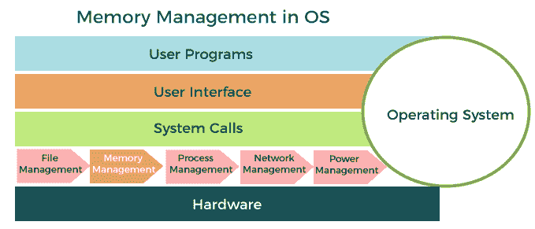
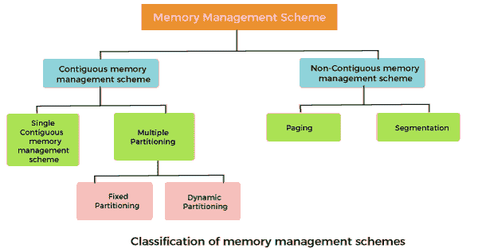

# 内存管理

> 原文：<https://www.javatpoint.com/memory-management-operating-system>

在本文中，我们将详细了解内存管理。

**什么叫内存管理？**

内存是计算机用来存储数据的重要部分。它的管理对计算机系统至关重要，因为计算机系统中可用的主存数量非常有限。任何时候，许多进程都在争夺它。此外，为了提高性能，同时执行几个进程。为此，我们必须在主内存中保留几个进程，因此有效地管理它们更加重要。

### 内存管理在计算机系统中扮演着几个角色。

以下是计算机系统中的重要角色:

*   内存管理器用于跟踪内存位置的状态，无论它是空闲的还是已分配的。它通过提供抽象来处理主内存，这样软件就能感觉到分配给它的内存很大。
*   内存管理器允许具有少量主内存的计算机执行大于可用内存大小或数量的程序。它通过使用交换的概念在主内存和辅助内存之间来回移动信息来实现这一点。
*   内存管理器负责保护分配给每个进程的内存不被另一个进程破坏。如果不能确保这一点，那么系统可能会表现出不可预测的行为。
*   内存管理器应该能够在进程之间共享内存空间。因此，两个程序可以驻留在同一存储位置，尽管时间不同。

**内存管理技术:**

**内存管理技术可分为以下几大类:**

*   连续内存管理方案
*   非连续内存管理方案

### 连续内存管理方案:

在连续存储器管理方案中，每个程序占用单个连续的存储单元块，即一组具有连续地址的存储单元。

### 单一连续内存管理方案:

单一连续内存管理方案是最早一代计算机系统中使用的最简单的内存管理方案。在这个方案中，主存储器被分成两个连续的区域或分区。操作系统永久驻留在一个分区中，通常位于较低的内存中，用户进程被加载到另一个分区中。

**单一连续内存管理方案的优势:**

*   实现简单。
*   易于管理和设计。
*   在单一连续内存管理方案中，一旦一个进程被加载，它就有了全部的处理器时间，没有其他处理器会中断它。

**单一连续内存管理方案的缺点:**

*   由于未使用的内存造成的内存空间浪费，因为进程不可能使用所有可用的内存空间。
*   中央处理器保持空闲，等待磁盘将二进制映像加载到主内存中。
*   如果程序太大，无法容纳整个可用的主内存空间，则无法执行。
*   它不支持多道程序设计，即不能同时处理多个程序。

### 多重分区:

单一的连续内存管理方案效率低下，因为它限制计算机一次只能执行一个程序，导致内存空间和 CPU 时间的浪费。使用允许多个程序同时运行的多道程序可以克服低效使用 CPU 的问题。要在两个进程之间切换，操作系统需要将两个进程都加载到主内存中。操作系统需要将可用的主存分成多个部分，将多个进程加载到主存中。因此，多个进程可以同时驻留在主存储器中。

**多个分区方案可以有两种类型:**

*   固定分区
*   动态分区

### 固定分区

在固定分区内存管理方案或静态分区中，主内存被分成几个固定大小的分区。这些分区的大小可以相同，也可以不同。每个分区可以容纳一个进程。分区的数量决定了多道程序设计的程度，即内存中进程的最大数量。这些分区是在系统生成时创建的，之后保持不变。

**固定分区内存管理方案的优势:**

*   实现简单。
*   易于管理和设计。

**固定分区内存管理方案的缺点:**

*   这个计划受到内部分裂的影响。
*   分区数量是在系统生成时指定的。

### 动态分区

动态分区旨在克服固定分区方案的问题。在动态分区方案中，每个进程只占用加载处理时所需的内存。请求的进程被分配内存，直到整个物理内存耗尽或剩余空间不足以容纳请求的进程。在该方案中，所使用的分区大小可变，并且在系统生成时没有定义分区的数量。

**动态分区内存管理方案的优势:**

*   实现简单。
*   易于管理和设计。

**动态分区内存管理方案的缺点:**

*   这一方案还受到内部分裂的影响。
*   分区数量是在系统分段时指定的。

### 非连续内存管理方案:

在非连续存储器管理方案中，程序被分成不同的块，并被加载到不一定彼此相邻的存储器的不同部分。该方案可以根据块的大小以及块是否驻留在主存储器中来分类。

### 什么是寻呼？

分页是一种不需要连续分配主内存的技术。在这种情况下，主内存被分成固定大小的物理内存块，称为帧。帧的大小应该与页面的大小保持一致，以最大化主内存并避免外部碎片。

**寻呼的优势:**

*   页面减少了外部碎片。
*   实现简单。
*   内存高效。
*   由于帧大小相等，交换变得非常容易。
*   它用于更快地访问数据。

### 什么是细分？

分段是一种消除连续分配主内存需求的技术。在这种情况下，主内存被划分为称为段的可变大小的物理内存块。它基于程序员构建程序的方式。使用分段内存分配，每个作业被分成几个不同大小的段，每个模块一个。函数、子程序、堆栈、数组等。，是这种模块的示例。

* * *