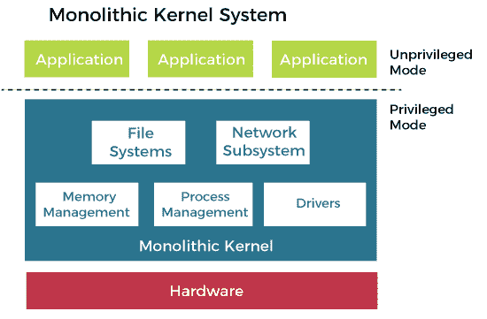

# 操作系统的单片结构

> 原文：<https://www.javatpoint.com/monolithic-structure-of-operating-system>

单片操作系统是一个非常基本的操作系统，其中文件管理、内存管理、设备管理和进程管理直接由内核控制。内核可以访问系统中的所有资源。在单片系统中，操作系统的每个组件都包含在内核中。使用单片架构的操作系统在 20 世纪 70 年代首次被使用。

单片操作系统也被称为单片内核。这是一个旧的操作系统，用于在银行中执行小任务，如批处理和分时任务。单片内核充当控制所有硬件部分的虚拟机。

它不同于任务有限的微内核。一个微内核分为两部分， ***内核空间*** ，和 ***用户空间*** 。两部分通过进程间通信相互通信。微内核的优势在于，如果一台服务器出现故障，那么另一台服务器就会控制它。

### 单片内核

单片内核是一种操作系统体系结构，其中整个操作系统都在内核空间中工作。单片模型不同于其他操作系统体系结构，例如微内核体系结构，因为它单独定义了计算机硬件上的高级虚拟接口。

一组原语或系统调用实现所有操作系统服务，如进程管理、并发和内存管理。设备驱动程序可以作为模块添加到内核中。

**单片内核的优势**

以下是单片内核的优点，例如:

*   单片内核的执行速度和内存管理、文件管理、进程调度等服务一样快。，在相同的地址空间下实现。
*   一个进程完全在单片内核的单个地址空间中运行。
*   单片内核是一个静态的单一二进制文件。

**单片内核的缺点**

下面是单片内核的一些缺点，例如:

*   如果单片内核中的任何服务出现故障，都会导致整个系统的故障。
*   用户需要修改整个操作系统才能添加任何新服务。

### 单片系统架构

操作系统架构的整体设计没有特别考虑操作系统的特殊性质。尽管设计遵循关注点分离，但并未试图限制授予操作系统各个部分的权限。整个操作系统以最高权限执行。单片操作系统内部的通信开销与任何其他软件相同，被认为相对较低。

CP/M 和 DOS 是单片操作系统的简单例子。CP/M 和 DOS 都是与应用程序共享单一地址空间的操作系统。

*   在 CP/M 中，16 位地址空间以系统变量和应用程序区域开始。它以操作系统的三个部分结束，即 CCP(控制台命令处理器)、BDOS(基本磁盘操作系统)和 BIOS(基本输入/输出系统)。
*   在 DOS 中，20 位地址空间以中断向量和系统变量的数组开始，然后是 DOS 的驻留部分和应用程序区域，最后是显卡和 BIOS 使用的内存块。

**单片架构的优势:**

单片架构具有以下优势，例如:

*   结构简单，易于实现。
*   由于直接访问所有服务，执行速度更快

**单片架构的缺点:**

以下是单片架构的一些缺点:

*   添加新功能或删除过时功能非常困难。
*   安全问题始终存在，因为内核中存在的各种服务器之间没有隔离。

### 模块化单片系统

模块化操作系统和大多数现代单片操作系统，如 OS-9 OpenVMS、Linux、BSD、SunOS、AIX 和 MULTICS，可以在运行时动态加载(和卸载)可执行模块。

操作系统的这种模块化是在二进制级别，而不是在体系结构级别。模块化整体操作系统不会与使用微内核和服务器的服务器-客户端操作系统(及其衍生产品，有时作为混合内核销售)固有的模块化架构级别相混淆。

实际上，动态加载模块只是在运行时处理操作系统映像的一种更灵活的方式，而不是使用不同的操作系统映像重新启动。这些模块允许根据需要轻松扩展操作系统的功能。与将模块构建到操作系统映像中相比，动态可加载模块的开销较小。

但是，在某些情况下，动态加载模块有助于将内核空间中运行的代码量保持在最低水平。例如，最小化嵌入式设备或硬件资源有限的设备的操作系统占用空间。也就是说，卸载的模块不需要存储在稀缺的随机存取存储器中。

### 单片系统的局限性

单片操作系统有以下限制，例如:

*   用这种操作系统编写的代码很难移植。
*   单片操作系统更容易产生错误和 bug。原因是用户进程使用与内核相同的地址位置。
*   在单片操作系统中添加和删除功能非常困难。所有代码都需要重写和重新编译，以添加或删除任何功能。

### 单片机系统的特点

单片操作系统为用户提供了以下功能，例如:

1.  **简单结构:**这类操作系统结构简单。处理所需的所有组件都嵌入到内核中。
2.  **适用于较小的任务:**适用于执行较小的任务，因为它可以处理有限的资源。
3.  **组件之间的通信:**所有的组件可以直接相互通信，也可以与内核通信。
4.  **快速操作系统:**制作单片内核的代码非常快速健壮。

### 单片内核和微内核的区别

内核是操作系统的核心部分，它管理系统资源。内核就像是应用程序和计算机硬件之间的桥梁。内核可以进一步分为两类，微内核和单片内核。

***微内核*** 是一种允许定制操作系统的内核。它以特权模式运行，并提供低级地址空间管理和进程间通信(IPC)。此外，文件系统、虚拟内存管理器和中央处理器调度器等操作系统服务都在微内核之上。每个服务都有自己的地址空间来保证它们的安全。此外，应用程序也有自己的地址空间。因此，在应用程序、操作系统服务和内核之间存在保护。

**A *单片内核*T3】是内核的另一种分类。在基于单一内核的系统中，每个应用程序都有自己的地址空间。和微内核一样，这个也管理应用和硬件之间的系统资源，但是 ***用户服务*** 和 ***内核服务*** 是在同一个地址空间下实现的。它增加了内核的大小，从而也增加了操作系统的大小。**

该内核通过系统调用提供 CPU 调度、内存管理、文件管理等系统功能。由于两种服务都在相同的地址空间下实现，这使得操作系统的执行速度更快。下面是微内核和单片内核之间的一些区别，例如:

| 条款 | 单片内核 | 微内核 |
| 定义 | 单片内核是操作系统中的一种内核，其中整个操作系统在内核空间中工作。 | 微内核是一种内核类型，它提供低级地址空间管理、线程管理和进程间通信来实现操作系统。 |
| 地址空间 | 在单一内核中，用户服务和内核服务都保持在同一个地址空间中。 | 在微内核用户服务和内核中，服务被保存在不同的地址空间中。 |
| 大小 | 单片内核比微内核大。 | 微内核的尺寸较小。 |
| 执行 | 它的执行速度很快。 | 执行缓慢。 |
| 操作系统服务 | 在单片内核系统中，内核包含操作系统服务。 | 在基于微内核的系统中，操作系统服务和内核是分离的。 |
| 可伸长的 | 单片内核的扩展相当复杂。 | 微内核很容易扩展。 |
| 安全 | 如果一个服务崩溃了，那么整个系统就会在一个单一的内核中崩溃。 | 如果一个服务崩溃了，它不会影响微内核的工作。 |
| 用户化 | 很难向单一内核添加新功能。因此，它不可定制。 | 向微内核添加新功能更容易。因此，它更具可定制性。 |
| 密码 | 编写单片内核需要更少的编码。 | 微内核需要更多的编码。 |
| 例子 | Linux、FreeBSD、OpenBSD、NetBSD、微软 Windows (95、98、Me)、Solaries、惠普-UX、DOS、OpenVMS、XTS-400 等。 | QNX、塞班、L4L.inux、奇点、K42、Mac OS X、Integrity、PikeOS、HURD、Minix 和 Coyotos。 |

* * *