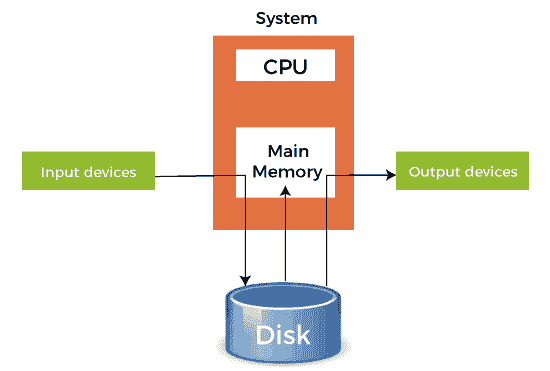
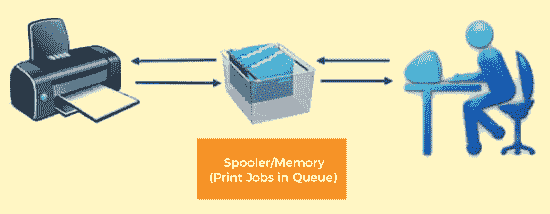
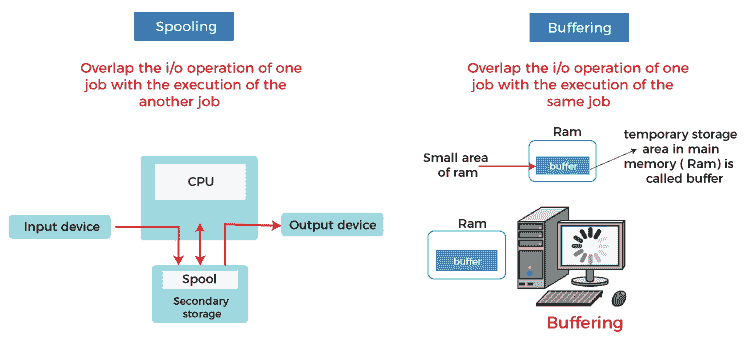

# 操作系统中的假脱机

> 原文：<https://www.javatpoint.com/spooling-in-operating-system>

在操作系统中，我们必须给中央处理器输入，中央处理器执行指令，最后给出输出。但是这种方法有一个问题。在正常情况下，我们必须处理许多进程，我们知道，与中央处理器执行指令所需的时间相比，输入/输出操作所需的时间非常长。因此，在旧的方法中，一个进程将在输入设备的帮助下给出输入，在此期间，中央处理器处于空闲状态。

然后 CPU 执行指令，输出再次给某个输出设备，此时 CPU 也处于空闲状态。显示输出后，下一个进程开始执行。所以，大多数时候，中央处理器都是空闲的，这是我们在操作系统中能遇到的最糟糕的情况。这里，假脱机的概念开始发挥作用。

### 什么是假脱机

假脱机是一种暂时保存数据以供设备、程序或系统使用和执行的过程。数据被发送并存储在存储器或其他易失性存储器中，直到程序或计算机请求它执行。

SPOOL 是 ***同时在线外围操作*** 的缩写。通常，假脱机保存在计算机的物理内存、缓冲区或输入/输出设备特定的中断中。线轴按照升序处理，基于先进先出算法工作。

假脱机是指将各种输入/输出作业的数据放入缓冲区。这个缓冲区是内存或硬盘中的一个特殊区域，输入/输出设备可以访问它。操作系统执行以下与分布式环境相关的活动:

*   处理输入/输出设备数据假脱机，因为设备具有不同的数据访问速率。
*   维护假脱机缓冲区，该缓冲区提供了一个等待站，当较慢的设备赶上时，数据可以在此停留。
*   由于假脱机过程，计算机可以按并行顺序执行输入/输出，因此保持并行计算。当计算机在执行计算任务时，它可以从磁带上读取数据，将数据写入磁盘，并将数据写入磁带打印机。

### 假脱机在操作系统中是如何工作的

在操作系统中，假脱机按以下步骤工作，例如:

1.  假脱机包括创建一个名为假脱机的缓冲区，用于保存作业和数据，直到创建假脱机的设备准备好使用和执行该作业或对数据进行操作。
2.  当速度较快的设备向速度较慢的设备发送数据以执行某项操作时，它会使用任何附加的辅助内存作为 SPOOL 缓冲区。这些数据被保存在 SPOOL 中，直到速度较慢的设备准备好处理这些数据。当速度较慢的设备准备就绪时，SPOOL 中的数据将被加载到主内存中，用于所需的操作。
    
3.  假脱机将整个辅助内存视为一个巨大的缓冲区，可以为许多操作存储许多作业和数据。假脱机的优点是，它可以创建一个按先进先出顺序执行的作业队列，以便一个接一个地执行作业。
4.  一个设备可以连接到许多输入设备，这可能需要对它们的数据进行一些操作。因此，所有这些输入设备都可以将它们的数据放在辅助存储器(SPOOL)上，然后由设备一个接一个地执行。这将确保 CPU 在任何时候都不会空闲。因此，我们可以说假脱机是缓冲和排队的结合。
5.  CPU 产生一些输出后，这个输出首先保存在主内存中。该输出从主存储器传送到辅助存储器，并从那里输出到相应的输出设备。

### 假脱机示例

假脱机最大的例子是 ***打印*** 。要打印的文档存储在 SPOOL 中，然后添加到打印队列中。在此期间，许多进程可以执行其操作并使用中央处理器，而无需等待打印机对文档逐一执行打印过程。

许多功能也可以添加到假脱机打印过程中，如设置优先级或打印过程完成时的通知，或者根据用户的选择选择不同类型的纸张进行打印。

### 假脱机的优点

以下是在操作系统中假脱机的优点，例如:

*   输入/输出设备或操作的数量并不重要。许多输入/输出设备可以同时工作，而不会相互干扰或中断。
*   在假脱机中，输入/输出设备和中央处理器之间没有交互。这意味着中央处理器不需要等待输入/输出操作的发生。这样的操作需要很长时间才能完成执行，所以 CPU 不会等它们完成。
*   处于空闲状态的中央处理器被认为效率不高。大多数协议都是为了在最短的时间内有效利用中央处理器而创建的。在假脱机中，CPU 大部分时间都很忙，只有当队列耗尽时才会进入空闲状态。因此，所有的任务都被添加到队列中，CPU 将完成所有这些任务，然后进入空闲状态。
*   它允许应用程序以中央处理器的速度运行，同时以各自的全速运行输入/输出设备。

### 假脱机的缺点

在操作系统中，假脱机有以下缺点，例如:

*   假脱机需要大量存储空间，这取决于输入发出的请求数量和连接的输入设备数量。
*   因为 SPOOL 是在辅助存储中创建的，所以让许多输入设备同时工作可能会占用辅助存储上的大量空间，从而增加磁盘流量。这导致随着流量越来越多，磁盘越来越慢。
*   假脱机用于将数据从较慢的设备复制和执行到较快的设备。速度较慢的设备创建一个 SPOOL，将需要操作的数据存储在一个队列中，中央处理器对其进行处理。这个过程本身使得假脱机在我们需要来自中央处理器的实时结果的实时环境中无用。这是因为输入设备速度较慢，因此产生数据的速度较慢，而中央处理器可以更快地运行，因此它会继续进入队列中的下一个进程。这就是为什么最终结果或输出是在以后产生的，而不是实时产生的。

### 假脱机和缓冲的区别

假脱机和缓冲是输入/输出子系统通过使用主内存或磁盘上的存储空间来提高计算机性能和效率的两种方式。

假脱机和缓冲的基本区别是假脱机将一个作业的输入/输出与另一个作业的执行重叠。相比之下，缓冲会使一个作业的输入/输出与同一作业的执行重叠。下面是假脱机和缓冲之间的一些区别，例如:

| 条款 | 假脱机 | 减轻 |
| 定义 | 假脱机是同时外设操作联机(SPOOL)的缩写，它将数据放入一个临时工作区，由另一个程序或资源访问和处理。 | 缓冲是将数据临时存储在缓冲区中的行为。它有助于匹配发送方和接收方之间的数据流速度。 |
| 所需资源 | 假脱机需要较少的资源管理，因为不同的资源管理特定作业的流程。 | 缓冲需要更多的资源管理，因为相同的资源管理相同的分割作业的过程。 |
| 内部实施 | 假脱机使一个作业的输入和输出与另一个作业的计算重叠。 | 缓冲使一个作业的输入和输出与同一作业的计算重叠。 |
| 高效的 | 假脱机比缓冲更有效。 | 缓冲不如假脱机有效。 |
| 处理器 | 假脱机还可以在远程站点处理数据。假脱机程序只需在远程站点完成一个进程时发出通知，就可以将下一个进程假脱机到远程设备。 | 缓冲不支持远程处理。 |
| 内存大小 | 它认为磁盘是一个巨大的线轴或缓冲器。 | 缓冲区是主内存中的一个有限区域。 |

* * *