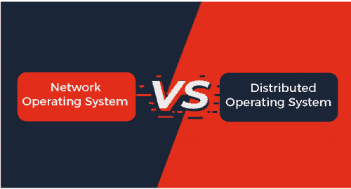

# 网络操作系统与分布式操作系统的区别

> 原文：<https://www.javatpoint.com/network-operating-system-vs-distributed-operating-system>

在本文中，您将了解**网络**和**分布式操作系统(DOS)** 之间的区别。但是在讨论差异之前，您需要了解网络和分布式操作系统。

## 什么是网络操作系统？

[网络操作系统](https://www.javatpoint.com/network-operating-system)是基于服务器的操作系统，提供网络相关功能。它管理用户、组、数据并提供安全性。这些操作系统允许用户在网络中的各种设备之间传输文件和共享设备，如打印机，该网络包括**局域网**、**专用网络**或其他网络。它是分布式架构中最流行的[操作系统](https://www.javatpoint.com/os-tutorial)的[类型](https://www.javatpoint.com/types-of-os)。网络操作系统的目标是允许在运行不同操作系统的两台或多台计算机之间共享资源。

另一个重要因素是服务器的可访问性。这些系统中的集中式服务器高度可靠。新技术、升级和硬件可能很容易集成到这个操作系统中。服务器的设置和操作都很昂贵。此外，这些系统需要定期维护和更新。部分网络操作系统有 **Linux、微软 Windows Server** 、**小说网件**。

### 网络操作系统的优缺点

网络操作系统有各种优点和缺点。这些措施如下:

**优势**

网络操作系统有各种各样的优点。其中一些如下:

1.  可以从不同的位置和系统类型远程访问服务器。
2.  新技术、升级和硬件可能很容易集成到这个操作系统中。
3.  服务器处理它的安全问题。
4.  高度稳定的集中式服务器。

**缺点**

网络操作系统有各种各样的缺点。其中一些如下:

1.  网络操作系统非常昂贵。
2.  它需要定期维护和更新。
3.  对于大多数过程，用户必须依赖中心位置。

## 什么是分布式操作系统？

一个[分布式操作系统 **(DOS)**](https://www.javatpoint.com/distributed-operating-system) 是必不可少的操作系统类型。分布式系统使用许多中央处理器来服务多个实时应用程序和用户。结果，数据处理作业被分布在处理器之间。

它通过一个通信通道连接多台计算机。此外，每个系统都有自己的处理器和内存。此外，这些**CPU**通过高速总线或电话线进行通信。通过单一通道进行通信的各个系统被视为单一实体。它们也被称为**松散耦合系统**。

该操作系统由许多计算机、节点和站点组成，这些计算机、节点和站点通过 [**局域网/广域网**](https://www.javatpoint.com/lan-vs-wan) 线路连接在一起。它支持在几个中央处理器上分发完整的系统，并支持许多实时产品和不同的用户。分布式操作系统可以共享其计算资源和输入/输出文件，同时为用户提供虚拟机抽象。

### 分布式操作系统的优缺点

分布式操作系统有各种各样的优缺点。这些措施如下:

**优势**

分布式操作系统有各种各样的优点。其中一些如下:

1.  它可以共享所有资源(中央处理器、磁盘、网络接口、节点、计算机等)。)从一个站点转移到另一个站点，提高了整个系统的数据可用性。
2.  整个系统彼此独立运行，因此，如果一个站点崩溃，整个系统不会停止。
3.  它降低了数据损坏的可能性，因为所有数据都在所有站点上复制；如果一个站点出现故障，用户可以从另一个运行站点访问数据。
4.  这是一个开放的系统，因为它可以从本地和远程位置访问。
5.  它提高了从一个站点到另一个站点的数据交换速度。
6.  大多数分布式系统由几个节点组成，这些节点相互作用以使它们具有容错性。如果单台机器出现故障，系统仍可运行。
7.  它有助于减少数据处理时间。

**缺点**

分布式操作系统有各种缺点。其中一些如下:

1.  系统必须决定哪些作业必须执行、何时执行以及在何处执行。调度程序有局限性，这可能会导致硬件利用不足和运行时不可预测。
2.  底层软件极其复杂，与其他系统相比，不太容易理解。
3.  在 DOS 中很难实现足够的安全性，因为节点和连接必须是安全的。
4.  系统分布越广，通信延迟就越大。因此，团队和开发人员必须在可用性、一致性和延迟之间做出选择。
5.  与单用户系统相比，连接到 DOS 的数据库相对复杂且难以管理。
6.  收集、处理、呈现和监控大集群的硬件使用指标可能是一个真正的问题。
7.  这些系统并不普遍，因为它们被认为太贵了。

## 网络操作系统和分布式操作系统的主要区别

网络操作系统和分布式操作系统之间有各种关键的区别。这些措施如下:

1.  网络操作系统用于异构计算机，被称为松耦合系统。另一方面，分布式操作系统(DOS)是紧密连接的系统，多用于同构计算机或多处理器。
2.  分布式操作系统中计算机(节点)之间的通信是通过共享内存或发送消息来实现的。另一方面，网络操作系统传输文件与其他节点交互。
3.  网络操作系统中安装在计算机上的操作系统可能会有所不同，但在分布式系统中却不是这样。
4.  网络操作系统的主要目标是为远程用户提供本地服务。相比之下，DOS 的目标是处理计算机硬件资源。
5.  网络操作系统的透明度很低。另一方面，DOS 是高度透明的，隐藏了资源的使用。
6.  网络操作系统的可扩展性高于 DOS。
7.  网络操作系统使用两层客户机/服务器架构，而 DOS 使用 n 层架构。
8.  网络操作系统在每个节点维护资源，而分布式操作系统全局管理资源，无论它们是集中的还是分布式的。

## 网络操作系统与分布式操作系统的面对面比较

网络和分布式操作系统之间有各种面对面的比较。其中一些如下:

| 特征 | 网络操作系统 | 分布式操作系统 |
| **定义** | 网络操作系统是基于服务器的操作系统，提供与网络相关的功能。 | 分布式操作系统管理一组独立的、联网的、可通信的计算机，并使它们看起来像一个普通的集中式操作系统。 |
| **目标** | 它的主要目标是为远程用户提供本地服务。 | 它的主要目标是管理硬件资源。 |
| **可扩展性** | 更高的可扩展性更低的可扩展性 |
| **沟通** | 它的通信是基于文件或共享文件夹的。 | 它的通信大多基于消息或共享内存。 |
| **资源管理** | 每个节点都管理资源。 | 在分布式操作系统中，使用全局中央或分布式管理来管理资源。 |
| **耦合系统** | 松耦合系统用于异构计算机。 | 紧耦合系统用于同构计算机。 |
| **容错** | 它的容错性比较低。 | 它的容错性很高。 |
| **节点** | 它的所有节点都可以有不同的操作系统。 | 它的所有节点都有相同的操作系统。 |
| **易于实施** | 高的 | 较少的 |
| **自主率** | 自主率很高。 | 自主率更低。 |

## 结论

网络和分布式操作系统的主要区别在于它们的实现。在网络操作系统中，不对核心系统进行任何修改或更改。相比之下，在 DOS 中，系统组件可能会在必要时升级。

* * *