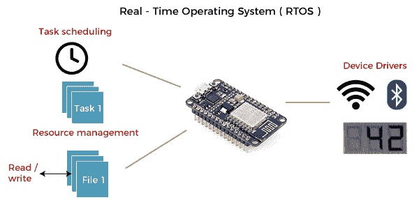
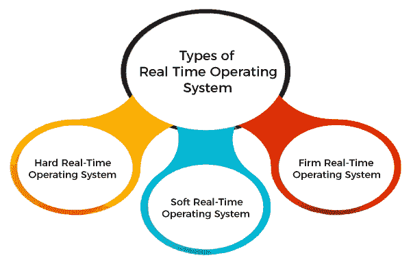

# 实时操作系统

> 原文：<https://www.javatpoint.com/real-time-operating-system>

在本文中，我们详细了解了实时操作系统。

**什么叫实时操作系统？**

**实时操作系统(RTOS)** 是计算机中使用的专用操作系统，对要执行的任何作业都有严格的时间限制。它主要用于计算结果被用来影响正在执行的进程的那些系统中。每当计算机外部的事件发生时，它会在用于监控该事件的某个传感器的帮助下被传送到计算机。传感器产生的信号被操作系统解释为中断。收到中断时，操作系统调用一个特定的进程或一组进程来处理中断。

除非在执行过程中出现更高优先级的中断，否则这个过程是完全不间断的。因此，中断之间必须有严格的优先级等级。必须允许优先级最高的中断启动进程，而优先级较低的中断应保存在稍后处理的缓冲区中。在这样的操作系统中，中断管理非常重要。

实时操作系统采用专用操作系统，因为传统操作系统不提供这样的性能。

**实时操作系统的各种示例有:**

*   机器翻译系统
*   猞猁
*   QNX
*   VxWorks 等。

**实时操作系统应用(RTOS):**

RTOS 用于必须在特定期限内工作的实时应用程序。以下是实时操作系统的常见应用领域。

*   实时运行结构被用在雷达小工具内部。
*   实时运行结构用于导弹制导。
*   实时运行结构用于在线库存交易。
*   实时运行结构被用在手机交换小工具中。
*   实时运行的结构被 Air 站点访问者用来操纵结构。
*   实时运行结构用于医学成像系统。
*   实时运行结构用于燃油喷射装置内部。
*   实时运行结构在流量操纵小工具中使用。
*   自动驾驶旅行模拟器采用实时运行结构。

### 实时操作系统的类型

以下是三种类型的 RTOS 系统:

**硬实时操作系统:**

在硬 RTOS，所有关键任务必须在指定的时间期限内完成，即在给定的期限内。不遵守最后期限将导致重大故障，如设备损坏，甚至人命损失。

**例如**

让我们以汽车制造商提供的安全气囊和驾驶员座椅上的手柄为例。当司机在特定情况下踩刹车时，安全气囊会膨胀，防止司机的头撞到把手。如果有几毫秒的延迟，那就会导致事故。

同样，考虑一个股票交易软件。如果有人想出售某个特定份额，系统必须确保在给定的关键时间内执行命令。否则，如果市场突然下跌，可能会给交易者造成巨大损失。

**软实时操作系统:**

软 RTOS 通过操作系统接受一些延迟。在这种 RTOS，可能会有一个特定工作的结束日期，但延迟一小段时间是可以接受的。因此，通过这种 RTOS 的方式，被切断的日期被温柔地对待。

**例如**

这种系统用于在线交易系统和牲畜价格报价系统。

**公司实时操作系统:**

在公司，RTOS 还想遵守最后期限。然而，缺少一个截止日期可能不会有很大的影响，但是可能会有意不想要的影响，比如产品罚款中的大幅度折扣。

**例如**，该系统用于各种形式的多媒体应用。

**实时操作系统优势:**

实时操作系统的优势如下:

*   易于在实时操作系统下布局、开发和执行实时应用。
*   实时工作结构非常紧凑，因此这些结构需要更少的存储空间。
*   在实时操作系统中，设备和系统的最大利用率。
*   专注于运行应用程序，而对队列中的应用程序不太重要。
*   由于程序的规模很小，RTOS 也可以像在交通和其他嵌入式系统。
*   这些类型的系统是无错误的。
*   内存分配最好在这些类型的系统中管理。

**实时操作系统的缺点:**

实时操作系统的缺点如下-

*   实时操作系统有复杂的布局原则，开发成本非常高。
*   实时操作系统非常复杂，可能会消耗关键的 CPU 周期。

* * *