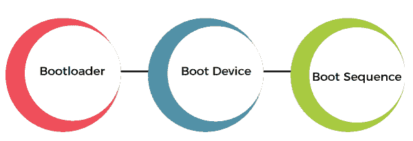
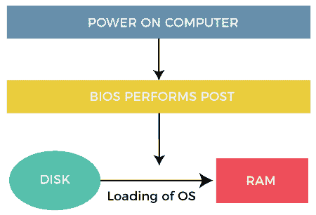

# 在操作系统中启动

> 原文：<https://www.javatpoint.com/booting-in-operating-system>

引导是启动计算机的过程。它可以通过硬件启动，如按钮按压或软件命令。开启后，CPU 的主内存中没有软件，所以有些进程在执行前必须将软件加载到内存中。这可以通过[中央处理器](https://www.javatpoint.com/cpu-full-form)中的硬件或固件或计算机系统中的独立处理器来完成。

重启电脑也叫重启，可以是硬的*，比如给 [CPU](https://www.javatpoint.com/central-processing-unit) 通电后由关转开，也可以是软的*，不断电。在某些系统上，软引导可以选择性地将内存清零。硬引导和软引导可以通过硬件启动，如按键或软件命令。当可运行的运行时系统(通常是操作系统和一些应用程序)完成时，引导就完成了。**

 **计算机从睡眠状态返回的过程不涉及引导；然而，将它从休眠状态恢复确实如此。最低限度，一些嵌入式系统不需要明显的引导序列来开始工作，并且当打开时，可以运行存储在只读存储器中的操作程序。所有计算机系统都是状态机，重启可能是从非预期的锁定状态返回指定零状态的唯一方法。

除了加载[操作系统](https://www.javatpoint.com/os-tutorial)或独立实用程序之外，引导过程还可以加载存储转储程序，用于诊断操作系统中的问题。

### 引导顺序

引导是一个启动序列，它在计算机打开时启动操作系统。引导序列是计算机开机时执行的一组初始操作。每台计算机都有一个引导序列。

**1。引导加载程序:**由中央处理器供电的计算机只能执行系统内存中的代码。现代操作系统和应用程序代码和数据存储在非易失性存储器中。当计算机第一次开机时，它最初必须只依赖存储在系统存储器非易失性部分的代码和数据。操作系统在启动时没有真正加载，计算机的硬件无法执行许多复杂的系统操作。

启动以整个操作系统加载结束的连锁反应的程序是引导加载程序或引导加载程序。引导加载程序的唯一工作是加载操作系统启动所需的其他软件。

**2。引导设备:**引导设备是加载操作系统的设备。现代电脑基本输入输出系统支持从各种设备启动。这些设备包括本地硬盘、光驱、软驱、网络接口卡和 USB 设备。基本输入输出系统将允许用户配置引导顺序。如果引导顺序设置为:

*   光盘驱动器
*   硬式磁盘机
*   网络

BIOS 会先尝试从[光盘](https://www.javatpoint.com/cd)驱动器引导，如果失败了，那么它会尝试从[硬盘](https://www.javatpoint.com/hdd)引导，如果失败了，那么它会尝试从网络引导，如果失败了，那么它根本不会引导。

**3。开机顺序:**有一个标准的开机顺序，所有个人电脑都使用。首先，中央处理器在内存中为基本输入输出系统运行一条指令。该指令包含转移到 BIOS 启动程序的跳转指令。该程序运行开机自检(POST)来检查计算机将依赖的设备是否正常运行。然后，基本输入输出系统通过配置的引导序列，直到找到可引导的设备。一旦基本输入输出系统找到可引导设备，基本输入输出系统加载引导扇区，并将执行转移到引导扇区。如果引导设备是硬盘，它将是主引导记录(MBR)。

MBR 代码检查分区表中的活动分区。如果找到一个，MBR 代码加载该分区的引导扇区并执行它。引导扇区通常是特定于操作系统的，然而，在大多数操作系统中，它的主要功能是加载和执行操作系统内核，从而继续启动。假设没有活动分区，或者活动分区的引导扇区无效。在这种情况下，MBR 可以加载辅助引导加载程序，该程序将选择一个分区并加载其引导扇区，该扇区通常加载相应的操作系统内核。

### 引导的类型

操作系统中有两种类型的引导。

1.  **冷启动:**当电脑第一次启动或处于关机状态并打开电源按钮启动系统时，这种启动电脑的过程称为冷启动。在冷启动期间，系统将从只读存储器(基本输入输出系统)读取所有指令，操作系统将自动加载到系统中。这种引导比热引导或热引导花费更多的时间。
2.  **热启动:**热启动或热启动过程是计算机系统进入无响应或挂起状态，然后允许系统在开机状态下重启。这也被称为重新启动。出现这种状态的原因有很多，唯一的解决办法就是重启电脑。当我们安装新软件或硬件时，可能需要重新启动。系统需要重新启动以设置软件或硬件配置更改，或者有时系统可能表现异常或无法正常响应。在这种情况下，系统必须强制重启。最常用的[***Ctrl+Alt+Del***](https://en.wikipedia.org/wiki/Control-Alt-Delete)按钮是用来重启系统的。否则，在某些系统中，可以使用外部重置按钮来重新启动系统。

### 操作系统中的引导过程

当我们的计算机开机时，它可以通过硬件启动，如按下按钮，或者通过软件命令，计算机的中央处理器(CPU)的主内存中没有软件，有一些过程必须将软件加载到主内存中才能执行。以下是描述操作系统引导过程的六个步骤，例如:

**第一步:**电脑系统开机后， ***BIOS*** (基本输入输出系统)对存储在 ROM 中的程序进行一系列活动或功能测试，称为***【POST】***(开机自检)，检查系统中的外设是否完好。

**步骤 2:**BIOS 完成预引导活动或功能测试后，从 ***CMOS*** (通用金属氧化物半导体)中读取引导序列，并按照 ***CMOS*** 中指定的引导设备序列在引导盘的第一个物理扇区中查找主引导记录。例如，如果引导设备序列是:

*   软盘
*   硬盘
*   （同 CD-ReadOnlyMemory）只读光盘

**步骤 3:** 之后，主引导记录将首先在[软盘驱动器](https://www.javatpoint.com/what-is-a-floppy-disk)中搜索。如果没有找到，硬盘驱动器将搜索主引导记录。但是如果主引导记录甚至不在硬盘上，那么光驱会搜索。如果系统无法从这些来源读取主引导记录，只读存储器显示**“*”未找到引导设备*“**”并停止系统。从特定的可引导磁盘驱动器找到主引导记录后，操作系统加载程序(也称为引导加载程序)将从该可引导驱动器的引导扇区加载到内存中。引导加载程序是一种特殊的程序，存在于可引导驱动器的引导扇区中。

**步骤 4:** 引导加载程序首先加载 ***IO。系统*T5 文件。在此之后，**T7】MSDOS。加载 SYS** 文件，这是 DOS 操作系统的核心文件。**

**第五步:**之后， ***MSDOS。系统*** 文件搜索在 ***配置中找到命令解释器。SYS*** 文件，找到后载入内存。如果在 ***配置中没有指定命令解释器。SYS*** 文件，***COMMAND.COM***文件作为 DOS 操作系统的默认命令解释器加载。

**第 6 步:**最后一个要加载和执行的文件是 ***AUTOEXEC。包含一系列 DOS 命令的文件。之后，将显示提示。我们可以看到计算机系统上显示的可引导驱动器的驱动器号，这表明操作系统已从该驱动器成功进入系统。***

### 什么是双引导

当计算机系统上安装了两个操作系统时，则称为双引导。在这样的系统上可以安装多个操作系统。但是要知道要引导哪个操作系统，了解多个文件系统和多个操作系统的引导加载程序可以占用引导空间。

加载后，它可以引导磁盘上可用的操作系统之一。磁盘可以有多个分区，每个分区包含不同类型的操作系统。当计算机系统打开时，引导管理程序会显示一个菜单，允许用户选择要使用的操作系统。

* * ***