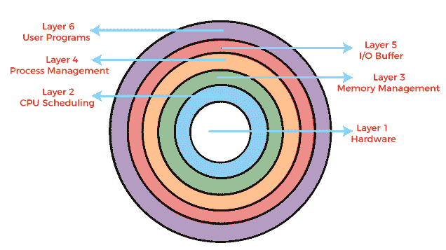
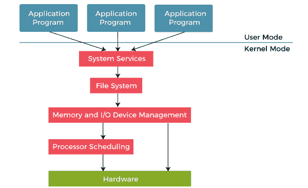

# 操作系统的分层结构

> 原文：<https://www.javatpoint.com/layered-structure-of-operating-system>

操作系统可以在各种结构的帮助下实现。操作系统的结构主要取决于操作系统的各种常见组件如何相互连接并融合到内核中。根据这一点，我们必须遵循操作系统的结构。

分层结构方法将操作系统分成不同的层，并保留对系统的更多控制。底层(0 层)是硬件，最上层(N 层)是用户界面。这些层的设计使得每一层仅使用较低层的功能。它简化了调试过程，就像调试较低层一样，并且在调试过程中会出现错误。错误必须只出现在该层上，因为低级别的层已经被调试过了。

*   这允许实现者改变内部工作并增加模块化。
*   只要例程的外部接口不改变，开发人员就有更多的自由来改变例程的内部工作方式。
*   主要优点是施工和调试简单。主要的困难是定义不同的层。

这种结构的主要缺点是数据需要在每一层修改和传递，这增加了系统的开销。此外，仔细规划层是必要的，因为层只能使用较低级别的层。UNIX 就是这种结构的一个例子。

### 为什么要在操作系统中分层？

分层在[操作系统](https://www.javatpoint.com/os-tutorial)中提供了明显的优势。所有层都可以单独定义，并根据需要相互作用。此外，如果以层的形式完成，则更容易创建、维护和更新系统。一个层规范的更改不会影响其他层。

操作系统中的每个层只能与上面和下面的层交互。最底层处理硬件，最上层处理用户应用程序。

### 分层结构的架构

这种类型的操作系统是作为对早期单片系统的改进而创建的。在分层操作系统中，操作系统分为不同的层，每个层都有不同的功能。这些层的实现有如下一些规则。

*   特定层可以访问其下的所有层，但不能访问它们。也就是说，第 n-1 层可以访问从第 n-2 层到第 0 层的所有层，但不能访问第 n 层
*   第 0 层负责分配进程，当中断发生或定时器到期时，在进程之间切换。它还处理中央处理器的基本多道程序设计。

因此，如果用户层想要与硬件层交互，响应将通过从 n-1 到 1 的所有层。每一层都必须设计和实现成只需要它下面的层提供的服务。

分层操作系统有六层。演示这些层的图表如下:

1.  **硬件:**该层与系统硬件交互，并与所有使用的外围设备协调，如打印机、鼠标、键盘、扫描仪等。这些类型的硬件设备在硬件层进行管理。
    硬件层是分层操作系统架构中最低、最权威的一层。它直接连接到系统的核心。
2.  **CPU 调度:**这一层处理为 CPU 调度进程。许多调度队列用于处理流程。当进程进入系统时，它们被放入作业队列。
    准备在主存储器中执行的进程被保存在就绪队列中。这一层负责管理有多少进程将被分配给中央处理器，有多少进程将留在中央处理器之外。
3.  **内存管理:**内存管理处理内存，将进程从磁盘移动到主内存中执行，然后再返回。这由操作系统的第三层处理。所有内存管理都与该层相关联。计算机中有各种类型的存储器，如随机存取存储器、只读存储器。
    如果您考虑内存，那么它与内存的换入和换出有关。当我们的计算机运行时，一些进程会移动到主内存(RAM)中执行，当程序(如计算器)退出时，它会从主内存中移除。
4.  **进程管理:**该层负责管理进程，即将处理器分配给一个进程，并决定有多少进程将留在等待调度中。流程的优先级也在这一层进行管理。用于进程调度的不同算法有 FCFS(先到先得)、SJF(最短作业优先)、优先级调度、循环调度等。
5.  **I/O 缓冲区:** I/O 设备在计算机系统中非常重要。它们为用户提供了与系统交互的手段。该层处理输入/输出设备的缓冲区，并确保它们正常工作。
    假设你正在用键盘打字。键盘附带一个键盘缓冲区，用于暂时存储数据。同样，所有的输入/输出设备都有一些缓冲区。这是因为输入/输出设备的处理或存储速度较慢。计算机使用缓冲器来保持处理器和输入/输出设备的良好定时速度。
6.  **用户程序:**这是分层操作系统中最高的一层。这一层处理运行在操作系统中的许多用户程序和应用程序，如文字处理器、游戏、浏览器等。您也可以称之为应用层，因为它与应用程序有关。

### 分层结构的优点

操作系统设计的分层结构有几个优点，例如:

1.  **模块化:**这种设计促进了模块化，因为每一层只执行它计划执行的任务。
2.  **容易调试:**由于层是离散的，所以调试非常容易。假设 CPU 调度层出现错误。开发人员只能搜索特定的层进行调试，不像 Monolithic 系统中所有的服务都存在。
3.  **轻松更新:**在特定图层进行的修改不会影响其他图层。
4.  **无法直接访问硬件:**硬件层是设计中存在的最内层。因此，用户可以使用硬件的服务，但不能直接修改或访问它，这与用户可以直接访问硬件的简单系统不同。
5.  **抽象:**每一层都与其功能有关。所以其他层的功能和实现对它来说是抽象的。

### 分层结构的缺点

尽管该系统比单片和简单设计有几个优点，但也有一些缺点，例如:

1.  **复杂细致的实现:**由于一个层可以访问其下各层的服务，所以各层的排列一定要做得细致。例如，后备存储层使用内存管理层的服务。所以必须保持在内存管理层之下。因此，模块化带来了复杂的实现。
2.  **执行速度较慢:**如果一个层想要与另一个层交互，它会请求遍历存在于两个交互层之间的所有层。因此，它增加了响应时间，不像单片系统，比这更快。因此，层数的增加可能导致非常低效的设计。
3.  **功能:**功能并不总是可以划分的。很多时候，它们是相互联系，不可分割的。
4.  **通信:**非相邻层之间无通信。

* * *