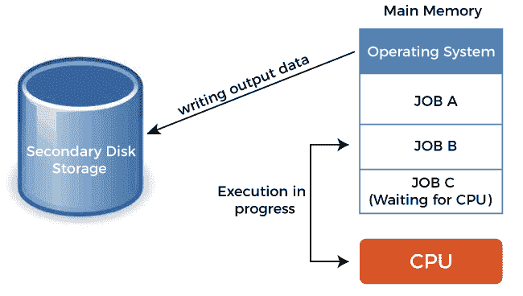
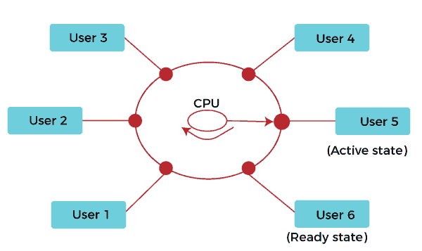
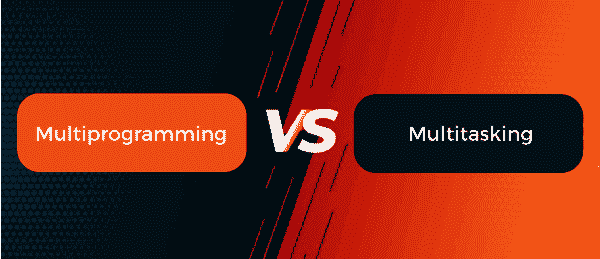

# 多道程序设计与分时操作系统

> 原文：<https://www.javatpoint.com/multiprogramming-vs-time-sharing-operating-system>

多道程序设计是指在计算机系统及其资源上分配多个并发程序。多道程序设计允许各种用户有效地使用中央处理器和输入输出设备，从而有效地使用中央处理器。多道程序设计确保了 CPU 总是有东西要执行，从而提高了 CPU 利用率。

另一方面，分时是多个用户同时共享计算资源。因为这将允许许多用户同时在单个计算机系统中工作，所以它将降低提供计算能力的成本。

### 多道程序操作系统

多道程序是 [CPU](https://www.javatpoint.com/cpu-full-form) 在几个程序之间的快速切换。一个程序通常由几个任务组成。任务以移动数据的请求结束，这需要执行一些输入/输出操作。多任务通常用于在当前运行的程序执行输入/输出操作时保持[中央处理器](https://www.javatpoint.com/central-processing-unit)忙碌。与其他正在执行的指令相比，输入/输出操作极其缓慢。

即使一个程序包含非常少的输入/输出操作，程序所花费的大部分时间都花在这些输入/输出操作上。因此，利用这段空闲时间并允许另一个程序使用 CPU 将会提高 CPU 利用率。多道程序设计最初是在 20 世纪 50 年代后期作为[操作系统](https://www.javatpoint.com/os-tutorial)的一项功能开发的，并首先用于大型机计算。随着虚拟内存和虚拟机技术的引入，多道程序设计的使用得到了加强。它没有固定的进程时间片。其主要目的是资源利用。

**多道程序操作系统的优势**

多道程序操作系统具有以下优点:

*   没有中央处理器空闲时间
*   多道程序设计系统可以最快地监控整个任务的并行运行。
*   更短的响应时间
*   最大化计算机的总作业吞吐量
*   提高资源利用率

**多道程序操作系统的缺点**

以下是多道程序操作系统的一些缺点:

*   有时长时间的工作要等很长时间
*   跟踪所有流程有时很困难
*   需要中央处理器调度
*   需要高效的内存管理
*   在执行过程中，用户不与任何程序交互

### 分时操作系统

分时是一种技术，它使位于不同终端的许多人能够同时使用特定的计算机系统。分时是多道程序设计的逻辑扩展。在这种分时操作系统中，许多进程在各自的时隙中被分配了计算机资源。在这种情况下，处理器的时间由多个用户共享。这就是为什么它被称为分时操作系统。它对不同的进程有一个固定的时间片。它的主要目的是交互式响应时间。

中央处理器通过在它们之间切换来执行多个作业，但是切换发生得如此频繁。因此，用户可以立即收到响应。操作系统使用 CPU 调度和多道程序设计为每个用户提供少量时间。最初设计为批处理系统的计算机系统已经被修改为分时系统。

多程序批处理系统和分时系统的主要区别在于，在多程序批处理系统中，目标是最大限度地利用处理器。相反，在分时系统中，目标是最小化响应时间。

**分时操作系统的特点**

分时操作系统为用户提供以下功能:

*   每个用户都为所有操作争取专用时间。
*   多个在线用户可以同时使用同一台计算机。
*   最终用户觉得他们垄断了计算机系统。
*   用户和计算机之间更好的交互。
*   用户请求可以在短时间内做出响应。
*   它不需要再等待最后一个任务结束来获得处理器。
*   它可以快速处理大量任务。

**分时操作系统的优势**

分时操作系统具有以下优点:

*   它提供了快速响应
*   减少中央处理器空闲时间
*   所有的任务都有特定的时间
*   软件复制的可能性更小
*   缩短响应时间
*   易于使用且用户友好

**分时操作系统的缺点**

下面是分时操作系统的一些缺点，例如:

*   它消耗了许多资源
*   需要高规格的硬件
*   它存在可靠性的问题
*   用户程序和数据的安全性和完整性问题
*   数据通信问题概率

### 多道程序设计和分时系统的区别

在多程序设计中，一次可以有多个进程驻留在主存储器中。因此，当一个进程进行输入/输出操作时，中央处理器不会等待并分配给另一个进程。这使得中央处理器一直很忙。

分时的概念克服了没有用户交互的问题。分时系统要求为每个用户提供一个输入设备(键盘或鼠标)和一个输出设备(监视器)来与系统交互。在分时操作中，多个作业同时执行，中央处理器在它们之间频繁切换，这样每个用户都可以在每个程序运行时与之交互。它减少了系统对每个用户进程的响应时间，并给每个用户一种 CPU 工作缓慢的错觉。

多道程序设计和分时程序设计的主要区别在于，多道程序设计通过允许几个程序同时使用 CPU，有效地利用了 CPU 时间。但是分时共享是由几个想同时使用同一设备的用户共享一个计算设备。分时系统上的每个用户都有自己的终端，感觉像是单独使用 CPU。分时系统使用多道程序设计的概念，在多个用户之间同时共享 CPU 时间。以下是多道程序设计系统和分时系统之间的更多区别，例如:

| 多道程序系统 | 分时系统 |
| 多道程序操作系统允许通过监视进程状态和进程间的切换来执行多个进程。 | 分时是多道程序设计的逻辑扩展。在这个分时操作系统中，许多用户/进程在各自的时隙中被分配了计算机资源。 |
| 处理器和内存利用不足的问题得到解决，多个程序在 CPU 上运行。这就是为什么它被称为多道程序设计。 | 处理器的时间由多个用户共享。这就是为什么它被称为分时操作系统。 |
| 在多道程序设计中，进程可以由单个处理器执行。 | 在这个过程中，两个或多个用户可以在他们的终端中使用一个处理器。 |
| 多道程序操作系统没有固定的时间片。 | 分时操作系统有一个固定的时间片。 |
| 在多道程序操作系统中，在完成一项任务之前，执行权是不会被拿掉的。 | 在分时操作系统中，执行权在完成执行之前被剥夺。 |
| 在这里，系统不需要花费一些时间来处理不同的流程。 | 在这里，系统在每个进程上工作的时间相同或更少。 |
| 在多道程序操作系统中，系统依靠设备在输入输出中断等任务之间切换。 | 在分时操作系统中，操作系统依赖时间在不同的进程之间切换。 |
| 多道程序设计系统的系统模型是多个程序。 | 分时系统的系统模型是多个程序和多个用户。 |
| 多道程序系统使响应时间最大化。 | 分时系统使响应时间最大化。 |
| 例如:苹果操作系统、视窗操作系统、微型机，如 MP/M、XENIX 和 ESQview | 示例:Windows NT 服务器、Unix、Linux、Multics、TOPS-10、TOPS-20 |

* * *