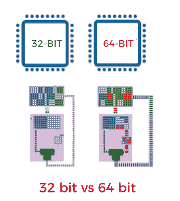
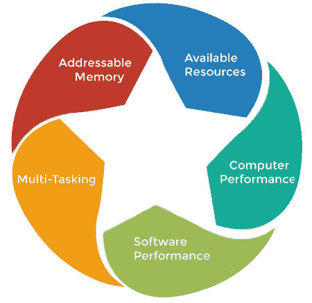

# 32 位和 64 位操作系统的区别

> 原文：<https://www.javatpoint.com/32-bit-vs-64-bit-operating-system>

在计算中，字节是数据的单位，处理通常被称为位处理。一般来说，有两种类型的处理器，即 [32 位处理器和 64 位处理器](https://www.javatpoint.com/32-bit-vs-64-bit-processors)。这种类型的处理器告诉我们一个处理器可以从一个中央处理器寄存器访问多少内存。

*   32 位系统可以访问 2 32 内存地址，即 4gb RAM 或物理内存；理想情况下，它还可以访问 4 GB 以上的 RAM。
*   一个 64 位系统可以访问 2 64 个内存地址，也就是实际上 18-5000 兆字节的内存。简而言之，任何大于 4 GB 的内存都可以由它轻松处理。

随着 64 位处理器和更大内存容量可用性的提高，微软和苹果都升级了操作系统版本，旨在充分利用新技术。第一个完全 64 位操作系统是 2009 年的 Mac OS X 雪豹。与此同时，第一款搭载 64 位芯片(苹果 A7)的智能手机是 iPhone 5s。

### 什么是 32 位操作系统？

它是一种能够传输 32 位数据的 [CPU](https://www.javatpoint.com/central-processing-unit) 架构类型。指的是你的 [CPU](https://www.javatpoint.com/cpu-full-form) 在操作时可以轻松处理的数据和信息的数量。21 世纪初和 20 世纪 90 年代生产的大多数计算机都是 32 位机器。

寄存器中的一个位通常可以引用单个字节。因此，32 位系统能够寻址约 4，294，967，296 字节(4 GB)的[内存](https://www.javatpoint.com/ram)。它的实际限制小于 3.5 GB(通常)，因为寄存器的一部分存储除内存地址之外的各种其他临时值。

### 什么是 64 位操作系统？

64 位微处理器允许计算机系统处理由 64 位表示的信息、数据和存储器地址。这样的系统通常可以引用 16 exabytes (17，179，869，184 GB)或 18，446，744，073，709，551，616 字节的内存。

64 位系统(带有 64 位处理器的计算机)可以访问 4 GB 以上的内存。这比一个普通工作站需要访问的内容多了数百万倍。意思是如果一台电脑有 8 GB 的 [RAM](https://www.javatpoint.com/ram-full-form) ，那就需要一个 64 位处理器。否则，至少 4 GB 的内存将无法访问 CPU。

### 64 位相对于 32 位操作系统的优势

以下是 64 位操作系统相对于 32 位操作系统的以下优势，例如:

1.  **可寻址内存:** 32 位操作系统最多可寻址 4gb RAM。但是 64 位操作系统可以处理高达 17，179，869，184 GB (16 exabytes)的数据。这比 32 位操作系统能处理的 4GB 内存多得多。
2.  **可用资源:**与 32 位系统相比，64 位操作系统可以充分利用可用的系统资源。为了简化，在 32 位操作系统上安装更多内存不会影响性能。但是，将内存过剩的系统升级到 64 位版本的 Windows，您会发现有所不同。
3.  **计算机性能:**使用带有 64 位处理器的 64 位系统，系统每秒可以执行更多的计算。因此，它提高了处理能力，使计算机运行得更快。这在 32 位操作系统的情况下是有限的。
4.  **软件性能:**编写更多软件是为了充分利用 64 位操作系统的优势。如果您使用 64 位操作系统并安装 64 位软件，您可以提前注意到性能的提高。当执行需要系统访问更多内存的大型操作时，这一点变得更加关键。软件性能的提高导致整体效率的提高。
5.  **多任务:**使用 64 位，用户可以同时在多任务中做各种事情。用户可以轻松地在各种应用程序之间切换，而不会出现任何窗口挂起的问题。

### 32 位和 64 位操作系统的区别

64 位处理器比 32 位处理器更有能力，因为它可以同时处理更多的数据。64 位处理器可以存储更多的计算值，包括内存地址，这意味着它可以访问超过 32 位处理器物理内存的 40 亿倍。

这是关键的区别，32 位处理器完全能够处理有限的内存(在视窗系统中，4GB 或更少)，64 位处理器可以利用更多的内存。 **32 位处理器和 64 位处理器**的一个主要区别是它们每秒可以执行的 ***计算次数*** ，这影响了它们完成任务的速度。以下是 32 位和 64 位操作系统之间的更多区别，例如:

| 因素 | 32 位处理器 | 64 位处理器 |
| 数据处理和存储 | 顾名思义，32 位操作系统比 64 位操作系统能够存储和处理更少的数据。更具体地说，它最多可处理 4，294，967，296 字节(4 GB)的内存。 | 另一方面，64 位操作系统比 32 位操作系统能处理更多的数据。这意味着它总共可以寻址 264 个内存地址，这是 1800 万 GB 的内存。 |
| 体系结构 | 32 位系统有通用计算，包括 IBM System/360 和 IBM System/370，DEC VAX，摩托罗拉 68000 系列，英特尔 IA-32，以及 32 位版本的 x86 架构不同版本。这些架构用于嵌入式计算，包括 68000 个系列。 | 寄存器分为不同的组，如整数、浮点、控制，通常用于各种用途的地址和名称，如地址、索引或基址寄存器。这些寄存器的大小取决于可寻址存储器的数量。 |
| 系统兼容性 | 32 位处理器系统可以正常运行 32 位操作系统，但它不能完全运行 64 位操作系统。 | 64 位处理器系统可以运行 32 位或 64 位版本的已安装操作系统。 |
| 表演 | 32 位处理器的性能因素不如 64 位处理器有效。 | 它表现出比 32 位处理器更高的性能。 |
| 应用支持 | 64 位程序和应用程序无法工作。 | 32 位程序和应用程序将顺利运行。 |
| 可寻址空间 | 它有 4 GB 的可寻址空间。 | 它们的可寻址空间为 16 GB。 |
| 每秒计算次数 | 32 位系统提供双核和四核版本。 | 64 位系统可以配备双核、四核、六核和八核版本。拥有这些可用的多核提高了其每秒的计算速度。 |
| 多任务支持 | 32 位系统不是多任务处理和压力测试的理想选择。 | 对于多任务处理和压力测试，64 位处理器更好。它也可以很好地执行其他繁重的应用程序。 |
| 操作系统支持 | 它需要 32 位操作系统。 | 这个可以在 32 位和 64 位操作系统上运行。 |
| 操作系统和中央处理器要求 | 32 位应用程序和操作系统需要 32 位 CPU。 | 64 位操作系统需要 64 位 CPU，64 位应用需要 64 位 CPU 和 OS。 |
| 可用系统 | 这些支持 Windows 7、Windows XP、Windows Vista、Windows 8 和 Linux。 | 这些支持 Windows XP Professional、Windows 7、Windows 8、Windows 10、Windows Vista、Linux 和 Mac OS X。 |
| 内存中的限制 | 32 位系统的 32 位 Windows 内存限制为 3.2 GB。其可寻址空间的限制不允许您使用 4GB 的整个物理内存空间。 | 64 位系统使其用户能够存储高达 170 亿 GB 的内存。 |

### 如何选择处理器？

虽然 64 位处理器比 32 位处理器具有更高的处理能力，但这并不总是意味着您需要 64 位计算机或软件。您应该在计算机上安装 32 位还是 64 位应用程序取决于您当前的设置。

如果你想让你的电脑更快，你可能应该选择 64 位处理器。如果你正在运行 32 位程序，你甚至可以使用这个处理器，因为大多数应用程序都是向后兼容的。这意味着 64 位计算机将运行大多数 32 位程序。但是，32 位计算机不会运行任何 64 位应用程序。以下是您可能想要升级到 64 位处理器的一些原因:

*   **显卡:**除了能够处理更多数据，64 位处理器还能提供更好的显卡性能。这意味着你的电脑在启动应用程序、编辑照片和玩图形密集型游戏时会更快。
*   **安全性:**64 位计算机仍然可能受到恶意软件(恶意软件)的感染，包括病毒、间谍软件、特洛伊木马和勒索软件。但是，64 位系统的计算机比 32 位系统具有更多的安全功能。

* * *