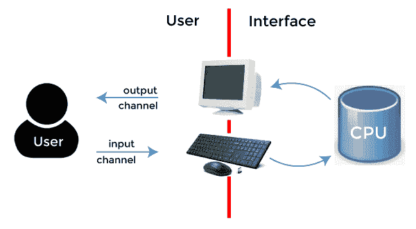
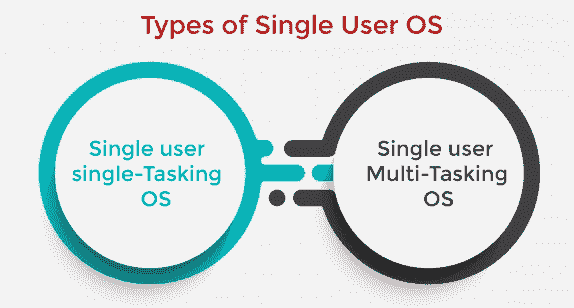
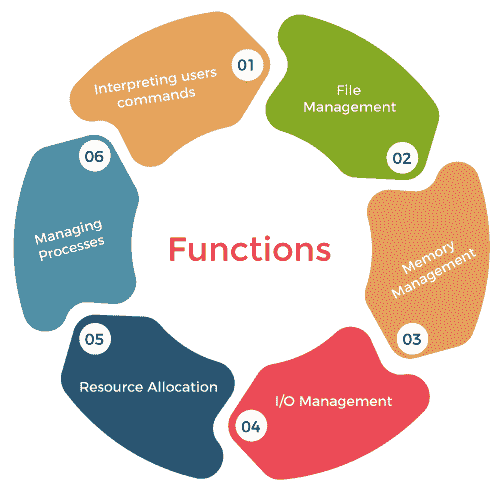

# 单用户操作系统

> 原文：<https://www.javatpoint.com/single-user-operating-system>

单用户操作系统是一种为在任何给定时间只有一个用户的计算机或类似机器上使用而开发的操作系统。这种类型的操作系统通常用于无线电话和双向消息设备等设备。

操作系统负责处理许多不同的任务，通常是计算机上使用的最重要的程序之一。它管理内存使用和其他资源、硬件连接以及其他应用程序的正确执行。单任务操作系统一次只能运行一个程序或应用程序。因此，对于打算同时运行多个程序的计算机或其他设备来说，它没有那么有用。

这是使用多任务单用户操作系统的地方。多任务操作系统可以同时运行多个应用程序和程序。这通常用在这样的计算机上:有人可能想同时浏览互联网、运行图形编辑程序、通过媒体播放程序播放音乐以及在简单的文字处理程序中键入注释。单一任务操作系统无法做到这一点，但多任务系统可以处理所有这些过程。

即使这种类型的操作系统可以通过网络连接到其他计算机，它仍然只由一个用户使用。只要电脑只有一个显示器、键盘等输入设备，那么就是单用户系统。

### 单用户操作系统的类型

单用户操作系统可以分为两部分，例如:

**1。单用户单任务操作系统**

在单用户单任务操作系统中，一次只允许一个用户执行单个任务。一些功能，如打印文档和下载图像和视频，在一个给定的帧中执行。这个操作系统是专为无线电话和双向信息设备设计的。比如 MS-DOS，Palm OS 等。它具有以下优点:

*   这个操作系统占用较少的内存空间。
*   很划算。

**2。单用户多任务操作系统**

单用户多任务操作系统是专门为一个用户开发的，但是这个用户可以同时执行多个任务。例如，你可以在上网、下载图片、看电影等时写任何文字。，它有以下优点:

*   省时。
*   在更短的时间内实现高生产率。
*   较少的内存用于执行多个任务。

### 单用户操作系统的特点

单用户操作系统为用户提供以下功能，例如:

*   它不使用输入/输出的调度过程
*   它对用户使用较少的调度。
*   它只适合一次性使用。
*   它并不打算同时用于几个任务。
*   它不使用 MMU。

### 单用户操作系统的功能

描述和范例是单用户操作系统的主要功能。以下是单用户操作系统的更多功能，例如:

1.  **解释用户命令:**它从用户那里获取指令，并将它们传递给操作系统的其他部分。这是操作系统的一部分，用户可以通过它向计算机发出指令。它可以是命令驱动的、菜单驱动的或图形用户界面，可能使用 WIMP 系统。
2.  **文件管理:**控制后备存储的组织。它将光盘的一部分用作文件目录，其中包含数据在光盘上存储位置的详细信息。文件被组织成一个分层的归档系统，将文件存储在不同的目录和子目录中。
3.  **内存管理:**控制程序和数据在主内存中的放置位置。许多操作系统允许多个程序同时存在于内存中。内存管理确保任何程序都不会覆盖任何其他程序(包括操作系统本身)。
4.  **输入输出管理:**在计算机系统和输入输出设备之间进行通信。它处理外围设备和中央处理器之间的数据传输。
5.  **资源分配:**OS 将资源分配给应用等其他程序。例如:
    *   共享处理器的调度程序，例如批处理、前台或后台、分时。
    *   内存管理-例如，虚拟内存分页，将内存内容交换到硬盘。
    *   确保驱动程序可以访问硬件设备。
    *   会计机制；限制执行-例如打印页数、每个用户的文件空间等。
6.  管理进程:它控制进程并处理中断**离子。内核**管理进程(当一个程序运行时，它启动一个进程，这个进程可能会启动更多的进程)并处理中断。

### 单用户操作系统示例

有一些操作系统的例子像 DOS，Windows 3x，Windows 95，97，98。另外，在手机中，塞班操作系统是单用户操作系统。

这些系统也称为单应用操作系统，因为一次集中一个应用程序。这些系统需要更少的资源，可以在队列中进行处理。在这些系统中，重复出现的任务执行得很好，例如制作工资单或员工工资。

### 单用户操作系统的优势

单用户操作是指一个用户在一个界面上工作。在这些系统中，没有其他操作系统会中断处理。单用户操作系统的处理需要更少的资源。以下是单用户操作系统的一些更重要的优势，例如:

*   **一次支持一个用户:**在这些系统中，一次只有一个用户处于活动状态。因此不会有其他用户干扰应用程序。在这些系统中，所有的计算机资源都被用户请求使用。
*   **易于维护:**这些系统使用的资源较少，复杂度也较低，易于维护和调试。多用户操作系统需要更高的资源，资源大部分时间都在使用。
*   **损坏几率更小:**这些系统一次对硬件和软件的请求更少，因此损坏几率更小。这些系统也不会增加加载时间。
*   **专注于一个任务:**在现代操作系统中，一次有多个任务在运行。像许多应用程序和任务同时运行一样，但是在单用户操作系统中，一次只能运行一个任务。所以这些系统有时一次给出的输出结果较少。

### 单用户操作系统的缺点

单用户操作系统也有一些缺点，例如:

*   **任务需要更长的时间才能完成:**如你所知，如果一次没有多个任务运行，很多任务都在等待 CPU。所以这些系统在更高的时间响应过程。这将使系统变慢，并且响应时间更长。
*   **空闲时间较高:**如果只有一个任务在运行，并且该任务不需要内存或 I/O 使用，则这些设备保持空闲。但是其他任务需要这些设备。所以一次只能运行一个任务，那么其他任务就要等到第一个任务完成。所以 CPU、内存、磁盘 I/O 都没有用好。

### 单用户和多用户操作系统的区别

单用户操作系统和多用户操作系统的区别如下:

| 条款 | 单用户操作系统 | 多用户操作系统 |
| 定义 | 单用户操作系统是指一次只有一个用户可以访问计算机系统的系统。 | 多用户操作系统是一种允许多个用户同时访问计算机系统的系统。 |
| 引导加载程序 | 引导加载程序以单个超级用户的身份加载中央处理器的所有资源。 | 引导加载程序根据用户的优先级分配中央处理器的资源。 |
| 超级用户 | 超级用户获得维护系统和进行更改的所有权力，以确保系统平稳运行。 | 多用户操作系统不存在超级用户，因为每个实体都可以控制自己的工作。 |
| 复杂性 | 单用户操作系统简单且易于设计。 | 多用户操作系统是复杂的，因为它们必须应用复杂的技术来在不同的用户之间共享资源。 |
| 表演 | 一次只能执行一项任务。 | 无论如何都要安排不同的任务来提高性能。 |
| 例子 | MS-DOS，Windows 95，Windows NT，Windows 2000，个人电脑等。 | 大型机、IBM AS400、Linux & Unix 分布式操作系统等。 |

* * *