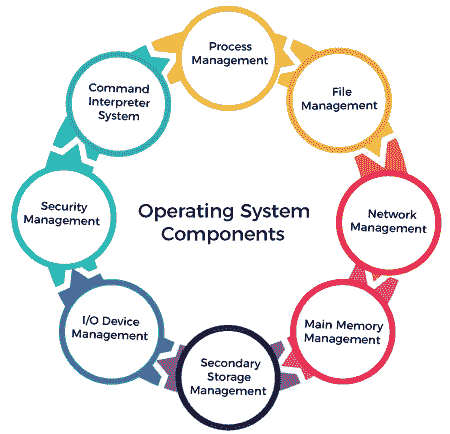
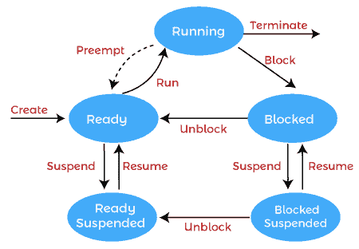
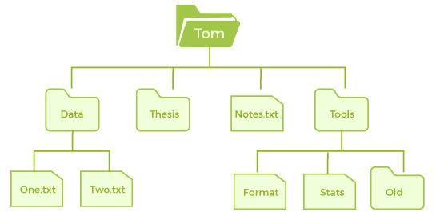
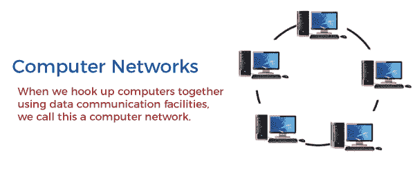
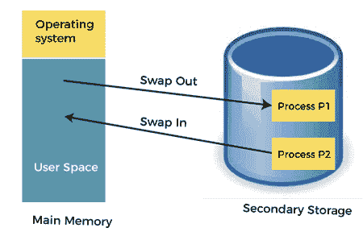
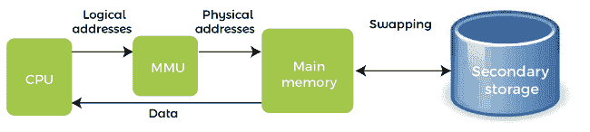
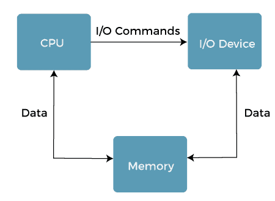
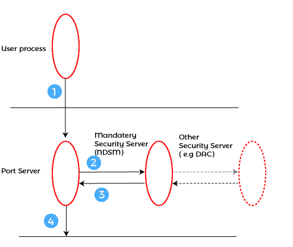
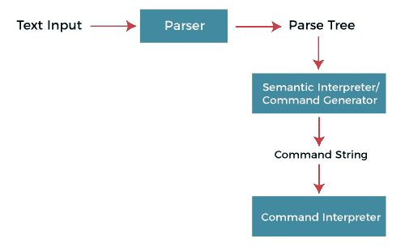

# 操作系统的组件

> 原文：<https://www.javatpoint.com/components-of-operating-system>

操作系统是一个庞大而复杂的系统，只能通过划分成小部分来创建。这些部分应该是系统中定义明确的部分，仔细定义输入、输出和功能。

尽管 Windows、Mac、UNIX、Linux 和其他操作系统没有相同的结构，但大多数操作系统共享相似的操作系统组件，如文件、内存、进程、输入/输出设备管理。

操作系统的组件在使各种计算机系统部件协同工作方面起着关键作用。操作系统有以下组件，例如:

1.  进程管理
2.  文件管理
3.  网络管理
4.  主内存管理
5.  二级存储管理
6.  输入输出设备管理
7.  安全管理
8.  命令解释系统

操作系统组件通过检测 CPU 和内存硬件错误来帮助您获得正确的计算。

### 进程管理

进程管理组件是用于管理操作系统上同时运行的许多进程的过程。每个运行的软件应用程序都有一个或多个与之相关的进程。

例如，当您使用像 Chrome 这样的搜索引擎时，有一个为该浏览器程序运行的进程。

流程管理使流程高效运行。它还使用分配给它们的内存，并在需要时关闭它们。

进程的执行必须是顺序的，因此至少应该代表该进程执行一条指令。

**流程管理功能**

以下是操作系统中流程管理的功能，例如:

*   流程创建和删除。
*   暂停和恢复。
*   同步过程
*   沟通过程

#### 注意:操作系统促进了在相同或不同系统上执行的进程之间的信息交换。

### 文件管理

文件是由其创建者定义的一组相关信息。它通常表示程序(源和对象形式)和数据。数据文件可以是字母、数字或字母数字。

**文件管理功能**

操作系统在文件管理方面有以下重要活动:

*   文件和目录的创建和删除。
*   用于操作文件和目录。
*   将文件映射到辅助存储。
*   在稳定的存储介质上备份文件。

### 网络管理

网络管理是管理和管理计算机网络的过程。它包括性能管理、网络供应、故障分析和维护服务质量。

分布式系统是从不共享内存和时钟的计算机或处理器的集合。在这种类型的系统中，所有的处理器都有自己的本地存储器，并且处理器使用不同的通信电缆(如光纤或电话线)相互通信。

网络中的计算机通过通信网络连接，通信网络可以通过多种不同的方式进行配置。网络可以在网络管理中完全或部分连接，这有助于用户设计路由和连接策略，以克服连接和安全问题。

**网络管理功能**

网络管理提供以下功能，例如:

*   分布式系统帮助您在大小和功能上获得各种计算资源。它们可能涉及小型计算机、微处理器和许多通用计算机系统。
*   分布式系统还为用户提供对网络共享的各种资源的访问。
*   它有助于访问有助于计算加速或提供数据可用性和可靠性的共享资源。

### 主内存管理

主存是一个大的存储或字节数组，它有一个地址。内存管理过程通过使用特定内存地址的一系列读取或写入来进行。

它应该被映射到绝对地址，并加载到内存中以执行程序。内存管理方法的选择取决于几个因素。

然而，这主要是基于系统的硬件设计。每种算法都需要相应的硬件支持。主内存提供快速存储，可由中央处理器直接访问。它成本高，因此存储容量较低。然而，要执行一个程序，它必须在主存储器中。

**内存管理功能**

操作系统在操作系统中执行以下内存管理功能:

*   它有助于你记录主要记忆。
*   确定它的哪些部分正被谁使用，哪些部分未被使用。
*   在多道程序设计系统中，操作系统决定哪个进程将获得内存和多少内存。
*   当进程请求时分配内存。
*   当进程不再需要或已经终止时，它还会取消分配内存。

### 二级存储管理

计算机系统最重要的任务是执行程序。这些程序帮助您在执行过程中从主内存访问数据。计算机的内存非常小，无法永久存储所有数据和程序。计算机系统提供辅助存储器来备份主存储器。

今天，现代计算机使用硬盘/固态硬盘作为程序和数据的主要存储。但是，辅助存储管理也适用于存储设备，如 u 盘和光盘驱动器。汇编器和编译器之类的程序存储在磁盘上，直到它被加载到内存中，然后使用磁盘作为源和目的地进行处理。

**二级存储管理功能**

以下是操作系统中辅助存储管理的一些主要功能:

*   存储分配
*   自由空间管理
*   磁盘调度

### 输入输出设备管理

操作系统的一个重要用途是帮助用户隐藏特定硬件设备的变化。

**输入输出管理功能**

输入/输出管理系统提供以下功能，例如:

*   它提供了一个缓冲缓存系统
*   它提供通用设备驱动程序代码
*   它为特定的硬件设备提供驱动程序。
*   输入/输出帮助您了解特定设备的个性。

#### 注意:用户程序不能直接执行输入输出操作。操作系统应该提供一些介质来执行此操作。

### 安全管理

操作系统中的各种进程需要与其他活动隔离开来。因此，各种机制可以确保那些想要操作文件、内存、中央处理器和其他硬件资源的进程应该得到操作系统的适当授权。

安全性是指一种机制，用于控制程序、进程或用户对计算机控制所定义的资源的访问，以及一些强制手段。

例如，内存寻址硬件有助于确认进程可以在其自己的地址空间内执行。时间确保没有进程不放弃它就能控制中央处理器。最后，不允许任何进程进行自己的输入/输出来保护，这有助于您保持各种外围设备的完整性。

安全性可以通过检测组件子系统之间接口的潜在错误来提高可靠性。接口错误的早期检测可以防止故障子系统对健康子系统的污染。未受保护的资源不能被未授权或不称职的用户滥用。

### 命令解释系统

操作系统最重要的组件之一是它的命令解释器。命令解释器是用户和系统其他部分之间的主要接口。

许多命令是通过控制语句提供给操作系统的。当批处理系统中启动新作业或用户登录分时系统时，会自动执行一个读取和解释控制语句的程序。这个程序有不同的叫法。

*   控制卡解释器，
*   命令行解释器，
*   外壳(在 UNIX 中)等等。

它的功能相当简单，获取下一条命令语句，并执行它。命令语句处理进程管理、输入/输出处理、辅助存储管理、主内存管理、文件系统访问、保护和网络。

* * *