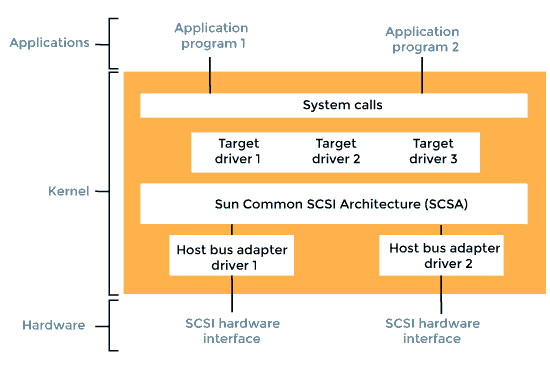
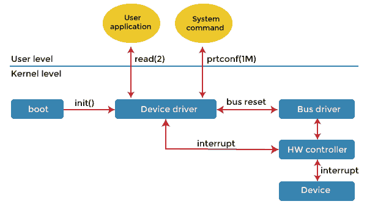
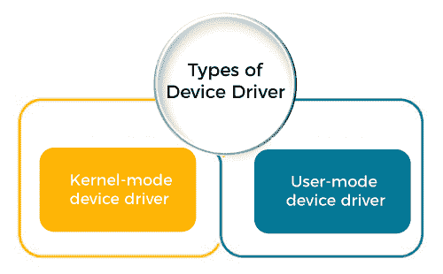

# 操作系统中的设备驱动程序

> 原文：<https://www.javatpoint.com/device-driver-in-operating-system>

操作系统需要设备驱动程序的帮助来处理所有的输入/输出设备。设备驱动程序是操作或控制连接到计算机或自动机的特定设备的计算机程序。驱动程序为硬件设备提供软件接口，使操作系统和其他计算机程序能够访问硬件功能，而无需知道正在使用的硬件的确切细节。

**设备驱动程序**对于计算机系统正常工作非常重要。如果没有设备驱动程序，特定的硬件将无法相应地工作，这意味着它无法完成为其创建的特定操作。

驱动程序依赖于硬件，并且特定于操作系统。它们通常提供任何必要的异步时间相关硬件接口所需的中断处理。

驱动程序通过硬件连接的计算机总线或通信子系统与设备通信。一旦设备将数据发送回驱动程序，驱动程序就可以调用原始调用程序中的例程。当调用程序调用驱动程序的例程时，驱动程序向设备发出命令。

设备驱动程序封装设备相关的代码，并实现一个标准接口来包含设备特定的寄存器读或写。设备驱动程序通常由设备制造商编写，并与设备一起存储在光盘上。设备驱动程序执行以下任务，例如:

*   接受来自上面独立于设备的软件的请求。
*   确保请求成功执行。
*   与设备控制器交互，获取和提供输入/输出，并执行所需的错误处理。

### 设备驱动程序如何处理请求？

设备驱动程序如何在操作系统中处理请求如下:

假设一个请求来读取块 n。如果当一个请求到达时，驱动程序是空闲的，它会立即开始执行该请求。否则，如果驱动程序已经忙于其他请求，它会将新请求放入挂起请求的队列中。

### 设备驱动程序的用途

设备驱动程序的主要目的是通过充当硬件设备和使用它的应用程序或操作系统之间的转换器来提供抽象。程序员可以独立于最终用户使用的特定硬件编写更高级别的应用程序代码。

例如，与串行端口交互的高级应用程序可能具有“发送数据”和“接收数据”功能。实现这些功能的设备驱动程序将与安装在用户计算机较低层的特定串行端口控制器通信。

控制 16550 通用异步收发器所需的命令不同于控制 FTDI 串行端口转换器所需的命令。然而，每个硬件特定的设备驱动程序将这些细节抽象到相同或相似的软件接口中。

### 设备驱动程序是如何工作的？

当您获得打印机、扫描仪、键盘或调制解调器等外围设备时，该设备会附带一张驱动程序光盘，该光盘需要在设备开始工作之前安装。一旦我们将驱动软件安装到计算机中，它就会检测并识别外围设备，我们就能够控制它。

设备驱动程序是一种软件，它允许您的计算机操作系统与为其编写驱动程序的硬件设备进行通信。一般来说，驱动程序通过 ***计算机总线*** 与设备通信，该总线将设备与计算机连接起来。设备驱动程序依赖于操作系统的指令来访问设备和执行任何特定的操作。在行动之后，他们还通过从硬件设备向操作系统传递输出或消息来显示他们的反应。

设备驱动程序在操作系统的 ***内核*** 层内工作。内核是操作系统中直接与系统物理结构交互的部分。操作系统不是直接访问设备，而是加载设备驱动程序，并调用驱动程序软件中的特定功能来执行设备上的特定任务。每个驱动程序都包含在设备上执行操作所需的设备特定代码。

读卡器、控制器、调制解调器、网卡、声卡、打印机、显卡、USB 设备、RAM、扬声器等。，需要设备驱动程序才能操作。例如，打印机驱动程序在从操作系统获得指令后会告诉打印机打印哪种格式。同样，声卡驱动程序也在那里，因为 MP3 文件的 1 和 0 数据被转换成音频信号，你可以享受音乐。

### 设备驱动程序的类型

对于与计算机系统相关联的几乎每一个设备，都存在针对特定硬件的设备驱动程序。但它可以大致分为以下两种类型，如:

**1。内核模式设备驱动程序**

这个内核模式设备驱动程序包括一些通用硬件，这些硬件作为操作系统的一部分加载操作系统。这些是 ***BIOS、主板、处理器*** ，以及其他一些属于内核软件的硬件。其中包括每个操作系统的最低系统要求设备驱动程序。

*   **BIOS:** BIOS(基本输入输出系统)是现存最基本的计算机驱动程序。它被设计成第一个在电脑开机时启动的程序。基本输入输出系统存储在主板内置的内存中，用于引导连接到电脑的硬件，包括硬盘、视频显示输出、键盘和鼠标。
*   **主板驱动程序:**主板驱动程序是由 Windows 或 Linux 读取的小程序，在操作系统内部允许基本的计算机功能。这些驱动程序通常包括允许鼠标和键盘使用宽带端口、通用串行总线端口和输入/输出端口的程序。根据主板的制造，驱动程序可能还具有视频和音频支持的基本驱动程序。

**2。用户模式设备驱动程序**

除了内核带来的用于系统工作的设备之外，用户还带来了一些在系统使用期间使用的设备，这些设备需要设备驱动程序来运行，这些驱动程序属于用户模式设备驱动程序。例如，用户需要任何即插即用的动作。

### 设备驱动程序的应用

由于现代硬件和操作系统的多样性，驱动程序在许多不同的环境中运行。设备驱动程序可以与打印机、视频适配器、网卡、声卡、各种类型的本地总线、图像扫描仪、数码相机、数字地面电视调谐器、IrDA 适配器以及对不同文件系统的实现支持进行接口。它还与以下设备接口:

*   用于鼠标、键盘等定点设备的各种低带宽输入/输出总线。
*   计算机存储设备，如硬盘、光盘和软盘总线(ATA、SATA、SCSI、SAS)
*   射频通信收发器适配器用于家庭自动化中的短距离和低速率无线通信，例如蓝牙低能量(BLE)、线程、紫蜂和 Z 波。

为给定的硬件选择和安装正确的设备驱动程序通常是计算机系统配置的关键组成部分。设备驱动程序的常见抽象级别包括:

**1。对于硬件:**

*   直接接口
*   写入或读取器件控制寄存器
*   使用一些更高级别的接口(例如视频基本输入输出系统)
*   使用另一个较低级别的设备驱动程序(例如，使用磁盘驱动程序的文件系统驱动程序)
*   一边用硬件模拟工作，一边做完全不同的事情。

**2。对于软件:**

*   允许操作系统直接访问硬件资源
*   仅实现原语
*   实现非驱动软件的接口(例如 TWAIN)
*   实现一种语言，有时是非常高级的(例如 PostScript)

### 什么是虚拟设备驱动程序

虚拟设备驱动程序代表了设备驱动程序的一种特殊变体。它们用于模拟硬件设备，尤其是在虚拟化环境中，例如，当 DOS 程序在微软视窗计算机上运行时，或者当客户操作系统在 XenT3 主机上运行时。虚拟设备驱动程序扮演相反的角色，模拟硬件，而不是让客户操作系统与硬件对话。虚拟机内部运行的客户操作系统及其驱动程序可能会产生访问真实硬件的错觉。

客户操作系统访问硬件的尝试作为函数调用被路由到主机操作系统中的虚拟设备驱动程序。虚拟设备驱动程序还可以向虚拟机发送模拟的处理器级事件，如中断。

虚拟设备也可以在非虚拟化环境中运行。例如，虚拟网络适配器用于虚拟专用网络，而虚拟磁盘设备用于***【iSCSI】***。虚拟设备驱动程序有几种变体，如 vxd、VLMs 和 vdd。虚拟设备驱动程序的一个很好的例子是 ***守护工具*** 。

* * *