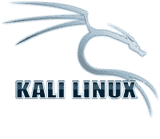
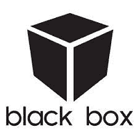
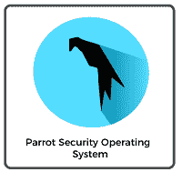
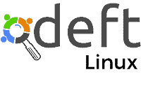
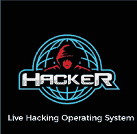
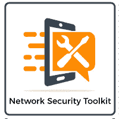
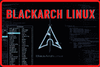
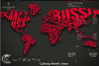
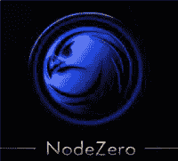

# 最佳黑客操作系统

> 原文：<https://www.javatpoint.com/best-operating-system-for-hacking>

黑客攻击是指试图未经授权访问计算机系统或计算机内部的专用网络。简单来说，就是因为未经授权的原因，对计算机网络安全系统进行未经授权的使用或控制。黑客使用各种技术来发现威胁，以提高设备的安全性。黑客可以使用基于 Linux 的操作系统来入侵计算机或网络。它包括一系列防止网络攻击的程序。在本文中，您将学习黑客攻击的最佳操作系统。

黑客有各种最好的操作系统。一些流行的操作系统如下:

1.  kali Linux
2.  **黑盒**
3.  **鹦鹉安全操作系统**
4.  **Fedora 安全实验室**
5.  **DEFT Linux**
6.  **直播黑客操作系统**
7.  **网络安全工具包(NST)**
8.  **BlackArch Linux**
9.  **生化人鹰 Linux**
10.  **节点结构**

## Kali Linux

它是最流行的黑客操作系统。这是一个基于 Debian Linux 构建的 Linux 发行版，旨在用于数字取证和渗透测试。由**进攻安全有限公司**出资维护。Kali Linux 是黑客最好最受欢迎的操作系统。其中包括首次针对 Nexus 设备的开源安卓渗透测试。Kali Linux 操作系统的另一个重要方面是它的取证模式。

它支持从任何可引导介质实时引导操作系统，用于入侵计算机系统的取证。它还拥有所有标准的 Linux 优势和工具。说到安全工具，这款最符合伦理的黑客操作系统附带了超过 **600** 的预装笔测试工具，这些工具定期更新，可用于许多平台，如 **ARM** 和 **VMware** 。

### 卡利 Linux 的特点

Kali Linux 的各种特性如下:

1.  它可能会在不下载最新版本的情况下更新。
2.  它支持 USB 实时安装。
3.  有 **32** 位和 **64** 位
4.  您可以轻松地在网络上定制和自动安装 Kali Linux。

## 黑盒子

BackBox 是一个广泛使用的测试和渗透工具，它基于 Ubuntu Linux。它提供渗透测试和安全评估、网络和信息系统分析工具箱以及一套全面的额外工具，用于道德黑客和安全测试。

这是一个非常推荐黑客使用的操作系统。它包括网络安全、漏洞测试、web 应用程序分析、取证、压力测试和利用，以及许多测试和黑客领域。它包括一个默认的 Launchpad 存储库，其中包含最新的黑客和安全测试工具。

### 黑盒的特点

黑盒的各种特性如下:

1.  它使用系统的最少资源。
2.  它是完全自动和非侵入性的，不需要代理或网络配置更改来提供定期的自动配置备份。
3.  它节省了时间，并且不需要跟踪特定的网络设备。
4.  它是首批允许云渗透测试的平台之一。
5.  它提供了一个易于使用的桌面环境。

## 鹦鹉安全操作系统

它建立在 **Debian GNU/Linux** 之上。它结合了 Frozenbox 操作系统和 Kali Linux，让道德黑客在现实环境中获得更好的渗透和安全测试体验。Frozenbox 团队还创建了它来提供匿名网络浏览、计算机取证以及漏洞评估和缓解。

鹦鹉安全操作系统利用 Kali 存储库来更新包和集成新工具。它使用 **MATE** 桌面环境和 **LightDM** 显示管理器，为计算机分析师执行取证、漏洞分析和加密提供了一个简单的图形用户界面(GUI)和轻量级环境。它还以其高度可定制性和强大的社区支持而闻名。

与其他道德黑客操作系统不同，它是一个云友好的 Linux 发行版。这是一个轻量级的 Linux 发行版，运行在至少有 **265Mb** 内存的设备上，适用于 **32 位**和 **64 位**，特定版本适用于旧的 **32 位**电脑。

### 鹦鹉安全操作系统的特点

鹦鹉安全操作系统的各种功能如下:

1.  它支持 FALCON 1.0 编程语言和许多编译器和调试器，以及 Qt5 and.NET/mono 框架。
2.  您可以与其他人共享此操作系统。
3.  它是轻量级软件，可以用最少的资源执行。
4.  它提供专家的支持，在网络安全方面帮助你。

## 软呢帽安全实验室

它允许你进行取证、安全审计和黑客攻击。它包括一个快速整洁的桌面环境。它包括关键的网络工具，如 Wireshark、Medusa、Sqlninja、Yersinia 等。它简化了笔测试和安全测试。

### Fedora 安全实验室的特点

Fedora 安全实验室的各种功能如下:

1.  您可以永久保存测试结果。
2.  它有一个定制的菜单，提供遵循正确测试路径所需的所有说明。
3.  它创建了一个实时映像，允许在系统运行时安装软件。
4.  它可能会成为一个实时 USB 创建者。

## DEFT Linux

**DEFT(数字证据与取证工具包)**是最伟大的黑客操作系统的选择。它是基于 Ubuntu 操作系统的开源 Linux 发行版，是在 **DART(数字高级响应工具包)**软件上开发的。这是一个取证操作系统，可以在计算机上实时运行，不会篡改硬盘或其他存储设备。它包括超过 **100 个**备受推崇的取证和黑客工具。

它从头开始构建，为个人、军队、警察部门、信息技术审计员和调查人员提供最佳的开源计算机取证和事件响应工具。

### DEFT Linux 的特点

DEFT Linux 的各种特性如下:

1.  它完全支持安卓和 iOS 7.1 逻辑收购和 Bitlocker 加密磁盘。
2.  它包括数字取证框架 1.3。
3.  它基于 Ubuntu 操作系统，包括开源数字取证和渗透测试软件。

## 实时黑客操作系统

它是一个基于 Linux 的直播操作系统，可以直接从 **CD/DVD** 上操作，无需安装。它是一个 Linux 发行版，包括各种用于道德黑客、对策验证和渗透测试的工具和应用程序。这个基于 Debian 的操作系统包括超过 **600** 软件。它包含 **GNOME** 图形用户界面。还有第二个版本是指令专用的，对硬件的要求要低得多。预装笔测试工具，让安全工具箱更丰富。

### 实时黑客操作系统的特点

实时黑客操作系统的各种特性如下:

1.  它提供所有的安全工具。
2.  它有无线网络实用程序。

## 网络安全工具包

这是一张支持 Fedora 操作系统的可引导实时光盘。是一个运行 Linux 的 Live **USB/DVD** 闪存盘。它提供免费和开源的网络和计算机系统安全工具，可用于黑客攻击。该工具包的创建是为了方便访问更好的开源网络安全程序，它将在大多数 **x86** 平台上运行。开发该工具包的主要目的是为网络安全管理员提供一套完整的开源网络安全工具。

### 网络安全工具包的特点

网络安全工具包的各种功能如下:

1.  使用网络用户界面很容易。
2.  它包括监控具有虚拟机的虚拟服务器。
3.  它提供了对开源网络安全应用程序的简单访问。
4.  它还提供网络系统监控。

## BlackArch Linux

它是基于 Arch Linux 的渗透测试人员和安全研究人员的渗透测试分发版。它包括超过 **1600 个**工具，被安全研究人员认为是执行基于 Web 和应用程序的安全测试的理想分布。在工具多样性和易用性方面，它是 Kali Linux 和 Backbox 的有力竞争者。

对于安全研究人员来说，它通常是 Arch Linux 的轻量级扩展。Arch Linux 可能会加载到 **32 位**和 **64 位**计算机和基于 ARM 的开发板上，如树莓 Pi、BeagleBone 等。前者的工具集可以在 Arch Linux 非官方用户存储库中访问，甚至可以加载到现有的 Arch Linux 发行版上。

### BlackArch Linux 的特点

BlackArch Linux 的各种特性如下:

1.  它包含模块化包组。
2.  可以从源位置执行安装。
3.  它有各种开箱即用的工具。

## Linux 半机械鹰

它是最先进、最强大的基于 Ubuntu 的渗透测试 Linux 发行版。由 **Ztrela 知识解决方案 Pvt 有限公司**开发。它包括超过 **700** 渗透测试工具和超过 **300** 移动安全和恶意软件分析工具。

最新版本的 Cyborg Hawk Linux 包括它的存储库，它是完全开源的，可以免费使用。根据道德黑客和笔测试人员的说法，该分布对于现实世界的网络压力测试、恶意软件分析和后门检测非常稳定和可靠。

### 赛博格霍克 Linux 的特点

Cyborg Hawk Linux 的各种特性如下:

1.  它提供了一个安全且补丁完善的内核。
2.  它为无线设备提供支持。
3.  它具有作为实时操作系统运行的全部能力。
4.  它在发行版中管理有序的菜单。

## 节点零

这是一个基于 Ubuntu 的开源渗透测试 Linux 发行版，从 Ubuntu 存储库中获取更新。它由超过 **300 个**渗透测试工具和所有类型操作所需的基本服务集合组成。Linux 发行版以双拱形实时 **DVD ISO** 映像的形式提供，供下载，它可以在 **32 位**和 **64 位**计算机平台上运行。实时操作系统支持许多其他功能，包括系统内存诊断测试、安全模式引导、硬盘引导、文本模式、直接安装和调试模式。

### 零节点的特性

NodeZero 的各种特性如下:

1.  它是一个开源的基于 Ubuntu 的渗透测试 Linux 发行版。
2.  它可以在 32 位**和 64 位**计算设备上运行。
3.  它提供了许多功能，包括直接安装、安全模式引导、硬盘引导等。

* * *