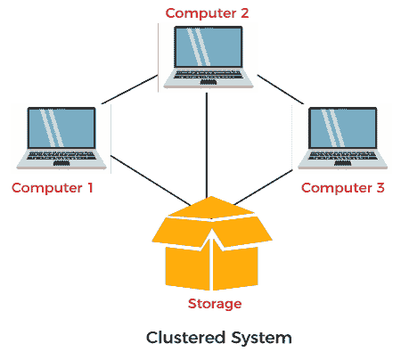

# 集群操作系统

> 原文：<https://www.javatpoint.com/clustered-operating-system>

集群系统类似于并行系统，因为两个系统都使用多个 CPU。主要区别在于集群系统是由两个或多个独立的系统链接在一起组成的。他们有独立的计算机系统和共享的存储介质，所有系统一起工作来完成所有任务。所有集群节点使用两种不同的方式相互交互，如**消息传递接口(MPI)** 和**并行虚拟机(PVM)** 。

在本文中，您将了解集群操作系统、其类型、分类、优点和缺点。

## 什么是集群操作系统？

集群操作系统是**软件**和**硬件**集群的组合。硬件集群有助于在所有计算机系统之间共享高性能磁盘，而软件集群为所有系统的运行提供了更好的环境。集群系统由不同的节点组成，每个节点都包含自己的集群软件。群集软件安装在群集系统中的每个节点上，它监控群集系统并确保其正常运行。如果群集系统的一个节点出现故障，其他节点将接管其存储和资源，并尝试重新启动。

集群组件通常通过快速局域网链接，每个节点执行其操作系统实例。在大多数情况下，所有节点共享相同的硬件和操作系统，而在其他情况下可以使用不同的硬件或不同的操作系统。使用集群系统的主要目的是帮助天气预报、科学计算和超级计算系统。

有两个集群可用于构建更高效的集群。这些措施如下:

1.  **软件集群**
2.  **硬件集群**

**软件集群**

软件集群允许所有系统协同工作。

**硬件集群**

它有助于在系统之间共享高性能磁盘。

## 集群操作系统的类型

集群操作系统主要有三种类型:

1.  **非对称集群系统**
2.  **对称聚类系统**
3.  **并联集群系统**

### 非对称聚类系统

在非对称集群系统中，所有节点中有一个节点处于热备用模式，而其余节点运行基本应用程序。热备用模式是完全故障安全的，也是集群系统的一个组成部分。该节点监控所有服务器功能；如果热备用节点停止，它会交换此位置。

### 对称聚类系统

多个节点帮助运行该系统中的所有应用程序，并且它同时监控所有节点。因为它使用所有的硬件资源，所以这个集群系统比非对称集群系统更可靠。

### 并行集群系统

并行集群系统使多个用户能够访问同一共享存储系统上的相似数据。该系统是由特定的软件版本和其他应用程序实现的。

## 聚类分类

计算机集群被管理以支持各种目的，从像网络服务支持这样的通用业务需求到计算密集型科学计算。集群有多种分类。其中一些如下:

**1。故障转移集群**

将应用程序和数据资源从故障系统移动到群集中另一个系统的过程称为故障转移。这些数据库用于聚集重要的任务、应用服务器、邮件和文件。

**2。负载平衡集群**

集群需要所有可用计算机系统之间更好的负载平衡能力。这种类型的集群中的所有节点都可以与其他节点共享其计算工作负载，从而获得更好的整体性能。例如，基于 web 的集群可以将各种 web 查询分配给各个节点，因此有助于提高系统速度。说到抓取请求，只有少数集群系统使用循环方法。

**3。高可用性集群**

这些也被称为“高可用性集群”。它们提供了所有资源都可用的高概率。如果出现故障，例如系统故障或磁盘卷丢失，则该过程中的查询会丢失。如果重试丢失的查询，它将由不同的群集计算机处理。它广泛用于新闻、电子邮件、文件传输协议服务器和网络。

## 集群操作系统的优缺点

群集操作系统的各种优点和缺点如下:

### 优势

集群操作系统的各种优势如下:

**1。高可用性**

尽管集群中的每个节点都是独立的计算机，但是单个节点的故障并不意味着服务的丢失。单个节点可以被拉下来进行维护，而剩余的集群承担该单个节点的负载。

**2。成本效率**

与高可靠性和更大的存储主机相比，这些类型的集群计算系统被认为更具成本效益和更便宜。此外，这些系统中的大多数在性能方面都优于大型计算机系统。

**3。额外的可扩展性**

集群的设置方式是，更多的系统可以以较小的增量添加到集群中。集群可以以水平方式添加系统。这意味着可以向集群添加额外的系统，以提高它们的性能、容错性和冗余性。

**4。容错**

集群系统具有很强的容错性，单个节点的丢失不会导致系统故障。他们还可能有一个或多个处于热备用模式的节点，这允许他们替换故障节点。

**5。性能**

群集通常用于提高单台计算机系统的可用性和性能，而通常比同等速度或可用性的单台计算机系统更具成本效益。

**6。加工速度**

处理速度也类似于市场上的大型机系统和其他类型的超级计算机。

### 不足之处

群集操作系统的各种缺点如下:

**1。性价比高**

这种设计的一个主要缺点是不划算。成本很高，并且集群将比非集群服务器管理设计更昂贵，因为它需要良好的硬件和设计。

**2。所需资源**

集群需要使用额外的服务器和硬件，使得监控和维护变得困难。因此，必须改善基础设施。

**3。维护**

系统的建立、监控和维护并不容易。

* * *