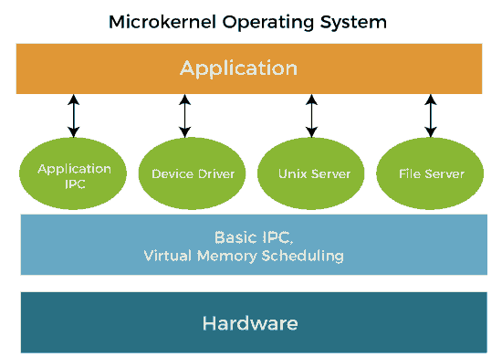

# 操作系统中的微内核

> 原文：<https://www.javatpoint.com/microkernel-in-operating-system>

在本文中，您将了解微内核的体系结构、优点和缺点。但是在讨论微内核之前，您必须了解内核。

## 什么是内核？

它是操作系统中处理系统资源的核心组件。它还充当计算机应用程序和硬件之间的桥梁。它是计算机启动时加载的初始程序之一。当一个操作系统被加载时，内核是第一个加载到内存中的组件，并停留在那里直到操作系统被关闭。它负责各种活动，包括任务管理、磁盘管理和内存管理。

## 什么是微内核？

微内核是内核的分类之一。作为一个内核，它处理所有的系统资源。另一方面，微内核中的用户和内核服务在不同的地址空间中实现。**用户服务**保存在**用户地址空间**中，而**内核服务**保存在**内核地址空间**中。它有助于减小内核和操作系统的大小。

它提供最少量的进程和内存管理服务。客户端应用程序和在用户地址空间中运行的服务之间的交互是通过消息传递建立的，这有助于降低微内核的执行速度。操作系统不受影响，因为内核和用户服务是隔离的，所以如果任何用户服务失败，内核服务不受影响。它是可扩展的，因为新的服务被添加到用户地址空间，因此不需要改变内核空间。它重量轻、安全可靠。

微内核及其用户环境通常用在 C++或 C 语言中，带有一点汇编。另一方面，其他实现编程语言可能带有一些高级代码。

## 微内核体系结构

微内核是正确实现操作系统所需的最少软件。内存、进程调度方法和基本的进程间通信都包括在内。

在上图中，微内核包括基本需求，如进程调度机制、内存和进程间通信。它是唯一在特权级别(即内核模式)执行的程序。操作系统的其他功能从内核模式移出，在用户模式下执行。

微内核确保代码可以很容易地被控制，因为服务在用户空间中是分开的。这意味着一些代码在内核模式下运行，从而提高了安全性和稳定性。

由于内核是最关键的操作系统组件，它负责基本服务。因此，在这种设计下，在这种架构中，只有最重要的服务存在于内核中。相比之下，其余的操作系统服务在系统应用软件中是可用的。因此，用户可以在系统应用程序中与这些不必要的服务进行交互。微内核完全负责操作系统最重要的服务，如下所示:

1.  **进程间通信**
2.  **内存管理**
3.  **CPU 调度**

### 进程间通信

进程间通信是指进程如何相互作用。一个进程有几个线程。在内核空间中，任何进程的线程都相互作用。使用端口跨线程发送和接收消息。在内核级，有几个端口，如进程端口、例外端口、引导端口和注册端口。所有这些端口都与用户空间进程交互。

### 内存管理

内存管理是在主内存中为进程分配空间的过程。然而，还有为进程创建虚拟内存。虚拟内存意味着，如果一个进程的大小大于主内存，它将被划分成多个部分并进行存储。之后，一个接一个，进程的每个部分都存储在主内存中，直到 CPU 执行。

### 中央处理器调度

CPU 调度是指 CPU 接下来要执行哪个进程。所有进程都排队，一次执行一个。每个进程都有一个优先级，优先级最高的进程先执行。中央处理器调度有助于优化中央处理器利用率。此外，资源正得到更有效的利用。它还最大限度地减少了等待时间。等待时间表明一个进程在队列中花费的时间更少，资源分配给该进程的速度更快。CPU 调度也减少了响应和周转时间。

## 微内核的组件

微内核只包含系统的基本功能。一个组件只有在放在外面会破坏系统运行的情况下才包含在微内核中。用户模式应该用于所有其他非必要组件。微内核所需的最低功能如下:

1.  在微内核中，也需要处理器调度算法。包括进程和线程调度器。
2.  微内核中应该包含地址空间和其他内存管理机制。还包括内存保护功能。
3.  进程间通信(IPC)用于管理执行自己的地址空间的服务器。

## 微内核的优缺点

微内核的各种优点和缺点如下:

### 优势

1.  微内核是安全的，因为只有那些部分被添加，这可能会干扰系统的功能。
2.  微内核是模块化的，各种模块可以交换、重新加载和修改，而不会影响内核。
3.  微内核架构紧凑且孤立，因此性能可能更好。
4.  系统扩展更容易访问，因此可以在不中断内核的情况下将其引入系统应用程序。
5.  与单片系统相比，微内核的系统崩溃更少。此外，由于微内核的模块化结构，任何确实发生的崩溃都会被简单地处理。
6.  微内核接口有助于实现更加模块化的系统结构。
7.  服务器故障被视为与任何其他用户程序故障相同。
8.  它无需重新编译即可添加新功能。

### 不足之处

1.  当驱动程序实现为过程时，需要上下文切换或函数调用。
2.  在微内核系统中，提供服务比在传统的单一系统中更昂贵。
3.  微内核系统的性能可能是无关紧要的，并导致问题。

* * *