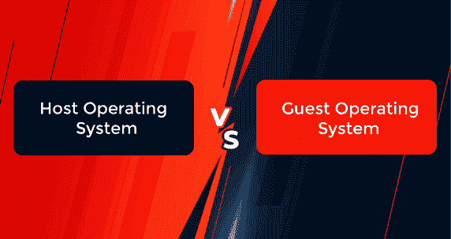

# 主机和客户操作系统的区别

> 原文：<https://www.javatpoint.com/host-vs-guest-operating-system>

在本文中，您将了解主机和客户机操作系统之间的区别。但是在讨论差异之前，您必须了解主机和来宾操作系统。

## 什么是主机操作系统？

主机操作系统是安装在计算机上的软件，允许它与硬件接口。它能够运行类型 2 虚拟机管理程序。换句话说，类型 2 虚拟机管理程序在主机操作系统上执行。

主机操作系统也可以使用基于容器的虚拟化。容器有助于服务器程序的逻辑分区。因此，可以在不为每个应用程序提供完整操作系统的情况下使用容器。它允许应用程序共享操作系统的内核，同时使用不同的硬件资源。这种类型的共享操作系统也称为主机操作系统。

由于虚拟化，单个物理服务器可能被划分为多个虚拟机，这些虚拟机是具有大量处理、存储、网络能力和内存的硬件的独立部分。在主机和客户机操作系统之间共享资源时，虚拟化效率更高，成本更低。

## 什么是客户操作系统？

类型 2 虚拟机管理程序可以创建多个虚拟机。每台机器都有自己的操作系统，这些被称为客户操作系统。换句话说，客户操作系统是安装在虚拟系统中的软件。因此，虚拟机运行客户操作系统客户操作系统在几个方面不同于主机操作系统，并且它可以在虚拟化中充当部分系统组件或虚拟机部分。它主要用于其他操作系统上的应用程序。

虽然来宾操作系统和主机操作系统共享资源，但它们的活动完全相互独立。这几个操作系统同时运行是可行的，但是应该先启动主机操作系统。使用来宾操作系统的主要优势之一是运行与主机操作系统不兼容的应用程序和程序。

## 主机操作系统和客户机操作系统之间的主要区别

在这里，您将了解主机操作系统和来宾操作系统之间的主要区别。主机操作系统和来宾操作系统之间的各种主要差异如下:

1.  主机操作系统是安装在计算机系统上并与底层硬件通信的软件。相比之下，来宾操作系统是安装在虚拟机中的软件。
2.  主机操作系统直接在硬件上执行。相比之下，来宾操作系统在虚拟机上执行。
3.  主机操作系统可以是单一的。相比之下，来宾操作系统可以是单个或多个。

## 主机操作系统和客户操作系统之间的面对面比较

在这里，您将了解主机操作系统和来宾操作系统之间的面对面比较。主机操作系统和来宾操作系统之间的各种面对面比较如下:

| 特征 | 主机操作系统 | 客户操作系统 |
| **定义** | 主机操作系统是安装在计算机系统上并与底层硬件通信的软件。 | 来宾操作系统是安装在虚拟机中的软件。 |
| **功能** | 主机操作系统与硬件进行交互。 | 来宾操作系统与虚拟机进行交互。 |
| **数量** | 主机操作系统可以是单一的。 | 来宾操作系统可以是多个或单个的。 |
| **执行** | 它直接在硬件上运行。 | 它在虚拟机上运行。 |

## 结论

基本而言，原始操作系统是提供客户操作系统可以运行的环境的主机操作系统。主机操作系统和来宾操作系统之间的主要区别在于主机操作系统直接在硬件上运行。相比之下，客户操作系统运行在虚拟机上。

* * *