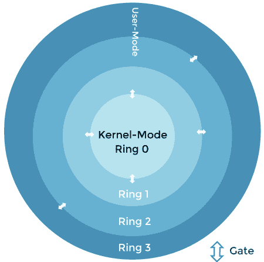
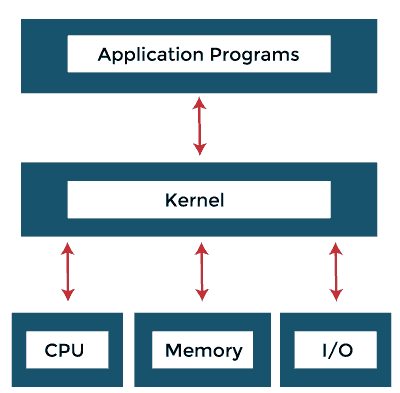
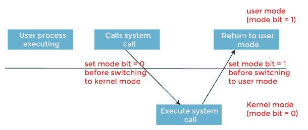

# 操作系统中的双模操作

> 原文：<https://www.javatpoint.com/dual-mode-operations-in-operating-system>

操作系统中的双模操作保护操作系统免受非法用户的攻击。我们通过将一些系统指令指定为可能造成伤害的特权指令来完成这种防御。硬件只允许在内核模式下执行特权指令。特权指令的一个例子是切换到用户模式的命令。其他示例包括监视输入/输出、控制计时器和处理中断。

为了确保正确的操作系统执行，我们必须区分机器代码执行和用户定义代码。大多数计算机系统已经接受提供硬件支持来帮助区分不同的执行模式。我们操作系统有两种模式: ***用户模式*** 和 ***内核模式*** 。

需要模式位来标识当前指令以哪种特定模式执行。如果模式位为 1，则运行用户模式，如果模式位为 0，则运行内核模式。

#### 注:在系统启动时，它总是从内核模式开始。

### 操作系统中双模式的类型

操作系统有两种操作模式来确保其正常工作:用户模式和内核模式。

**1。用户模式**

当计算机系统在用户模式下运行用户应用程序(如文件创建或任何其他应用程序)时，该模式不能直接访问计算机硬件。为了执行与硬件相关的任务，例如当用户应用程序向操作系统请求服务或发生某种中断时，在这些情况下，系统必须切换到内核模式。用户模式的模式位为 1。这意味着，如果系统处理器的模式位为 1，则系统将处于用户模式。

**2。内核模式**

操作系统的所有底层任务都在内核模式下执行。由于内核空间可以直接访问系统的硬件，所以内核模式处理所有需要硬件支持的进程。除此之外，内核模式的主要功能是执行特权指令。

用户不能访问这些特权指令，这就是为什么这些指令不能在用户模式下处理。因此，用户被限制干预的所有进程和指令都在操作系统的内核模式下执行。内核模式的模式位为 0。因此，要使系统在内核模式下运行，处理器的模式位必须等于 0。

### 例子

通过模式位，我们可以区分代表操作系统执行的任务和代表用户执行的任务。

*   当计算机系统代表用户应用程序执行时，系统处于 ***用户模式*** 。
*   然而，当用户应用程序通过系统调用从操作系统请求服务时，它必须从 ***用户*** 转换到 ***内核模式*** 来满足请求。正如我们可以说的，这种架构增强对于系统操作的许多其他方面都是有用的。
*   系统启动时，硬件在 ***内核模式*** 下启动。
*   然后加载操作系统，并在 ***用户模式*** 下启动用户应用。
*   每当陷阱或中断发生时，硬件从 ***用户模式*** 切换到 ***内核模式*** ，将模式位的状态更改为 0。
*   因此，每当操作系统获得对计算机的控制时，它就处于 ***内核模式*** 。
*   在将控制权交给用户程序之前，系统总是通过将模式位设置为 1 来切换到用户模式 。

### 需要双模操作

某些类型的进程将对用户隐藏，某些任务不需要任何类型的硬件支持。使用操作系统的 ***双模*** ，这些任务可以单独处理。

此外，操作系统需要在 ***双模*** 中运行，因为内核级程序执行操作系统的所有底层功能，如进程管理、内存管理等。如果用户改变这些，那么这可能导致整个系统故障。因此，为了指定用户只能访问他们使用的任务，双模式对于操作系统是必要的。

因此，每当系统在用户应用程序上工作时，它都处于用户模式。每当用户请求一些硬件服务时，就会发生从用户模式到内核模式的转换，这是通过将模式位从 1 更改为 0 来实现的。为了返回用户模式，模式位再次变为 1。

### 用户模式和内核模式切换

在其生命周期中，进程以用户模式和内核模式执行。用户模式是一种正常模式，在这种模式下，进程的访问权限有限。然而，内核模式是特权模式，进程可以不受限制地访问系统资源，如硬件、内存等。进程可以通过在内核模式下执行访问内核数据来访问硬件输入/输出等服务。任何与进程管理、输入/输出硬件管理和内存管理相关的事情都需要一个进程在内核模式下执行。

这一点很重要，要知道内核模式下的进程可以访问任何设备和内存，同时内核模式下的任何崩溃都会导致整个系统崩溃。但是用户模式下的任何崩溃只会导致错误的进程。

内核提供系统调用接口(SCI)，是用户进程进入内核模式的入口点。系统调用是进程从用户模式进入内核模式的唯一途径。下图详细解释了用户模式到内核模式的切换。

*   在用户模式下，应用进程调用 **Glibc** ，这是软件程序员使用的库。
*   Glibc 库知道不同体系结构调用系统调用的正确方法。它根据架构的应用程序二进制接口(ABI)设置传递参数，为系统调用输入做准备。
*   现在，Glibc 调用 ARM 的软件中断指令，通过更新 CPSR 寄存器的模式位，将处理器置于监控模式，并跳转到向量地址 0x08。
*   到目前为止，流程执行处于用户模式。在 SWI 指令执行之后，进程被允许执行内核代码。内存管理单元(MMU)现在将允许内核虚拟内存访问和执行这个过程。
*   从向量地址 0x08，进程执行加载并跳转到软件中断处理程序例程，ARM 的**向量 _swi()** 。
*   在 **vector_swi()** 中，从 swi 指令中提取系统调用号(SCNO)，执行跳转到系统调用表 **sys_call_table** 中以 SCNO 为索引的系统调用函数。
*   在系统调用执行之后，在返回路径中，用户空间寄存器在用户模式下开始执行之前被恢复。

### 为什么我们需要交换？

在用户模式和内核模式之间切换背后有两个主要原因，例如:

1.  如果一切都以单一模式运行，我们将在早期版本的 Windows 中遇到微软的问题。如果一个进程能够利用漏洞，那么这个进程就可以控制系统。
2.  某些情况被称为陷阱、异常或系统故障，通常是由异常情况(如被零除、无效内存访问等)引起的。如果进程在内核模式下运行，这种陷阱情况会导致整个操作系统崩溃。在用户模式下遇到陷阱情况的进程只会使用户模式进程崩溃。

因此，交换的开销是可以接受的，以确保更稳定、更安全的系统。

### 用户模式和内核模式的区别

计算机以用户模式或内核模式运行。用户模式和内核模式的区别在于，用户模式是应用程序运行的受限模式，内核模式是计算机在访问硬件资源时进入的特权模式。

计算机正在这两种模式之间切换。频繁的上下文切换会降低速度，但不可能在内核模式下执行所有进程。那是因为；如果一个进程失败，整个操作系统可能会失败。以下是用户模式和内核模式之间的更多区别，例如:

| 条款 | 用户状态 | 核心态 |
| 定义 | 用户模式是一种受限模式，应用程序在此模式下执行和启动。 | 内核模式是计算机在访问硬件资源时进入的特权模式。 |
| 模式 | 用户模式被认为是从属模式或受限模式。 | 内核模式是系统模式、主模式或特权模式。 |
| 地址空间 | 在用户模式下，进程获得自己的地址空间。 | 在内核模式下，进程获得一个地址空间。 |
| 中断 | 在用户模式下，如果发生中断，只有一个进程失败。 | 在内核模式下，如果发生中断，整个操作系统可能会失败。 |
| 限制 | 在用户模式下，访问内核程序是有限制的。无法直接访问它们。 | 在内核模式下，用户程序和内核程序都可以访问。 |

* * *