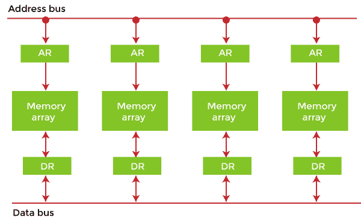
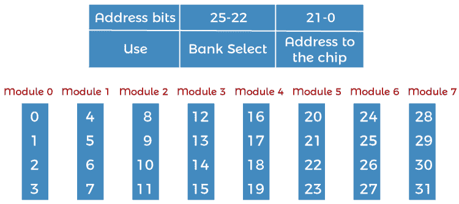
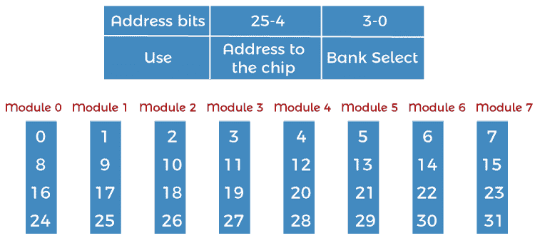

# 什么是交错内存？

> 原文：<https://www.javatpoint.com/what-is-interleaved-memory>

交错存储器旨在通过在存储体之间均匀分布存储器地址来补偿动态随机存取存储器(DRAM)或核心存储器相对较慢的速度。这样，连续的内存读写使用每个内存库，由于减少了等待内存库为操作做好准备的时间，从而提高了内存吞吐量。

它不同于多通道内存架构，主要是因为交错内存不会在主内存和内存控制器之间增加更多通道。然而，信道交织也是可能的，例如在 ***【飞思卡尔】*** i.MX6 处理器中，其允许在两个信道之间进行交织。使用交错内存时，内存地址被分配给每个内存库。

### 交错存储器的例子

这是一种抽象技术，它将内存分成许多模块，这样地址空间中的连续字就被放在不同的模块中。

假设我们有 4 个存储体，每个包含 256 个字节，然后面向块的方案(无交织)将虚拟地址 0 到 255 分配给第一个存储体，256 到 511 分配给第二个存储体。但是在交错存储器中，虚拟地址 0 将与第一存储体在一起，1 与第二存储体在一起，2 与第三存储体在一起，3 与第四存储体在一起，然后 4 再次与第一存储体在一起。

因此，中央处理器可以立即访问替代部分，而无需等待内存被缓存。有多个存储体轮流提供数据。

在上述 4 个存储体的例子中，虚拟地址为 0、1、2 和 3 的数据可以同时访问，因为它们位于不同的存储体中。因此，我们不必等待完成数据提取来开始下一个操作。

具有 n 个存储体的交错存储器被称为 ***n 路交错*** 。在一个交错存储系统中仍然有两个内存库，但从逻辑上来说，这个系统似乎有一个两倍大的内存库。

在下面具有 2 个存储体的交错存储体表示中，存储体 0 的第一个长字由存储体 1 的长字流过，接着是存储体 0 的第二个长字，接着是存储体 1 的第二个长字，以此类推。

下图显示了 n 个长单词的两个物理库的组织。逻辑库的所有偶数长字都位于物理库 0 中，所有奇数长字都位于物理库 1 中。

### 为什么我们要使用内存交错？

当处理器从主存储器请求数据时，数据块(组块)被传送到高速缓存，然后传送到处理器。因此，每当发生缓存未命中时，数据都将从主内存中取出。但是主存相对比缓存慢。因此，为了提高主存储器的存取时间，使用了交错。

例如，我们可以同时访问所有四个模块，从而实现并行。可以使用较高的位从模块获取数据。这种方法有效地利用了内存。

### 交错存储器的类型

在操作系统中，有两种类型的交错内存，例如:

**1。高阶交错:**在高阶存储器交错中，存储器地址的最高有效位决定特定位置所在的存储体。但是，在低阶交错中，存储地址的最低有效位决定了存储体。

最低有效位作为地址发送到每个芯片。一个问题是连续的地址往往在同一个芯片上。数据传输的最大速率受到内存周期时间的限制。也被称为 ***【记忆银行】*** 。

**2。低阶交错:**最低有效位选择低阶交错中的存储体(模块)。在这种情况下，连续的内存地址位于不同的内存模块中，允许比周期时间更快的内存访问。

### 交错内存的优势

指令流水线可能同时需要来自主存储器的指令和操作数，这在传统的存储器访问方法中是不可能的。类似地，算术流水线需要同时从主存储器中提取两个操作数。因此，为了克服这个问题，内存交错来解决这个问题。

*   它允许同时访问不同的内存模块。模块化内存技术允许中央处理器启动一个模块的内存访问，而其他模块则忙于中央处理器的读或写操作。因此，我们可以说交错内存会独立于其他模块的状态来满足每个内存请求。
*   因此，出于这个显而易见的原因，交叉存储使系统比非交叉存储更加灵敏和快速。此外，通过同步内存访问，中央处理器处理时间也减少，吞吐量增加。交织存储器在具有流水线和向量处理的系统中是有用的。
*   在交错存储器中，连续的存储器地址分布在不同的存储器模块中。比方说，在一个字节可寻址的 4 路交织存储器中，如果字节 0 在第一个模块中，那么字节 1 将在第二个模块中，字节 2 将在第三个模块中，字节 3 将在第四个模块中，并且字节 4 将再次落在第一个模块中，如此继续下去。
*   一种 n 路交错存储器，其中主存储器被分成 n 个存储体，系统可以从 n 个不同的存储体同时访问 n 个操作数/指令。这种存储器访问可以将存储器访问时间减少接近存储体数量的一个因素。在这个内存交错的内存位置，我可以在库 **i mod n** 中找到。

### 交错动态随机存取存储器

主存储器通常由一组动态随机存取存储器芯片组成，其中许多芯片可以组合在一起形成一个存储体。有了支持交错的存储控制器，就有可能布局这些存储体，从而使存储体交错。

动态随机存取存储器中的数据以页为单位存储。每个动态随机存取存储器存储体都有一个行缓冲器，用作访问存储体中任何页面的高速缓存。在读取动态随机存取存储器组中的一页之前，它首先被加载到行缓冲器中。如果页面立即从行缓冲区读取，则在一个内存周期内，它具有最短的内存访问延迟。假设是行缓冲区未命中，这也称为行缓冲区冲突。它比较慢，因为新页面在被读取之前必须被加载到行缓冲区中。当服务于同一存储体中不同存储页上的访问请求时，会发生行缓冲区未命中。行缓冲区冲突会导致内存访问的大量延迟。相比之下，对不同存储体的存储器访问可以以高吞吐量并行进行。

在传统布局中，可以为存储体分配一个连续的内存地址块，这对于内存控制器来说非常简单，并且在完全随机访问的情况下，与通过交错实现的性能水平相比，性能相当。然而，由于引用的局部性，内存读取很少是随机的，优化紧密结合的访问在交错布局中提供了更好的性能。

内存寻址的方式不会影响已经缓存的内存位置的访问时间，只会影响需要从动态随机存取存储器中检索的内存位置。

* * *