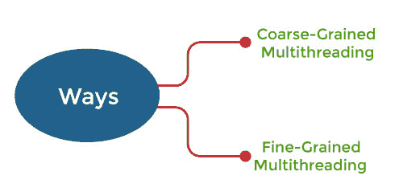
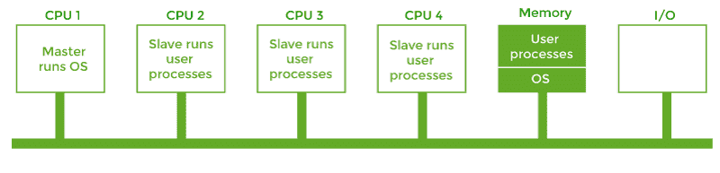

# 操作系统中的多处理器调度

> 原文：<https://www.javatpoint.com/multiple-processors-scheduling-in-operating-system>

**多处理器调度**或多处理器调度侧重于设计系统的调度功能，该功能由多个处理器组成。在多处理器调度中，多个 CPU 共享负载(负载共享)，以便各种进程同时运行。一般来说，与单处理器调度相比，多处理器调度是复杂的。在多处理器调度中，有许多处理器，它们是相同的，我们可以随时运行任何进程。

系统中的多个中央处理器紧密通信，共享公共总线、内存和其他外围设备。所以我们可以说系统是紧密耦合的。当我们要处理大量数据时，就会用到这些系统，这些系统主要用于卫星、天气预报等。

就多处理器调度中的功能而言，有时处理器是相同的，即同质的。我们可以使用任何可用的处理器来运行队列中的任何进程。

多处理器系统可能是*(不同种类的中央处理器)或*(同一中央处理器)。可能有特殊的调度限制，例如设备通过专用总线只连接到一个**

 **CPU。

对于只有一个处理器的系统来说，没有任何策略或规则可以被称为最佳调度解决方案。同样，对于具有多个处理器的系统，也没有最佳的调度解决方案。

### 多处理器调度方法

操作系统中有两种多处理器调度方法:对称多处理和非对称多处理。

1.  **对称多处理:**在每个处理器都是 ***自调度*** 的情况下使用。所有进程都可以在一个公共的就绪队列中，或者每个处理器都有自己的就绪进程专用队列。通过让每个处理器的调度器检查就绪队列并选择要执行的进程，调度进一步进行。
2.  **非对称多处理:**当所有的调度决策和 I/O 处理都由名为 ***主服务器*** 的单个处理器处理时使用。其他处理器只执行 ***用户代码*** 。这很简单，减少了数据共享的需要，整个场景称为非对称多处理。

### 处理器关联性

处理器相似性是指一个进程与它当前运行的处理器具有*相似性。当一个进程在特定的处理器上运行时，会对缓存内存产生一定的影响。进程最近访问的数据填充处理器的缓存。因此，进程的连续内存访问通常在缓存中得到满足。*

 *现在，假设进程迁移到另一个处理器。在这种情况下，第一个处理器的高速缓冲存储器的内容必须无效，第二个处理器的高速缓冲存储器必须重新填充。由于无效和重新填充高速缓存的高成本，大多数 SMP(对称多处理)系统试图避免将进程从一个处理器迁移到另一个处理器，并保持一个进程在同一处理器上运行。这就是所谓的处理器关联性。处理器关联性有两种类型，例如:

1.  **软亲和:**当操作系统有一个策略，让一个进程在同一个处理器上运行，但不保证它会这样做，这种情况称为软亲和。
2.  **硬关联:**硬关联允许进程指定它可能运行的处理器子集。一些 Linux 系统实现了软亲和，并提供了类似***sched _ setaffinity()***的系统调用，这些系统调用也支持硬亲和。

### 负载平衡

负载平衡是一种现象，它使工作负载均匀地分布在 SMP 系统中的所有处理器上。只有在每个处理器都有自己的专用进程队列的系统上，负载平衡才是必要的。

负载平衡是不必要的，因为一旦处理器空闲，它会立即从公共运行队列中提取可运行的进程。在 SMP(对称多处理)上，重要的是保持所有处理器之间的工作负载平衡，以充分利用多处理器的优势。一个或多个处理器将处于空闲状态，而其他处理器具有高工作负载以及等待中央处理器的处理器列表。有两种通用的负载平衡方法:

1.  **推送迁移:**在推送迁移中，任务会例行检查每个处理器上的负载。如果发现不平衡，它会将进程从过载的处理器转移到空闲或不太忙的处理器，从而平均分配每个处理器上的负载。
2.  **拉迁移:**当空闲处理器从繁忙处理器中拉出等待执行的任务时，就会发生拉迁移。

### 多核处理器

在多核处理器中，多个处理器内核被放置在同一个物理芯片上。每个内核都有一个寄存器集来维护其体系结构状态，因此在操作系统看来，它是一个独立的物理处理器。 ***使用多核处理器的 SMP 系统*** 比每个处理器都有自己的物理芯片的系统速度更快，功耗更低。

然而，多核处理器可能会使调度问题复杂化。当处理器访问内存时，它会花费大量时间等待数据变得可用。这种情况叫做 ***记忆失速*** 。出现这种情况有多种原因，例如高速缓存未命中，即访问不在高速缓存中的数据。

在这种情况下，处理器可能会花费高达 50%的时间等待内存中的数据可用。为了解决这个问题，最近的硬件设计已经实现了多线程处理器内核，其中两个或多个硬件线程被分配给每个内核。因此，如果一个线程在等待内存时停止，内核可以切换到另一个线程。多线程处理处理器有两种方法:

1.  **粗粒度多线程:**线程在处理器上执行，直到在粗粒度多线程中出现长延迟事件，如内存停滞。由于长延迟事件造成的延迟，处理器必须切换到另一个线程才能开始执行。线程间切换的成本很高，因为在另一个线程开始在处理器内核上执行之前，必须终止指令流水线。一旦这个新线程开始执行，它就开始用它的指令填充管道。
2.  **细粒度多线程:**这种多线程在线程之间的切换要精细得多，主要是在指令周期的边界。细粒度系统的体系结构设计包括线程切换的逻辑，因此线程之间切换的成本很小。

### 对称多处理机

对称多处理器是第三种模式。在这个模型中，内存中有一个操作系统的副本，但是任何中央处理器都可以运行它。现在，当进行系统调用时，进行系统调用的中央处理器捕获内核并处理该系统调用。这个模型动态地平衡进程和内存。这种方法使用对称多处理，其中每个处理器都是自调度的。

通过让每个处理器的调度器检查就绪队列并选择要执行的进程，调度进一步进行。在这个系统中，所有的进程可能都在一个公共的就绪队列中，或者每个处理器都有自己的就绪进程专用队列。在多处理器操作系统中，主要有三个竞争来源。

*   **锁定系统:**众所周知，资源在多处理器系统中是共享的，为了多处理器之间的安全访问，需要保护这些资源。锁定方案的主要目的是序列化多个处理器对资源的访问。
*   **共享数据:**当多个处理器同时访问同一个数据时，那么可能存在数据不一致的机会，所以为了保护这一点，我们不得不使用一些协议或者锁定方案。
*   **缓存一致性:**是存储在多个本地缓存中的共享资源数据。假设两个客户端有一个缓存的内存副本，一个客户端更改了内存块。另一个客户端可能会留有无效的缓存，而不通知更改，因此可以通过维护数据的一致视图来解决此冲突。

### 主从多处理器

在这种多处理器模型中，有一个单一的数据结构来跟踪就绪的进程。在这个模型中，一个中央处理器作为主处理器工作，另一个作为从处理器工作。所有的处理器都由一个处理器处理，这个处理器叫做主服务器。

主服务器运行操作系统进程，从服务器运行用户进程。所有处理器共享内存和输入输出设备，所有处理器都连接到公共总线。这个系统比较简单，减少了数据共享，所以这个系统叫做 ***【非对称多处理】*** 。

### 虚拟化和线程化

在这种类型的 ***多处理器*** 调度中，即使是单个 CPU 系统也充当多处理器系统。在具有虚拟化的系统中，虚拟化向系统上运行的每个虚拟机呈现一个或多个虚拟 CPU。然后，它在虚拟机之间安排物理 CPU 的使用。

*   大多数虚拟化环境都有一个主机操作系统和许多来宾操作系统，并且主机操作系统创建和管理虚拟机。
*   每个虚拟机都安装了一个客户操作系统，应用程序在该客户中运行。
*   每个客户操作系统可以被分配给特定的用例、应用程序或用户，包括分时或实时操作。
*   任何假定在给定时间内有一定进度的客户操作系统调度算法都将受到虚拟化的负面影响。
*   分时操作系统试图为每个时间片分配 100 毫秒，以给用户一个合理的响应时间。给定的 100 毫秒时间片可能需要比 100 毫秒多得多的虚拟 CPU 时间。根据系统的繁忙程度，时间片可能需要一秒或更长时间，这将导致登录到该虚拟机的用户的响应时间非常短。
*   这种调度分层的净效果是，单个虚拟化操作系统仅接收一部分可用的 CPU 周期，即使它们认为自己正在接收所有周期并调度所有这些周期。虚拟机中的时间时钟通常是不正确的，因为计时器触发的时间不会比专用 CPU 长。
*   虚拟化因此可以消除虚拟机内操作系统的良好调度算法努力。

* * ****