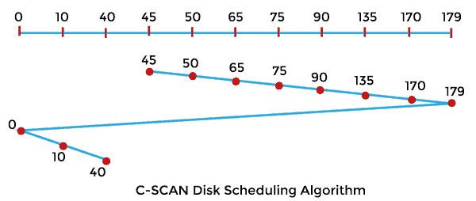
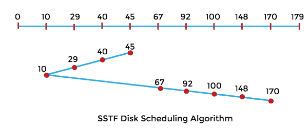

# C-SCAN 与 SSTF 磁盘调度算法的区别

> 原文：<https://www.javatpoint.com/c-scan-vs-sstf-disk-scheduling-algorithm>

在本文中，您将了解 C-SCAN 和 SSTF 磁盘调度算法之间的区别。但是在讨论差异之前，您需要了解 C-SCAN 和 SSTF 磁盘调度算法。

## 什么是 C-SCAN 磁盘调度算法？

也被称为**圆形电梯算法**。它是 SCAN 磁盘调度算法的改进版本。在该算法中，头部处理单个方向上的请求，即它一直扫描到一个方向的末端，然后跳到另一个末端，并在同一方向上为请求提供服务。

**示例:**

让我们取一个带有 **180** 磁道 **(0-179)** 的磁盘，磁盘队列有输入/输出请求，顺序如下: **75、90、40、135、50、170、65、10** 。读/写磁头的初始磁头位置是 **45** ，并将在右侧移动。使用 C-SCAN 算法计算读/写磁头的磁道移动总数。

**解决方案:**

头部运动总数，

最初的头部点是 45 度，

= (50-45) + (65-50) + (75-65) + (90-75) + (135-90) + (170-135) + (179-170) + (179-0) + (10-0) + (40-10)

= 5 + 15 + 10 +15 + 45 + 35 + 9 +179 + 10 + 30

= 353

### C-SCAN 磁盘调度算法的优缺点

C-SCAN 磁盘调度算法有各种优缺点。这些优点和缺点如下:

**优势**

1.  它给出了统一的等待时间。
2.  它提供了更好的响应时间。
3.  磁头从一端移动到另一端，一路上为所有请求提供服务。
4.  C-SCAN 算法是 SCAN 调度算法的改进版本。

**缺点**

1.  如果没有剩余的请求需要处理，磁头将移动到磁盘的末端。

## 什么是 SSTF 磁盘调度算法？

SSTF 代表**最短寻道时间优先**，它服务于最接近头部当前位置的请求。头部指针的方向在该算法中相当重要。如果请求之间出现平局，负责人将按照当前方向处理请求。与 FCFS 相比，SSTF 算法在总寻道时间方面非常有效。

**示例:**

让我们举个例子来理解 SSTF 磁盘调度算法。让我们取一个带有 **180** 磁道 **(0-179)** 的磁盘，磁盘队列有输入/输出请求，顺序如下: **92，100，40，148，67，170，29，10** 。读/写磁头的初始磁头位置为 45°，并将向左侧移动。使用 SSTF 算法计算读/写磁头的磁道移动总数。

**解决方案:**

头部运动总数，

初始水头点为 45°，

= (45-40) + (40-29) + (29-10) + (67-10) + (92-67) + (100-92) + (148-100) + (170-148)

= 5 + 11 + 19 + 57 + 25 + 8 + 48 + 22

= 195

### SSTF 磁盘调度算法的优缺点

SSTF 磁盘调度算法有各种优缺点。这些优点和缺点如下:

**优势**

1.  它提高并增加了吞吐量。
2.  SSTF 的总寻道时间低于 FCFS。
3.  它具有更少的响应时间和平均等待时间。

**缺点**

1.  远离头部的请求会导致饥饿。
2.  在 SSTF 磁盘调度算法中，响应时间和等待时间具有高方差。
3.  该算法因头部方向的频繁变化而变慢。

## C-SCAN 和 SSTF 磁盘调度算法的主要区别

在这里，您将了解 C-SCAN 和 SSTF 磁盘调度算法之间的主要区别。C-SCAN 和 SSTF 磁盘调度算法之间的不同之处如下:

1.  C-SCAN 算法只服务于一个方向的请求。另一方面，SSTF 算法可以处理两个方向的请求。
2.  C-SCAN 算法的平均等待时间和响应时间的方差较低。另一方面，SSTF 磁盘调度算法在响应时间和平均等待时间上有巨大的差异。
3.  C-SCAN 磁盘调度算法导致更多的寻道时间。另一方面，SSTF 磁盘调度算法有查找最近请求的开销。
4.  C-SCAN 磁盘调度算法绝不会造成任何请求的饥饿。相比之下，SSTF 磁盘调度算法可能会导致饥饿。
5.  C-SCAN 性能优于 SSTF。相比之下，SSTF 磁盘调度算法的性能不如 C-SCAN。

## C-SCAN 和 SSTF 磁盘调度算法的端到端比较

在这里，您将学习 C-SCAN 和 SSTF 磁盘调度算法之间的面对面比较。C-SCAN 和 SSTF 磁盘调度算法之间的主要区别如下:

| 扫描磁盘调度算法 | SSTF 磁盘调度算法 |
| 它只服务于一个方向的请求。 | 它可以处理两个方向的请求。 |
| 它在平均等待和响应时间方面的差异很小。 | 它在响应时间和平均等待时间上有巨大的差异。 |
| 这会导致更多的寻道时间。 | 它有查找最近的请求的开销。 |
| 它绝不会让任何请求挨饿。 | 它可能会导致饥饿。 |
| 它的性能比 SSTF 好。 | 它的性能不如 C-SCAN。 |

* * *