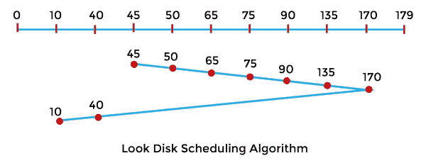
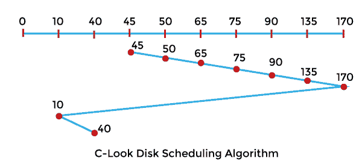

# Look 与 C-Look 磁盘调度算法的区别

> 原文：<https://www.javatpoint.com/look-vs-c-look-disk-scheduling-algorithm>

在本文中，您将了解 **LOOK** 和 **C-LOOK** 磁盘调度算法之间的区别。但是在讨论差异之前，您必须了解 LOOK 和 C-LOOK 磁盘调度算法。

## 什么是 LOOK 磁盘调度算法？

它是 SCAN 磁盘调度算法的更高级版本。在这个算法中，头从磁盘的一端开始，一直延伸到另一端，服务于一路上的所有请求。当头部到达一端的最后一个请求的末尾时，它改变方向并返回到第一个请求，为中间的所有请求提供服务。与 SCAN 不同，这个头不是去最后一个轨道，而是去最后一个请求，然后改变方向。

**示例:**

让我们举个例子来理解 LOOK 磁盘调度算法。让我们取一个带有 **180** 磁道 **(0-179)** 的磁盘，磁盘队列有输入/输出请求，顺序如下: **75、90、40、135、50、170、65、10** 。读/写磁头的初始磁头位置是 45，将在右手边移动。使用 LOOK 磁盘调度算法查找读/写磁头的磁道移动总数。

**解决方案:**

头部运动总数，

最初的头部点是 45 度，

= (50-45) + (65-50) + (75-65) + (90-75) + (135-90) + (170-135) + (170-40) + (40-10)

= 5 + 15 + 10 + 15 + 45 + 35 + 130 + 30

= 285

### LOOK 磁盘调度算法的优缺点

LOOK 磁盘调度算法有各种优点和缺点。这些优点和缺点如下:

**优势**

1.  与扫描算法相比，它提供了更好的性能。
2.  LOOK 调度算法避免了饥饿。
3.  如果没有满足更多的请求，磁头将不会移动到磁盘的末端。
4.  等待时间和响应时间的方差较低。

**缺点**

1.  找到最终请求会产生开销。

## C-LOOK 磁盘调度算法

它是 LOOK 和 SCAN 磁盘调度算法的组合。在这种磁盘调度算法中，磁头从最初的请求开始，到另一个方向的最后一个请求，并为其间的所有请求提供服务。在一端完成最后一个请求后，头向另一个方向跳跃，并向剩余的请求前进，以与先前相同的方向完成它们。与 LOOK 不同，它只响应一个方向的请求。

**示例:**

我们举个例子来了解一下 **C-LOOK** 磁盘调度算法。让我们取一个带有 **180** 磁道 **(0-179)** 的磁盘，磁盘队列有输入/输出请求，顺序如下: **75、90、40、135、50、170、65、10** 。读/写磁头的初始磁头位置是 45，将在右手边移动。使用 C-LOOK 磁盘调度算法查找读/写磁头的磁道移动总数。

**解决方案:**

头部运动总数，

最初的头部点是 45 度，

= (50-45) + (65-50) + (75-65) + (90-75) + (135-90) + (170-135) + (170-10) + (40-10)

= 5 + 15 + 10 + 15 + 45 + 35 + 160 + 30

= 315

### C-LOOK 磁盘调度算法的优缺点

C-LOOK 磁盘调度算法有各种优点和缺点。这些优点和缺点如下:

**优势**

1.  与 LOOK 磁盘调度算法相比，它提供了更好的性能。
2.  C-LOOK 磁盘调度算法避免了饥饿现象。
3.  如果没有请求被服务，在 C-LOOK 磁盘调度算法中，头不必一直走到磁盘的末端。
4.  在 C-LOOK 中，只有头部访问的气缸等待时间最短。
5.  等待时间和响应时间的方差较低。

**缺点**

1.  查找结束请求的开销存在于 C-LOOK 中。

## LOOK 和 C-LOOK 磁盘调度算法的主要区别

在这里，您将了解 LOOK 和 C-LOOK 磁盘调度算法之间的主要区别。LOOK 和 C-LOOK 磁盘调度算法之间的主要区别如下:

1.  LOOK 磁盘调度算法是 SCAN 磁盘调度算法的更高级版本。相比之下，C-LOOK 是 LOOK 和 SCAN 算法的结合。
2.  LOOK 磁盘调度算法的头部可以双向服务该请求。相比之下，C-LOOK 磁盘调度算法的头部可能只在一个方向上处理请求。
3.  它在性能上并不比 C-LOOK 磁盘调度算法好。相比之下，C-LOOK 磁盘调度算法优于所有其他磁盘调度技术。
4.  LOOK 磁盘调度算法具有较好的吞吐量和较快的低方差响应时间。相比之下，C-LOOK 磁盘调度算法给出了统一的等待时间和响应时间。
5.  在 LOOK 中，对请求的处理不如 C-LOOK 磁盘调度算法。相比之下，C-LOOK 可能比 LOOK 磁盘调度算法更有效地管理请求。

## LOOK 和 C-LOOK 磁盘调度算法的面对面比较

在这里，您将学习 LOOK 和 C-LOOK 磁盘调度算法之间的面对面比较。LOOK 和 C-LOOK 磁盘调度算法之间的主要区别如下:

| 查找磁盘调度算法 | C-LOOK 磁盘调度算法 |
| 它是 SCAN 算法的更高级版本。 | 它是 LOOK 和 SCAN 磁盘调度算法的组合。 |
| 它具有更好的吞吐量和更快的响应时间，并且方差很小。 | 它给出了统一的等待时间和响应时间。 |
| 在 LOOK 中，对请求的处理不如 C-LOOK 磁盘调度算法。 | 它可能比 LOOK 磁盘调度算法更有效地处理请求。 |
| 它在性能上并不比 C-LOOK 好。 | 它优于所有其他磁盘调度技术。 |
| LOOK 磁盘调度算法的头部可以双向服务该请求。 | C-LOOK 磁盘调度算法的头部可能只在一个方向上处理请求。 |
| 在 LOOK 算法示例中，头部从 45 开始，在右侧继续，服务所有请求，直到到达一端的最后一个请求。它改变头的方向，并以相反的方向服务其余的请求。 | 在 C-LOOK 算法示例中，头部从 45°开始移动，服务于右侧的所有请求，直到到达一端的最后一个请求。它继续处理剩余的请求，并且只在右侧为它们提供服务。 |

* * *