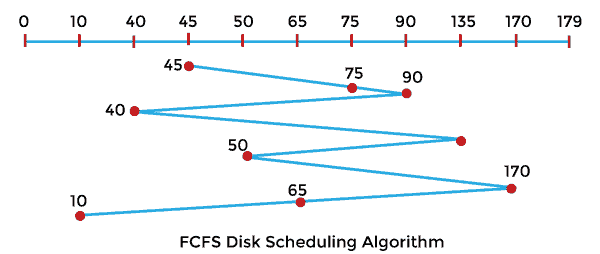
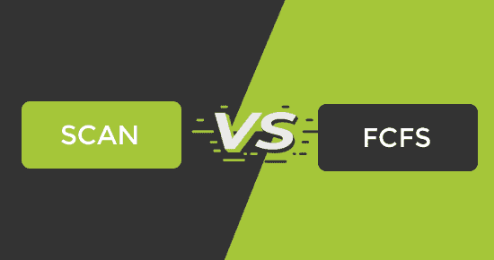

# 扫描和 FCFS 磁盘调度算法的区别

> 原文：<https://www.javatpoint.com/scan-vs-fcfs-disk-scheduling-algorithm>

在本文中，您将了解 SCAN 和 FCFS 磁盘调度算法之间的区别。但是在讨论差异之前，您需要了解 SCAN 和 FCFS 磁盘调度算法。

## 什么是扫描磁盘调度算法？

也被称为**电梯算法**。在该算法中，磁头可以在两个方向上移动，即磁盘臂开始从磁盘的一端移动到另一端，并服务于所有请求，直到它到达磁盘的另一端。到达另一端后，磁头位置方向被改变，并进一步继续服务请求，直到磁盘结束。

**示例:**

让我们取一个带有 **180** 磁道 **(0-179)** 的磁盘，磁盘队列有输入/输出请求，顺序如下: **75、90、40、135、50、170、65、10** 。读/写磁头的初始磁头位置是 **45** ，并将在左侧移动。使用扫描算法计算读/写磁头的磁道移动总数。

**解决方案:**

头部运动总数，

初始水头点为 45°，

= (45-40) + (40-10) + (10-0) + (50-0) + (65-50) + (75-65) + (90-75) + (135-90) + (170-135)

= 5 + 30 +10 +50 +15 + 10 +15 + 45 + 35

= 215

### 扫描磁盘调度算法的优缺点

SCAN 磁盘调度算法有各种优缺点。这些优点和缺点如下:

**优势**

1.  它易于使用和理解。
2.  在扫描磁盘调度算法中，等待时间和响应时间的方差较低。
3.  饥饿得以避免。

**缺点**

1.  如果没有剩余的请求需要处理，磁头会移动到磁盘的末端。

## 什么是 FCFS 磁盘调度算法？

FCFS 代表**先到先得**。在全磁盘调度算法中，这是一种非常简单的算法。这是一种操作系统磁盘调度算法，它以排队的请求到达磁盘队列的方式运行这些请求和进程。这是一个非常简单的 CPU 调度算法。在这个调度算法中，请求处理器的进程首先接收处理器分配。它由一个先进先出队列管理。

**示例:**

让我们取一个带有 **180** 磁道 **(0-179)** 的磁盘，磁盘队列有输入/输出请求，顺序如下: **75、90、40、135、50、170、65、10** 。读/写磁头的初始磁头位置是 **45** 。使用 FCFS 算法计算读/写磁头的磁道移动总数。

**解决方案:**

头部运动总数，

最初的头部点是 45 度，

= (75-45) + (90-75) + (90-40) + (135-40) + (135-50) + (170-50) + (170-65) + (65-10)

= 30 + 15 + 50 + 95 + 85 + 120 + 105 + 55

= 555

### FCFS 磁盘调度算法的优缺点

FCFS 磁盘调度算法有各种优缺点。这些优点和缺点如下:

**优势**

1.  这是一种非常简单的磁盘调度算法。
2.  编程很容易。
3.  它提供先到先得的流程。
4.  在 FCFS 中，每个进程最终都有机会执行，因此不存在饥饿。

**缺点**

1.  因为简单，所以效率不高。
2.  它的平均等待时间很长。
3.  这是一种非抢占式的中央处理器调度算法，这意味着一旦一个进程被分配给一个中央处理器，它将永远不会释放中央处理器，直到该进程完成执行。

## 扫描和 FCFS 磁盘调度算法的主要区别

在这里，您将了解扫描和 FCFS 磁盘调度算法之间的主要区别。扫描和 FCFS 磁盘调度算法之间的不同之处如下:

1.  扫描磁盘调度算法也称为电梯算法。相比之下，FCFS 代表先到先得。
2.  扫描调度算法在一个方向上处理请求，直到到达磁盘末端，然后磁盘臂改变方向，开始以相反的顺序处理请求。相比之下，FCFS 将以请求到达磁盘队列的方式处理请求。
3.  在吞吐量方面，SCAN 算法比 FCFS 调度算法有更好的算法。相比之下，在所有磁盘调度技术中，FCFS 算法的吞吐量最低。
4.  扫描可能发生在磁盘臂访问请求的位置时，因此请求需要很长的等待时间才能完成。相比之下，FCFS 算法有一个公平的策略，即根据时间表处理请求。
5.  与 FCFS 调度算法相比，SCAN 算法的平均寻道时间要低得多。相比之下，FCFS 调度算法的平均寻道时间是所有磁盘调度算法中最高的，因为它没有优化寻道时间。

## 扫描和 FCFS 磁盘调度算法的端到端比较

在这里，您将学习扫描和 FCFS 磁盘调度算法之间的面对面比较。扫描和 FCFS 磁盘调度算法之间的主要区别如下:

| 扫描磁盘调度算法 | 磁盘调度算法 |
| 它也被称为电梯算法。 | FCFS 代表先到先得。 |
| 它具有比 FCFS 调度算法更好的吞吐量。 | 在所有磁盘调度算法中，它的吞吐量最低。 |
| 它在一个方向上处理请求，直到到达磁盘末端，然后磁盘臂改变方向，开始以相反的顺序处理请求。 | 它将以请求到达磁盘队列的方式处理请求。 |
| 与 FCFS 调度算法相比，它的平均寻道时间要短得多。 | FCFS 调度算法平均寻道时间是所有磁盘调度算法中最高的，因为它没有优化寻道时间。 |
| 扫描可能发生在磁盘臂访问请求的位置时，因此请求需要很长的等待时间才能完成。 | 它有一个公平的政策，即根据时间表处理请求。 |

* * *