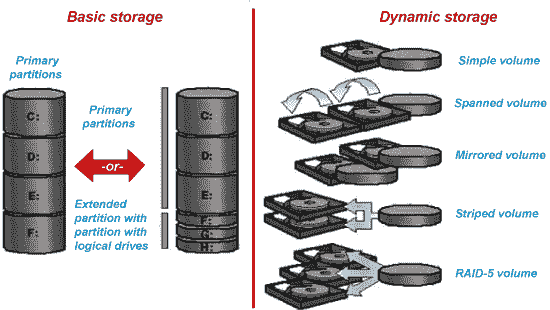

# 基本磁盘和动态磁盘的区别

> 原文：<https://www.javatpoint.com/basic-disk-vs-dynamic-disk>

基本磁盘和动态磁盘都是 Windows 操作系统中可用的磁盘配置。一个基本盘和 MS-DOS 和 Windows NT 使用的配置是一样的，从 DOS 时代就有了，Windows XP/2000 默认使用基本盘配置。然而，从 Windows 2000 开始，Windows 就开始使用动态磁盘的概念。

这两种磁盘配置都有不同的功能，它们都有各自的优缺点，但它们之间有某种联系。这两种磁盘配置都支持 FAT、FAT32 和 NTFS 文件系统，但您不能创建 FAT32 动态卷。

### 什么是基本磁盘？

基本磁盘是一种适用于 Windows 操作系统的硬盘配置。普通分区表或逻辑驱动器用于管理硬盘上的所有分区和数据，它们是 Windows 最常用的存储类型。它可以包含四个或三个主分区以及一个带有多个逻辑驱动器的扩展分区。以下操作可以在基本磁盘配置中执行。

*   创建或删除主分区和扩展分区。
*   在扩展分区内创建或删除逻辑驱动器。
*   格式化分区并将其标记为活动的。

基本磁盘提供了一个简单的存储解决方案，可以适应各种不断变化的存储需求场景。基本磁盘还支持群集磁盘、电气和电子工程师协会(IEEE) 1394 磁盘以及通用串行总线(USB)可移动驱动器。为了向后兼容，基本磁盘通常使用与微软操作系统和所有版本的窗口使用的磁盘相同的主引导记录(MBR)分区样式。尽管如此，它们也可以在支持它的系统上支持 **GUID** 分区表(GPT)分区。

### 什么是动态磁盘？

为动态存储而初始化的磁盘称为动态磁盘。它使用动态卷来管理数据。动态磁盘上的所有卷都称为动态卷，动态磁盘配置基于卷的概念。动态磁盘提供了基本磁盘没有的功能，例如能够创建跨多个磁盘的卷(跨区卷和条带卷)以及创建容错卷(镜像卷和 RAID-5 卷)。

动态磁盘为卷管理提供了更大的灵活性，因为它们使用数据库来跟踪磁盘上的动态卷和计算机中其他动态磁盘的信息。因为计算机中的每个动态磁盘都存储动态磁盘数据库的副本。例如，损坏的动态磁盘可以通过使用另一个动态磁盘上的数据库来修复一个动态磁盘。磁盘的分区样式决定了数据库的位置。在 MBR 分区上，数据库包含在磁盘的最后 1 兆字节(MB)中。在 GPT 分区上，数据库包含在 1mb 的保留(隐藏)分区中。

动态磁盘是一种单独的卷管理形式，它允许卷在一个或多个物理磁盘上具有不连续的扩展区。动态磁盘和卷依赖于逻辑磁盘管理器(LDM)、虚拟磁盘服务(VDS)及其相关功能。这些功能使您能够将基本磁盘转换为动态磁盘，并创建容错卷。多分区卷支持已从基本磁盘中删除，现在只在动态磁盘上支持，以鼓励动态磁盘。以下操作只能在动态磁盘上执行:

*   创建和删除简单卷、跨区卷、分条卷、镜像卷和 RAID-5 卷。
*   扩展简单卷或跨区卷。
*   从镜像卷中删除镜像或将镜像卷分成两个卷。
*   修复镜像卷或 RAID-5 卷。
*   重新激活丢失或脱机的磁盘。

### 基本磁盘和动态磁盘的区别

大多数硬盘使用两种类型的配置来存储信息。这些配置是基本磁盘和动态磁盘。虽然这两种配置都能高效地存储数据，但它们的工作原理不同，提供的功能也不同。

基本磁盘和动态磁盘的区别在于，基本磁盘是传统的基于窗口的硬盘数据存储配置，使用 MBR 和 GPT 分区，无法进行分区扩展。相比之下，动态磁盘是最新的数据配置格式，在可能进行分区扩展的情况下使用 LDM 和 VDS 功能。

基本磁盘和动态磁盘之间的另一个区别是，动态磁盘卷可以由一个或多个物理磁盘上的非连续扩展区组成。相比之下，基本磁盘上的卷由单个磁盘上的一组连续扩展区组成。由于 LDM 数据库所需磁盘空间的位置和大小，除非磁盘上至少有 1 MB 的未使用空间，否则 Windows 无法将基本磁盘转换为动态磁盘。

下面是基本磁盘和动态磁盘之间一些更重要的区别，例如:

| 条款 | 基本磁盘 | 动态磁盘 |
| 定义 | 基本磁盘使用在 MS-DOS 和 Windows 中找到的普通分区表来管理硬盘上的所有分区。 | 在动态磁盘中，硬盘被分成动态卷。 |
| 划分 | 包含在基本磁盘上的卷称为基本卷，当您使用基本磁盘配置或特定的集大小创建分区时，这些卷无法更改。每个硬盘最多可以容纳 4 个分区或 3 个分区和一个辅助分区，您可以从辅助分区创建逻辑驱动器。 | 动态磁盘不限于主分区和扩展分区。硬盘被划分为多个卷，而不是分区，分区可以是不连续的，并且跨越一个或多个磁盘。 |
| 音量类型 | 一个基本磁盘只能创建两种类型的分区，MBR 和 GPT 分区。

*   Master boot record (MBR) is a common disk layout, using standard BIOS partition table.
*   GPT (GUID partition table) is a partition table using unified extensible firmware interface (UEFI). GPT-based hard disk can hold up to 128 partitions.

 | 动态磁盘包含简单卷、跨区卷、条带卷、镜像卷和 RAID-5 卷。动态卷包含在动态磁盘中，是一个逻辑卷，很像基本磁盘中的逻辑驱动器。 |
| 转换 | 基本磁盘可以很容易地转换成动态磁盘，而不会丢失任何数据。它允许您创建跨多个磁盘的卷，并且在转换过程中不必重新启动计算机。但是，它需要您进行备份。 | 但是，要将动态磁盘转换为基本磁盘，必须删除动态磁盘上的所有卷。因为动态磁盘需要 1 MB 的存储空间用于磁盘管理数据库，所以您可能希望将 1 MB 的存储空间保留在未分区的驱动器上，以便磁盘管理数据库以后可以使用它来将基本磁盘转换为动态磁盘。 |
| 修改 | 在基本磁盘中，不能更改或修改已经创建的分区。 | 在动态磁盘中，卷可以扩展。 |
| 多重引导配置 | 基本磁盘支持多引导配置。
基本磁盘支持多引导配置，这意味着你可以在一台电脑的多个操作系统之间轻松选择。 | 动态磁盘不使用不允许您在多个操作系统之间进行选择的引导加载程序。这就是为什么它不能用作多引导环境中的唯一驱动器。 |
| 和睦相处 | 旧的 windows 操作系统也支持基本磁盘。 | 仅从 Windows 2000 开始支持动态磁盘。 |

* * *