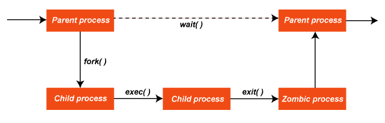
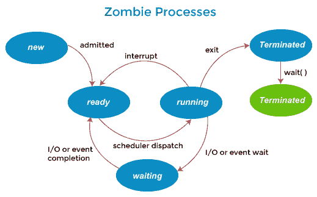
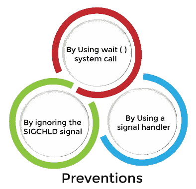

# 什么是僵尸进程？

> 原文：<https://www.javatpoint.com/what-is-zombie-process>

A ***僵尸进程*** 或 ***失效进程*** 是已经完成执行(通过退出系统调用)但在进程表中仍有一个条目的进程。对于子进程，这种情况会发生，此时仍然需要条目来允许父进程读取其子进程的退出状态。一旦通过等待系统调用读取了退出状态，僵尸的条目将从进程表中删除，并被称为“*”。子进程在从资源表中移除之前总是先变成僵尸。*

 *在大多数情况下，僵尸会立即被父母侍候，然后在正常的系统运行下被系统收割。长时间保持僵尸状态的进程通常是错误的，会导致资源泄漏，但它们只会占用进程表条目。

用这个术语的比喻来说，孩子的过程已经死亡，但还没有收获。此外，与正常进程不同，kill 命令不会影响僵尸进程。



僵尸进程不应与孤立进程混淆。孤立进程是一个仍在执行但其父进程已经死亡的进程。当父进程死亡时，init(进程标识 1)采用孤立的子进程。当孤立进程死亡时，它们不会保留为僵尸进程；相反，它们由 init 等待。结果是，一个既是僵尸又是孤儿的进程将被自动收割。

### 僵尸进程是如何工作的？

在操作系统中，僵尸进程的工作方式如下:

*   当一个进程通过 exit 结束时，所有与之相关的内存和资源都将被释放，以便其他进程可以使用它们。
    
*   但是，流程表中的流程条目仍然保留。父节点可以通过执行等待系统调用来读取子节点的退出状态，其中僵尸被移除。等待调用可以在顺序代码中执行，但它通常在 ***信号的句柄中执行，每当孩子死亡时，父母都会收到该信号。***
*   僵尸被移除后，它的进程标识符(PID)和进程表中的条目可以被重用。但是，如果父进程未能调用 wait，僵尸进程将留在进程表中，从而导致资源泄漏。在某些情况下，这可能是可取的，父进程希望继续持有该资源。例如，如果父进程创建了另一个子进程，它将不会被分配相同的 PID。
*   以下特例适用于现代类似 UNIX 的系统。如果父进程通过将其处理程序设置为***【SIG _ IGN】***(而不是默认情况下简单地忽略信号)来显式地忽略 ***SIGCHLD*** ，或者设置了***SA _ NOCDWAIT***标志，则所有子进程退出状态信息都将被丢弃，不会留下僵尸进程。
*   在 UNIX“PS”命令的输出中，僵尸可以通过“STAT”列中的“Z”来识别。僵尸存在的时间超过很短，通常表明父程序中有 bug，或者只是一个不常见的不收割孩子的决定。
*   如果父程序不再运行，僵尸进程通常表示操作系统中有错误。与其他资源泄漏一样，一些僵尸的存在并不令人担忧，但可能表明在较重的负载下问题会变得严重。由于没有分配给僵尸进程的内存，因此唯一的系统内存使用是进程表条目本身。许多僵尸的主要问题不是内存不足，而是进程表条目和具体的进程标识号不足。
*   使用 KILL 命令，可以手动将 ***SIGCHLD*** 信号发送给父节点，从系统中移除僵尸。如果父进程仍然拒绝收获僵尸，如果终止父进程没问题，下一步可以移除父进程。当一个进程失去它的父进程时，init 成为它的新父进程。Init 定期执行等待系统调用，以获取任何以 init 为父级的僵尸。

### 例子

让我们看一个僵尸进程的例子。

```

#include #include <stdlib.h>#include <unistd.h>int main(void)
{
    pid_t pids[10];
    int i;

    for (i = 9; i >= 0; --i) {
        pids[i] = fork();
        if (pids[i] == 0) {
            printf("Child%d\n", i);
            sleep(i+1);
            _exit(0);
        }
    }

    for (i = 9; i >= 0; --i) {
        printf("parent%d\n", i);
        waitpid(pids[i], NULL, 0);
    }

    return 0;
}</unistd.h></stdlib.h> 
```

**输出:**给出如下输出，如:

```
parent9
Child3
Child4
Child2
Child5
Child1
Child6
Child0
Child7
Child8
Child9 // there is a pause here
parent8
parent7
parent6
parent5
parent4
parent3
parent2
parent1
parent0

```

在第一个循环中，原始(父)进程分叉 10 个副本。这些子进程中的每一个都会打印一条消息、休眠和退出。由于父节点在循环中做的很少，所有的子节点基本上是在同一时间创建的，所以当它们中的每一个第一次被调度时，它有点随机，因此它们的消息的顺序被打乱了。

在循环过程中，会建立一个子进程标识的数组。在所有 11 个进程中都有一个**pids【】**数组的副本，但它只在父进程中完成。每个子代中的副本将缺少编号较低的子代 PID，并且其自身的 PID 为零。

第二个循环仅在父进程中执行，并等待每个子进程退出。它会等待睡了 10 秒的孩子，其他孩子早就退出了，所以所有的消息(除了第一条)都会很快出现。这里不存在随机排序的可能性，因为单个进程中的一个循环驱动着它。在任何子进程开始之前，父进程可以继续进入第二个循环。这也只是进程调度器的随机行为——“parent 9”消息可能出现在序列中“parent8”之前的任何地方。

孩子 0 到孩子 8 在这种状态下度过一秒或多秒，从他们退出到父母对他们进行 **waitpid()** 之间。在 Child9 退出之前，父进程已经在等待它了，因此一个进程基本上不会像僵尸一样花费时间。

### 僵尸进程的危险

僵尸进程不使用任何系统资源，但它们会保留自己的进程 ID。如果僵尸进程很多，那么所有可用的进程 id 都被它们垄断了。这将阻止其他进程运行，因为没有可用的进程标识。

如果僵尸进程的父进程不再运行，则僵尸进程也表示存在操作系统错误。如果有一些僵尸进程，这并不是一个严重的问题，但是这可能会在较重的负载下给系统带来问题。

### 僵尸进程的防范

我们需要防止创建僵尸进程，因为每个系统有一个进程表，并且进程表的大小是有限的。如果生成了太多僵尸进程，那么进程表就会满。系统将不会产生任何新的进程，然后系统将会停止。因此，我们需要防止僵尸进程的产生。以下是可以防止僵尸产生的不同方法，例如:



**1。唱等待()系统调用**

当父进程在创建子进程后调用 wait()时，它将等待子进程完成并获得它们的退出状态。父进程被挂起(在等待队列中等待)，直到子进程被终止。必须明白，在此期间，父进程什么都不做，只是等待。

```

// A C program to demonstrate the working of
// fork()/wait() and Zombie processes
#include #include <unistd.h>#include <sys>#include <sys>int main()
{
    int i;
    int pid = fork();
    if (pid==0)
    {
        for (i=0; i<20; i++)
            printf("I am Child\n");
    }
    else
    {
        wait(NULL);
        printf("I am Parent\n");
        while(1);
    }
}</sys></sys></unistd.h> 
```

**2。通过忽略信号**

当一个子节点被终止时，一个相应的 SIGCHLD 信号被传递给父节点。如果我们调用‘信号(SIGCHLD，SIG _ IGN)’，那么系统将忽略 SIGCHLD 信号，并且子进程条目将从进程表中删除。因此，没有僵尸被创造。但是，在这种情况下，父母不能知道孩子的退出状态。

```

// A C program to demonstrate ignoring
// SIGCHLD signal to prevent Zombie processes
#include #include <unistd.h>#include <sys>#include <sys>int main()
{
    int i;
    int pid = fork();
    if (pid == 0)
        for (i=0; i<20; i++)
            printf("I am Child\n");
    else
    {
        signal(SIGCHLD,SIG_IGN);
        printf("I am Parent\n");
        while(1);
    }
}</sys></sys></unistd.h> 
```

**3。通过使用信号处理器**

父进程为 SIGCHLD 信号安装一个信号处理程序。信号处理程序在其中调用 wait()系统调用。在这种情况下，当子节点被终止时，SIGCHLD 被传递给父节点。收到 SIGCHLD 后，相应的处理程序被激活，它调用 wait()系统调用。因此，父进程立即收集退出状态，进程表中的子进程被清除。因此没有僵尸被创造出来。

```

// A C program to demonstrate handling of
// SIGCHLD signal to prevent Zombie processes.
#include #include <unistd.h>#include <sys>#include <sys>void func(int signum)
{
    wait(NULL);
}

int main()
{
    int i;
    int pid = fork();
    if (pid == 0)
        for (i=0; i<20; i++)
            printf("I am Child\n");
    else
    {
        signal(SIGCHLD, func);
        printf("I am Parent\n");
        while(1);
    }
}</sys></sys></unistd.h> 
```

### 如何杀死僵尸进程？

僵尸进程可以通过使用 kill 命令向父进程发送 SIGCHLD 信号来杀死。此信号通知父进程使用 wait()系统调用清理僵尸进程。该信号与 kill 命令一起发送。其演示如下:

```

kill -s SIGCHLD pid

```

在上面的命令中，pid 是父进程的进程 id。

### 什么是 SIGHLD 信号？

SIGCHLD 是 UNIX 和类 UNIX 系统的信号。siginfo_t 的代码值如下:

*   子进程已终止 CLD 退出
*   子进程异常终止(无核心)CLD _ kill
*   子进程异常终止(核心为)CLD _ dump
*   被跟踪的子进程被困在 CLD
*   子进程已停止 CLD _ 停止
*   当进程终止或停止时，停止的子进程继续 CLD _ 继续。它向其父进程发送一个 SIGCHLD 信号。默认情况下，该信号将被忽略。如果父进程想要被告知它的子系统的这个状态，它应该捕获这个信号。信号捕获函数通常调用等待函数来获取进程标识及其终止状态。

* * **