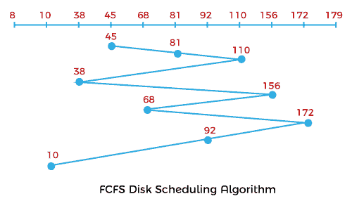
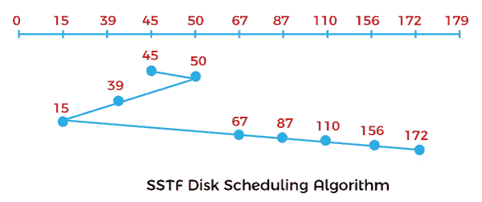
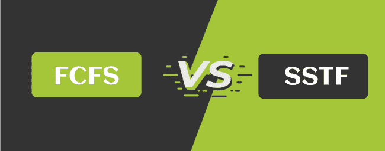

# FCFS 与 SSTF 磁盘调度算法的区别

> 原文：<https://www.javatpoint.com/fcfs-vs-sstf-disk-scheduling-algorithm>

在本文中，您将了解 FCFS 和 SSTF 磁盘调度算法之间的区别。但是在讨论差异之前，您需要了解 FCFS 和 SSTF 磁盘调度算法。

## 什么是 FCFS 磁盘调度算法？

FCFS 代表**先到先得**。在全磁盘调度算法中，这是一种非常简单的算法。这是一种操作系统磁盘调度算法，它以排队的请求到达磁盘队列的方式运行这些请求和进程。这是一个非常简单的 CPU 调度算法。在这个调度算法中，请求处理器的进程首先接收处理器分配。它由一个先进先出队列管理。

**示例:**

让我们取一个带有 **180** 磁道 **(0-179)** 的磁盘，磁盘队列有输入/输出请求，顺序如下: **81、110、38、156、68、172、92、10** 。读/写磁头的初始磁头位置是 **45** 。使用 FCFS 算法计算读/写磁头的磁道移动总数。

**解决方案:**

头部运动总数，

初始头点为 **45** ，

= (81-45) + (110-81) + (110-38) + (156-110) + (156-68) + (172-156) + (172-92) + (92-10)

= 36 + 29 + 72 + 46 + 88 + 16 + 80 + 82

= 449

### FCFS 磁盘调度算法的优缺点

FCFS 磁盘调度算法有各种优缺点。这些优点和缺点如下:

**优势**

1.  这是一种非常简单的磁盘调度算法。
2.  它很容易使用。
3.  它提供先到先得的流程。
4.  在 FCFS 中，每个进程最终都有机会执行，因此不存在饥饿。

**缺点**

1.  因为简单，所以效率不高。
2.  它的平均等待时间很长。
3.  这是一种非抢占式的中央处理器调度算法，这意味着一旦一个进程被分配给一个中央处理器，它将永远不会释放中央处理器，直到该进程完成执行。

## 什么是 SSTF 磁盘调度算法？

SSTF 代表**最短寻道时间** **第一**，它服务于最接近头部当前位置的请求。头部指针的方向在该算法中相当重要。当请求之间出现平局时，负责人将按照当前方向处理请求。与 FCFS 相比，SSTF 算法在总寻道时间方面非常有效。

**示例:**

让我们举个例子来理解 SSTF 磁盘调度算法。让我们取一个带有 **180** 磁道 **(0-179)** 的磁盘，磁盘队列有输入/输出请求，顺序如下: **87、110、50、172、67、156、39、15** 。读/写磁头的初始磁头位置为 45°，并将向左侧移动。使用 SSTF 算法计算读/写磁头的磁道移动总数。

**解决方案:**

头部运动总数，

初始头点为 **45** ，

= (50-45) + (50-39) + (39-15) + (67-15) + (87-67) + (110-87) + (156-110) + (172-156)

= 5 + 11 + 14 + 52 + 20 + 23 + 46 + 16

= 187

### SSTF 磁盘调度算法的优缺点

SSTF 磁盘调度算法有各种优缺点。这些优点和缺点如下:

**优势**

1.  它提高并增加了吞吐量。
2.  SSTF 的总寻道时间低于 FCFS。
3.  它具有更少的响应时间和平均等待时间。

**缺点**

1.  远离头部的请求会导致饥饿。
2.  在 SSTF 磁盘调度算法中，等待时间和响应时间具有高方差。
3.  该算法因头部方向的频繁变化而变慢。

## FCFS 和 SSTF 磁盘调度算法的主要区别

在这里，您将了解 FCFS 和 SSTF 磁盘调度算法之间的主要区别。FCFS 和 SSTF 磁盘调度算法之间的不同之处如下:

1.  FCFS 代表**先到先得**。相比之下，SSTF 代表**最短寻道时间优先**。
2.  FCFS 磁盘调度算法在寻道移动中效率不高。相比之下，SSTF 磁盘调度算法在寻道移动中非常有效。
3.  FCFS 磁盘调度算法给出了更多的平均等待时间和响应时间。相比之下，SSTF 磁盘调度算法的响应时间和平均等待时间更短。
4.  FCFS 磁盘调度算法不会对任何请求造成饥饿。相反，在 SSTF 算法中，远离头部的请求将遭受饥饿。
5.  FCFS 磁盘调度算法比 SSTF 算法增加了总寻道时间。相比之下，SSTF 磁盘调度算法比 FCFS 减少了总寻道时间。
6.  在 FCFS 磁盘调度算法中，磁头的方向并不重要。相比之下，SSTF 磁盘调度算法头的方向在打破请求之间的联系方面起着重要作用。

## FCFS 和 SSTF 磁盘调度算法的端到端比较

在这里，您将学习 FCFS 和 SSTF 磁盘调度算法之间的面对面比较。FCFS 和 SSTF 磁盘调度算法之间的主要区别如下:

| 磁盘调度算法 | SSTF 磁盘调度算法 |
| FCFS 代表先到先得。 | SSTF 代表最短寻道时间优先。 |
| 它在寻找运动中无效。 | 它在寻找运动中非常有效。 |
| 它比 SSTF 增加了总寻道时间。 | 它比 FCFS 减少了总寻道时间。 |
| 它提供了更多的响应时间和平均等待时间。 | 它提供更少的响应时间和平均等待时间。 |
| 它不会对任何请求造成饥饿。 | 远离头部的请求将在 SSTF 算法中挨饿。 |
| 它的头部方向无关紧要，头部可以向前或向后移动。 | 它的头部方向在打破请求之间的联系方面起着重要作用。 |

* * *