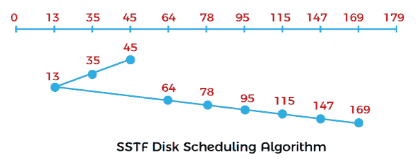
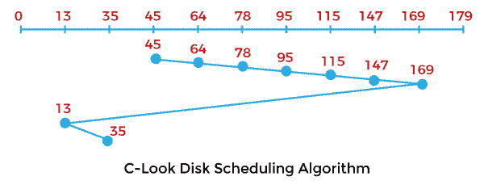
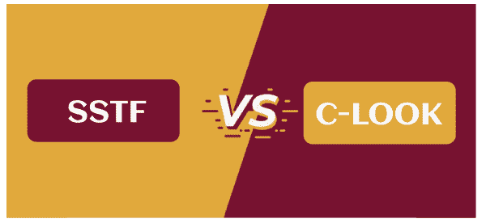

# SSTF 和 C-LOOK 磁盘调度算法的区别

> 原文：<https://www.javatpoint.com/sstf-vs-c-look-disk-scheduling-algorithm>

在本文中，您将了解 SSTF 和 C-LOOK 磁盘调度算法之间的区别。但是在讨论差异之前，您需要了解 SSTF 和 C-LOOK 磁盘调度算法。

## 什么是 SSTF 磁盘调度算法？

SSTF 代表**最短寻道时间优先**，它服务于最接近头部当前位置的请求。头部指针的方向在该算法中相当重要。当请求之间出现平局时，负责人将按照当前方向处理请求。与 FCFS 相比，SSTF 算法在总寻道时间方面非常有效。

**示例:**

让我们举个例子来理解 SSTF 磁盘调度算法。让我们取一个带有 **180** 磁道 **(0-179)** 的磁盘，磁盘队列有输入/输出请求，顺序如下: **78、64、35、169、95、147、13、115** 。读/写磁头的初始磁头位置是 **45** ，并将向左侧方向移动。使用 SSTF 算法计算读/写磁头的磁道移动总数。

**解决方案:**

头部运动总数，

初始头点为 **45** ，

= (45-35) + (35-13) + (64-13) + (78-64) + (95-78) + (115-95) + (147-115) + (169-147)

= 10 + 22 + 41 + 14 + 17 + 20 + 32 + 22

= 178

### SSTF 磁盘调度算法的优缺点

SSTF 磁盘调度算法有各种优缺点。这些优点和缺点如下:

**优势**

1.  它提高并增加了吞吐量。
2.  SSTF 的总寻道时间低于 FCFS。
3.  它具有更少的响应时间和平均等待时间。

**缺点**

1.  远离头部的请求会导致饥饿。
2.  在 SSTF 磁盘调度算法中，响应时间和等待时间具有高方差。
3.  该算法因头部方向的频繁变化而变慢。

## C-LOOK 磁盘调度算法

它是 LOOK 和 SCAN 磁盘调度算法的组合。在这种磁盘调度算法中，磁头从最初的请求开始，到另一个方向的最后一个请求，并为其间的所有请求提供服务。在一端完成最后一个请求后，头向另一个方向跳跃，并向剩余的请求前进，以与先前相同的方向完成它们。与 LOOK 不同，它只响应一个方向的请求。

**示例:**

让我们举个例子来理解 C-LOOK 磁盘调度算法。让我们取一个带有 **180** 磁道 **(0-179)** 的磁盘，磁盘队列有输入/输出请求，顺序如下: **78、64、35、169、95、147、13、115** 。读/写磁头的初始磁头位置是 **45** ，并将在右侧移动。使用 C-LOOK 磁盘调度算法查找读/写磁头的磁道移动总数。

**解决方案:**

头部运动总数，

初始头点为 **45** ，

= (64-45) + (78-64) + (95-78) + (115-95) + (147-115) + (169-147) + (169-13) + (35-13)

= 19 + 14 + 17 + 20 + 32 + 22 + 156 + 22

= 302

### C-LOOK 磁盘调度算法的优缺点

C-LOOK 磁盘调度算法有各种优点和缺点。这些优点和缺点如下:

**优势**

1.  与 LOOK 磁盘调度算法相比，它提供了更好的性能。
2.  C-LOOK 磁盘调度算法避免了饥饿现象。
3.  如果没有请求被服务，在 C-LOOK 磁盘调度算法中，头不必一直走到磁盘的末端。
4.  在 C-LOOK 中，只有头部访问的气缸等待时间最短。
5.  等待时间和响应时间的方差较低。

**缺点**

1.  查找结束请求的开销存在于 C-LOOK 中。

## SSTF 和 C-LOOK 磁盘调度算法的主要区别

在这里，您将了解 SSTF 和 C-LOOK 磁盘调度算法之间的主要区别。SSTF 和 C-LOOK 磁盘调度算法之间的不同之处如下:

1.  SSTF 代表最短寻道时间优先。相比之下，C-LOOK 是 LOOK 和 SCAN 磁盘调度算法的组合。
2.  SSTF 磁盘调度算法在响应时间和平均等待时间上有巨大的差异。相比之下，C-LOOK 磁盘调度在平均等待时间和响应时间方面差异较小。
3.  SSTF 磁盘调度算法的性能低于 C-LOOK 磁盘调度算法。相比之下，C-LOOK 磁盘调度算法的性能高于 SSTF 磁盘调度算法。
4.  SSTF 磁盘调度算法服务于双向请求。相比之下，C-LOOK 磁盘调度算法只在一个方向上为请求提供服务。
5.  SSTF 磁盘调度算法有寻找最近请求的负担。相比之下，C-LOOK 磁盘调度算法比 SSTF 磁盘调度算法导致更多的寻道时间。
6.  SSTF 磁盘调度算法可能会导致饥饿。相比之下，C-LOOK 磁盘调度算法绝不会导致任何请求饥饿。

## SSTF 和 C-LOOK 磁盘调度算法的面对面比较

在这里，您将学习 SSTF 和 C-LOOK 磁盘调度算法之间的面对面比较。SSTF 和 C-LOOK 磁盘调度算法之间的主要区别如下:

| SSTF 磁盘调度算法 | C-LOOK 磁盘调度算法 |
| SSTF 代表最短寻道时间优先。 | 它是 LOOK 和 SCAN 磁盘调度算法的组合。 |
| SSTF 磁盘调度算法服务于双向请求。 | C-LOOK 磁盘调度算法只在一个方向上服务请求。 |
| SSTF 磁盘调度算法在响应时间和平均等待时间上有巨大的差异。 | C-LOOK 磁盘调度在平均等待时间和响应时间方面差异很小。 |
| SSTF 磁盘调度算法的性能低于 C-LOOK 磁盘调度算法。 | C-LOOK 磁盘调度算法的性能高于 SSTF 磁盘调度算法。 |
| SSTF 磁盘调度算法有寻找最近请求的负担。 | C-LOOK 磁盘调度算法比 SSTF 磁盘调度算法导致更多的寻道时间。 |
| SSTF 磁盘调度算法可能会导致饥饿。 | C-LOOK 磁盘调度算法永远不会导致任何请求的饥饿。 |
| 在上面的 SSTF 算法示例中，头部从 45 开始，并在向该方向移动之前分析最近的请求。 | 在上面的 C-LOOK 算法示例中，头部从 45°开始移动，并以正确的方向服务所有请求，直到到达一端的最后一个请求。之后，它会继续处理剩余的请求，并且只向正确的方向提供服务。 |

* * *