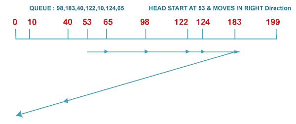

# SSTF 和 LOOK 磁盘调度算法的区别

> 原文：<https://www.javatpoint.com/sstf-vs-look-disk-scheduling-algorithm>

操作系统进行磁盘调度，以调度到达磁盘的输入/输出请求。磁盘调度也称为输入/输出调度。磁盘调度算法的目标是最大化吞吐量和最小化响应时间。这里有六种不同的磁盘调度算法，例如先到先服务(FCFS)、最短寻道时间优先(SSTF)、扫描、查找、C-Scan 和 C-look 磁盘调度，通过比较它们在不同运行中的磁头移动。

## 什么是 SSTF 磁盘调度算法？

SSTF 代表最短寻道时间优先。这个算法服务于任务请求，它最接近头部或指针的当前位置。这里，头部的方向在决定整个头部运动中起着至关重要的作用。如果两个请求之间出现联系，那么负责人将处理该请求，该请求会在其正在进行的方向上遇到它。与 C-LOOK 不同，SSTF 算法在总寻道时间上非常高效。

在 SSTF，寻道时间最短的请求首先被执行。因此，每个请求的寻道时间都是在队列中预先计算的，并且是根据计算出的寻道时间来安排的。因此，磁盘臂附近的请求将首先被执行。与 FCFS 相比，SSTF 无疑是一个进步，因为它缩短了平均响应时间，提高了系统的吞吐量。

对于批处理系统来说，这是一个合理的解决方案。有时，它不能确保公平性，因为有了这个调度，饥饿是可能的。这种策略对于交互式系统来说通常是不可接受的，并且会导致响应时间的更大差异。

### 例子

在这种情况下，根据下一个最短距离来服务请求。


从 50 开始，下一个最短距离将是 62，而不是 34，因为它距离 62 只有 12 个磁道，距离 34 只有 16 个磁道。该过程将继续，直到所有的过程都得到处理。例如，下一种情况将是从 62 移动到 64，而不是 34，因为它们之间只有 2 个轨道，如果走另一条路，则不是 18 个。

虽然这似乎是一个更好的服务，因为它移动了所有 236 个轨道，但它不是最佳的。饥饿发生的可能性很大，这是因为如果有许多请求彼此靠近，其他请求将永远不会被处理，因为距离总是更大。

### 优势

以下是 SSTF 磁盘调度算法的优势，例如:

*   与 FCFS 相比，它减少了总寻道时间。
*   它提供了更高的吞吐量
*   ，并且它提供更少的平均响应时间和等待时间。

### 不足之处

SSTF 磁盘调度算法也有以下缺点，例如:

*   找出最接近的请求会产生开销。
*   远离头部的请求可能会对中央处理器造成饥饿。
*   它在响应时间和等待时间上有很大差异。
*   频繁切换头部方向会降低算法速度。

## 什么是 LOOK 磁盘调度算法？

LOOK 算法实际上是 SCAN 算法的改进版本。在这种算法中，磁头从磁盘的一端开始第一个请求，并通过服务其间的所有请求向另一端移动。与 SCAN 不同的是，磁头不是一直走到最后一个磁道，而是一直走到最后一个请求，然后改变方向。与 SSTF 不同，它不提供最接近头部或指针当前位置的任务请求。

它类似于扫描磁盘调度算法，只是不同之处在于，尽管磁盘臂到达磁盘的末端，但它只到达磁头前面要服务的最后一个请求，然后只从那里反向。因此，它防止了由于不必要的盘尾遍历而产生的额外延迟。扫描算法和查找算法的主要区别在于:

*   扫描算法从一端到另一端扫描磁盘的所有柱面，即使两端没有请求。
*   LOOK 算法扫描磁盘的所有柱面，从一端的第一个请求开始，到另一端的最后一个请求。

### 例子

考虑一个有 200 个磁道(0-199)的磁盘，并且磁盘队列中有按以下顺序排列的输入/输出请求:98、183、40、122、10、124 和 65。

读/写磁头的当前磁头位置是 53，并将向正确的方向移动。使用查找算法计算读/写磁头的磁道移动总数。



```

Total head movements,
= (65-53) + (98-65) + (122-98) + (124-122) + (183-124) + (183-40) + (40-10)
= 303 

```

### LOOK 磁盘调度算法的优势

LOOK 磁盘调度算法的优点如下:

*   当没有请求需要服务时，它不会导致磁头移动到磁盘的末端。
*   与扫描算法相比，它提供了更好的性能。
*   它不会导致饥饿。
*   它在响应时间和等待时间方面的差异很小。

### LOOK 磁盘调度算法的缺点

看起来磁盘调度算法也有一些缺点，比如:

*   找到最终请求会产生开销。
*   并且它导致头部刚访问的气缸等待时间很长。

## SSTF 和 LOOK 磁盘调度算法的区别

以下是 SSTF 和 LOOK 磁盘调度算法的区别。

| SSTF 磁盘调度算法 | 查找磁盘调度算法 |
| SSTF 磁盘调度算法性能滞后。 | LOOK 磁盘调度算法的性能优于 SSTF。 |
| 与 LOOK 磁盘调度算法相比，它减少了总寻道时间。 | LOOK 磁盘调度算法增加了总寻道时间。 |
| 该算法提供了高方差平均响应时间和等待时间。 | 它提供了平均等待时间和响应时间的低方差。 |
| 如上例所示，头部的方向在打破请求之间的联系方面起着重要作用。 | 在 LOOK 磁盘调度算法中，当磁头在一个方向上服务最后一个请求时，它的方向会反转。 |
| 在 SSTF 磁盘调度算法中，查找最近的请求需要开销。 | 在这个算法中，有一个寻找结束请求的开销。 |
| 在 SSTF 磁盘调度算法中，距离头部较远的请求将遭受饥饿。 | LOOK 磁盘调度算法不会对任何请求造成饥饿。 |
| 在 SSTF 磁盘调度算法中，对请求的处理不如 LOOK 算法。 | LOOK 磁盘调度算法可以比 SSTF 更有效地处理请求。 |
| 与 FCFS 策略相比，SSTF 调度具有更高的吞吐量和更短的响应时间。 | 这种调度的主要优点是，它只执行足够大的扫描来服务所有请求。它通过避免不必要的寻道操作来提高效率，并提供高吞吐量。 |

* * *