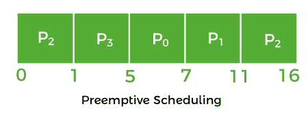
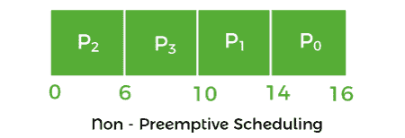

# 抢先调度和非抢先调度的区别

> 原文：<https://www.javatpoint.com/preemptive-vs-non-preemptive-scheduling>

在本文中，您将了解**抢先**和**非抢先调度**的区别。但是在讨论差异之前，您需要了解抢先和非抢先调度。

## 什么是抢先调度？

抢先调度是一种当进程从运行状态切换到就绪状态或从等待状态切换到就绪状态时可以使用的方法。资源在特定时间内被分配给进程，然后被移除。如果资源仍有剩余的 CPU 突发时间，进程将被放回就绪队列。该进程保持在就绪队列中，直到有机会再次执行。

当高优先级进程进入就绪队列时，它不必等待正在运行的进程完成其突发时间。但是，正在运行的进程在其执行过程中被中断，并被放入就绪队列，直到高优先级进程使用资源。因此，每个进程都会在就绪队列中获得一些 CPU 时间。它提高了将进程从运行状态切换到就绪状态的开销，反之亦然，增加了抢先调度的灵活性。它可能包括也可能不包括 SJF 和优先级调度。

**例如:**

让我们以抢先调度为例。我们取了 **P0，P1，P2，**和 **P3** 是四个流程。

| 过程 | 到达时间 | 中央处理器突发时间(毫秒)。) |
| **P0** | three | Two |
| **P1** | Two | four |
| **P2** | Zero | six |
| **P3** | one | four |

*   首先，过程 **P2** 在时间 **0** 到来。于是，中央处理器被分配去处理 **P2** 。
*   当进程 **P2** 运行时，进程 P3 到达时间 1，进程 **P2 (5 毫秒)**剩余时间大于进程 **P3 (4 毫秒)**所需时间。因此，处理器被分配给 P3。
*   当进程 **P3** 运行时，进程 **P1** 在时间 **2** 到来，进程 **P3 (3 ms)** 剩余时间小于进程 **P1 (4 ms)** 和 **P2 (5 ms)** 所需时间。因此， **P3** 继续执行。
*   当进程 **P3** 继续进程时，进程 **P0** 到达时间 **3** 。P3 的剩余时间 **(2 毫秒)**等于 **P0 的**必要时间 **(2 毫秒)**。所以，流程 **P3** 继续执行。
*   当进程 **P3** 结束时，CPU 被分配给 **P0** ，其突发时间比其他进程短。
*   进程 **P0** 完成后，分配 CPU 处理 **P1** ，再处理 **P2** 。

### 抢先调度的优缺点

抢先调度有各种各样的优缺点。非抢占式调度的优缺点如下:

**优势**

1.  这是一种更健壮的方法，因为一个进程可能不会独占处理器。
2.  每个事件都会导致正在进行的任务的执行中断。
3.  它提高了平均响应时间。
4.  当您在多编程环境中使用此方法时，它会更有好处。
5.  操作系统确保所有正在运行的进程使用相同数量的 CPU。

**缺点**

1.  它需要使用有限的计算资源。
2.  暂停正在执行的进程、切换上下文和调度新的传入进程需要更多的时间。
3.  如果几个高优先级进程同时到达，低优先级进程将不得不等待更长时间。

## 什么是非抢占式调度？

非抢占式调度是一种可以在进程终止或从运行状态切换到等待状态时使用的方法。当处理器被分配给一个进程时，它们会保留该进程，直到它被消除或达到等待状态。当处理器开始进程执行时，它必须在执行另一个进程之前完成它，并且不能在中间中断。

当具有高 CPU 突发时间的非抢占式进程正在运行时，另一个进程将不得不等待很长时间，这增加了就绪队列中的进程平均等待时间。然而，在非抢占式调度下，将进程从就绪队列转移到中央处理器没有开销。调度是严格的，因为执行进程甚至没有被更高优先级的进程抢占。

**例如:**

让我们以上面的抢先调度为例，用非抢先的方式来解决。

*   进程 **P2** 在 **0** 到来，因此处理器被分配处理 **P2** ，并需要 **(6 毫秒)**来执行。
*   所有流程 **P0、P1** 和 **P3** 都将到达中间的就绪队列。但是所有进程都要等到进程 **P2** 完成其 CPU 爆发时间。
*   之后，在进程 **P2** 之后的进程，即 **P3** 被分配给中央处理器，直到它完成其突发时间。
*   当进程 **P1** 完成执行时，给 CPU 处理 **P0** 。

### 非抢占式调度的优缺点

非抢占式调度有各种优缺点。非抢占式调度的优缺点如下:

**优势**

1.  它提供了低调度开销。
2.  这是一个非常简单的方法。
3.  它使用较少的计算资源。
4.  它提供高吞吐量。

**缺点**

1.  它对流程的响应时间很短。
2.  机器会因故障而冻结。

## 抢占式和非抢占式调度的主要区别

在这里，您将了解抢先和非抢先调度的主要区别。抢先调度和非抢先调度之间的不同之处如下:

1.  在抢先调度中，CPU 被分配给特定时间段的进程。相反，中央处理器被分配给进程，直到它移除并切换到等待状态。
2.  在抢占式调度中，当高优先级的进程频繁出现在就绪队列中时，低优先级的进程必须等待很长一段时间，并且可能会饿死。相比之下，当 CPU 被分配给高突发时间的进程时，在非抢占式调度中，突发时间较短的进程可能会饿死。
3.  当更高优先级的进程进入中央处理器时，抢占式调度中正在运行的进程在其执行过程中被暂停。另一方面，非抢占式调度中的运行进程在执行过程中不会中断，而是一直等到完成。
4.  抢占式调度处理灵活。另一方面，非先发制人是严格的。
5.  抢先调度非常灵活，因为关键进程被允许访问 CPU，因为它们进入就绪队列，无论当前哪个进程正在运行。非抢占式调度很困难，因为如果一个重要的进程被分配到就绪队列，CPU 进程就不会被中断。
6.  在抢占式调度中，CPU 利用率比非抢占式调度更有效。另一方面，在非抢占式调度中，CPU 利用率不如抢占式调度有效。
7.  抢先调度非常经济高效，因为它确保了共享数据的完整性。相比之下，它不是在非抢占式调度的情况下。

## 抢占式和非抢占式调度的面对面比较

在这里，您将学习抢先和非抢先调度之间的面对面比较。抢先调度和非抢先调度的主要区别如下:

| 抢先调度 | 非抢占式调度 |
| 资源长期分配给一个流程。 | 一旦资源被分配给一个进程，它们将被保留，直到它完成突发周期或改变到等待状态。 |
| 它的进程可能会在执行过程中暂停。 | 当处理器开始进程执行时，它必须在执行另一个进程之前完成它，并且不能在中间中断。 |
| 当高优先级进程不断进入就绪队列时，低优先级进程可能会挨饿。 | 当高突发时间进程使用一个中央处理器时，另一个具有较短突发时间的进程可能会挨饿。 |
| 它是灵活的。 | 它是刚性的。 |
| 这是成本相关的。 | 它没有相关的成本。 |
| 它有与进程调度相关的开销。 | 它没有开销。 |
| 它影响操作系统内核的设计。 | 不影响操作系统内核的设计。 |
| 它的 CPU 利用率非常高。 | 它的 CPU 利用率很低。 |
| 示例:循环法和最短剩余时间优先 | FCFS 和 SJF 就是非抢先调度的例子。 |

## 结论

这不是抢先调度优于非抢先调度的情况，反之亦然。这完全取决于调度算法如何在提高 CPU 利用率的同时减少平均进程等待时间

* * *