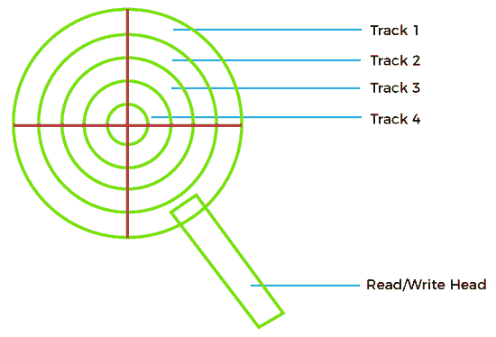
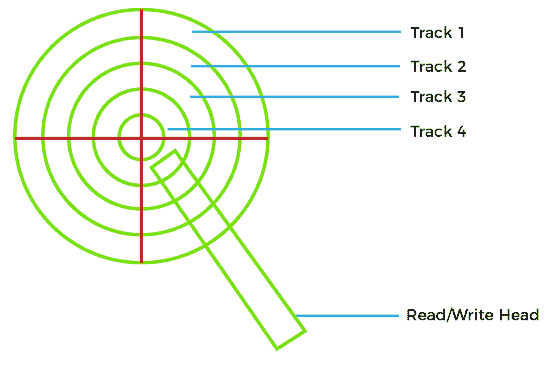
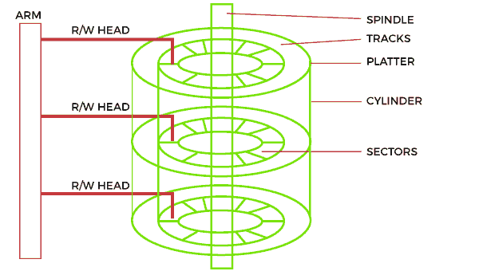

# 磁盘调度中寻道时间和磁盘访问时间的差异

> 原文：<https://www.javatpoint.com/seek-time-vs-disk-access-time-in-disk-scheduling>

在本文中，您将了解**寻道时间**和**磁盘访问时间**之间的差异，但是在讨论差异之前，您必须了解磁盘调度中的寻道时间和磁盘访问时间。

## 什么是磁盘调度中的寻道时间？

寻道时间是硬盘控制器定位特定存储数据所需的时间。发送读/写请求时，寻道时间可能因磁头所在位置而异。

当任何东西被读取或写入磁盘驱动器时，磁盘的读/写头移动到正确的位置。光盘读/写头的实际物理定位称为**寻道**。盘的读/写头从一个盘移动到另一个盘所花费的时间被称为**寻道时间**。

对于给定的盘，寻道时间可能不同，这是由于从起始点到读/写头被指示去的地方的距离不同。因此，寻道时间通常以平均寻道时间来衡量。寻道时间也是用另外两种方式来衡量的，跟踪到跟踪和全行程。

1.  **磁道到磁道**是读/写磁头在相邻磁道之间搜索或寻道所用的时间。它以毫秒为单位进行测量，通常在 2 至 4 ms 内，低至 1 ms。
2.  **全行程**是寻道整盘所需的时间。全冲程也是以毫秒为单位测量的，对于硬盘来说，低于 10ms 的寻道时间通常是可以接受的。

操作系统请求驱动器控制器固件获取硬盘来读取信息，这驱动读/写头移动到存储所需数据的位置。在轨道之间切换需要磁头致动器移动存取臂，这需要一定的时间。这个时间被称为寻道时间。它可以根据磁道之间的距离和每次读/写命令时的原点而变化。

因为没有记录寻道时间的行业标准，所以没有一个数字决定整个驱动器的寻道时间。这就是为什么大多数光盘驱动器制造商以平均值来衡量寻道时间，有些制造商还包括全行程和磁道到磁道规格。

**例如**

考虑一个同心圆的硬盘叫做**磁道**，你想取一些数据，但是读写头目前在磁道 1 上，如下图所示。



但是用户请求轨道 4 上存在的数据。在这种情况下，读/写磁头将移动到下图所示的磁道 4。到达轨道 4 所需的时间是 ***寻道时间*** 。



寻道时间是磁头从其当前磁道(磁道 1)移动到数据所在位置(机架 4)所需的时间。即使在此之后，它也可能需要等待更多的时间，因为数据出现在轨道的另一侧，这种延迟称为 ***【旋转延迟】*** ，但这不计入寻道时间。

## 磁盘调度中的磁盘访问时间是多少？

磁盘访问时间定义为计算机处理读/写请求，然后从磁盘存储器中检索所需数据所需的总时间。

磁盘访问时间有两个组成部分。第一个组成部分是 ***寻道时间*** ，它发生在读写臂寻找所需磁道的时候。第二个组成部分是延迟或等待*时间*，当磁头写臂等待磁道上的所需扇区旋转时发生。



对磁盘上数据的访问以毫秒为单位。然而，这实际上比 CPU 的处理速度慢得多。尽管输入/输出仍然很慢，但它无法与现代处理器的速度提升相匹配。磁盘访问时间分为两部分:

1.  存取时间
2.  数据传输时间

**公式**

您可以使用以下公式计算磁盘访问时间。

```

Disk Access Time = Access Time + Data Transfer Time 

//OR

Disk Access Time = Seek time + Rotational delay + Transfer time + Controller overhead + Queuing delay

// Average disk access time is calculated as

Average disk access time = Average seek time + Average rotational delay + Transfer time + Controller overhead + Queuing delay

```

**1。访问时间**

访问时间定义为实际数据传输发生之前的设置时间。例如，读/写磁头在磁道 1 上，但我们需要从另一个磁道或段读取数据。因此，读/写头将在实际传输发生之前移动到数据块位置。这种延迟称为 ***访问时间*** 。访问时间通过以下各项的总和来计算:

*   **寻道时间:**读/写磁头达到所需输出所需的时间。众所周知，这是最重要的时刻，因为它不会造成隔阂。寻道时间与性能成反比。因此，寻道时间越短，性能越好。

```

Seek Time = (Number of tracks/cylinders crossed) * (Time to cross one track/cylinder)

```

*   **旋转延迟:**读/写磁头从当前扇区移动到请求扇区所需的时间。

```

Rotational latency = (Angle by which disk is rotated) / (Angular Frequency)

```

*   **命令处理时间:**是磁盘设备处理命令并在磁盘设备的各个组件之间建立连接以读取/写入数据所需的时间。这是由于内部电路。
*   **稳定时间:**稳定时间是读/写头停止振动所需的时间。

#### 注:命令处理时间和建立时间通常不在数字问题中提及，我们将其视为零。

**2。数据传输时间**

数据传输时间定义为在系统和磁盘之间传输数据所需的时间。数据传输时间有两种类型:

*   **内部传输速率:**定义为在盘面和硬盘缓存之间移动数据所需的时间。
*   **外部传输速率:**定义为在硬盘缓存和系统之间移动数据所需的时间。

## 寻道时间和磁盘访问时间之间的差异

以下是磁盘调度中旋转延迟和磁盘访问时间之间的一些差异，例如:


| 寻道时间 | 磁盘访问时间 |
| 寻道时间是磁头从当前磁道移动到有数据的磁道所用的时间。 | 磁盘访问时间是计算机处理读/写请求和检索所需数据所需的时间。 |
| 寻道时间总是小于磁盘访问时间，因为它是磁盘访问时间的一个子部分。 | 与寻道时间相比，磁盘访问时间非常长。 |
| 寻道时间不考虑数据传输。 | 磁盘访问时间考虑传输数据所需的时间。 |
| 根据当前位置和最终位置之间的距离以及指令的执行方式，寻道时间可能会有很大差异。 | 磁盘访问时间取决于两个部分，即访问时间和数据传输时间。 |
| 寻道时间通常在 10-20 毫秒之间，具体取决于转速和驱动器等级。 | 如果我们能减少访问时间和数据传输时间，我们就能减少磁盘访问时间。 |
| 寻道时间以平均寻道时间衡量。 | 磁盘访问时间，
=寻道时间+旋转延迟+数据传输时间 |

* * *