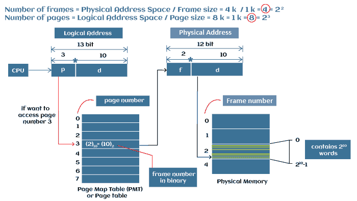
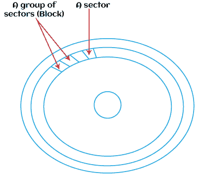

# 操作系统中页面和块的区别

> 原文：<https://www.javatpoint.com/page-vs-block-in-operating-system>

页面和块都是操作系统中的数据存储单元。然而，两者对于操作系统都很重要，因为它们都有各自的用途。本文将讨论操作系统中 ***页面*** 和 ***区块*** 的概述，并讨论它们之间的区别。

### 操作系统中的页面是什么？

页面也是数据存储的单位。页面从主存储器加载到处理器中。页面由单元块或块组组成。页面大小固定，通常为 2k 或 4k，固定长度的连续内存块称为页面。页面也称为虚拟页面或内存页面。

在虚拟机操作系统中，它是数据的最小单元，在页面操作系统的帮助下管理内存，执行文件的功能读取和写入。当主存和辅存之间发生页面转移时，称为 ***分页*** 。

操作系统更喜欢页面，而不是块，因为当有多个存储设备时，处理页面比处理块更容易。此外，页面大小通常是固定的，块的大小也各不相同。然而，页和块都是数据存储单元。

**例如**

使用页面的一个很好的例子是存储区域网络。页面使用将因存储区域网络在后端存储内容的方式而异。在使用虚拟化的存储区域网络中，分页是存储区域网络在驱动器类型之间移动数据的方式。

分页是存储区域网络操作系统优化和跟踪存储数据的方法。因此，当您将数据写入阵列时，写入通常会分成可管理的段。这些段消耗内存空间，并且使用的页面越小，通常消耗的内存就越多。

**页面功能**

以下是操作系统中页面的以下功能，例如:

*   页面大小由处理器架构决定
*   ，一些操作系统使用页面而不是块。
*   页面是内存中最小的存储单元，与内存相当。
*   如果主存储器中不存在处理器所需的页面，则称之为页面错误，并通过称为页面错误例程的特殊例程将其带入主存储器。
*   在主内存中获取所需页面的技术称为页面要求。
*   页面充当操作系统和硬盘之间的中间人。

### 什么是操作系统中的块？

块是数据存储的最小单位。它用于读取文件或将数据写入文件。块也是位和字节的序列。扇区是格式化磁盘上保存信息的物理位置。一个块由一个扇区或多个扇区(2，4，6...).一个区块也叫一个 ***物理记录*** 。

块是表示文件系统上最小存储单元的抽象。在内核中，所有文件系统操作都是以块的形式发生的。无论何时从磁盘读取或向磁盘写入，无论需要读取多少个数据块，您都要读取该数量的数据。默认的 NTFS 块大小(又名群集大小，又名分配单元)是 4096 字节(4KB)。

如果您有一个 4096 字节长的文件，那么您从磁盘读取一个块。如果它是 4097 字节，那么你读取两个块。您无法读取部分数据块，因此存储文件系统会清空数据块的其余部分，即使文件实际上并未占用整个数据块。

操作系统可以寻址的块或驱动器地址的数量是有限制的。通过将一个数据块定义为几个扇区，操作系统可以在不增加数据块地址数量的情况下使用更大的硬盘。

**例**

PS DOS 使用了 65，536 个块地址(以前，现在使用页面)，每个块只能是一个扇区。因此，最大的磁盘容量可以是 32MB*(64K 512 字节)。如果您将数据块的大小增加到 4K，相同版本的 DOS 现在可以处理 256MB (64K 地址的 4K 数据块)的卷。*

在操作系统的当前版本中，格式化软件将查看驱动器的大小，并计算出需要在一个块中使用整个驱动器的最小扇区数量。所以，当你格式化软盘时，块大小将是一个扇区。例如，当您格式化 230MB 驱动器时，块大小为 8 个扇区(4K)。

当文件从硬盘复制到软盘时，它占用的空间通常比硬盘少。尽管文件大小相同，但用于存储文件的扇区会更少。

相反，当文件从软盘复制到硬盘时，通常会占用更多的磁盘空间。当文件存储在磁盘上时，它们总是会用完整个数据块，数据块末尾任何不需要的空间都不会被使用和浪费。

### 文件系统中如何使用数据块？

文件系统中用于存储数据的每个数据块都需要与您正在写入的实际文件数据一起存储一定量的元数据，例如时间戳(已创建、已修改)、文件名、所有权和权限位。对于跨越多个块的文件，您还必须存储每个块的标识以及它们链接在一起的顺序等。

确定操作系统中的块大小是一种权衡。每个文件必须至少占用一个块，即使文件大小为 0 字节，这意味着文件的元数据中有一些内容需要附加。不完全适合该块的文件会有一定的浪费。

当您需要存储许多小文件时，小块大小很好。另一方面，更多的块等于更多的元数据，因此您最终会在开销上浪费存储系统的一大块，跟踪所有文件的位置。大块意味着更少的元数据，但也意味着在存储小文件时更大的浪费。例如，存储在 4k 块中的 1 字节文件浪费了该块的 3.99k。

**区块特征**

以下是操作系统中块的以下功能，例如:

*   大多数操作系统使用块来存储数据。
*   当我们将数据放入块中时，称为分块，当我们从块中提取数据时，称为 ***【去块】*** 。
*   块可以有不同的大小，块的大小称为块大小。
*   操作系统中的每个文件至少占用一个块，即使它是 0 字节。
*   块为负责存储和检索数据的硬件提供了一个抽象级别。
*   阻塞提高了数据处理流的速度并减少了开销。

### 页面和块的区别

页面和块都是操作系统中的数据存储单元，但两者是不同的。以下是页面和块之间的一些区别，例如:

| 街区 | 页 |
| 块是操作系统可以写入文件或从文件中读取的最小数据单元。 | 页面是虚拟机管理的最小数据单元。 |
| 块是位和字节的序列。区块由扇区组成。 | 页面由单元块或块组组成。 |
| 一个块由一个扇区或多个扇区(2，4，6...)，这意味着块的大小各不相同。 | 页面大小固定。通常，4K 和 2K 是最常用的尺寸。 |
| 当有多个存储设备时，处理块很困难，因为每个设备都支持不同的块大小。 | 由于页面大小固定，当有多个存储设备时，处理页面比处理块更容易，而不是试图知道如何处理不同大小的块。 |
| 硬盘和内存之间传输的任何数据通常都是以块而不是实际字节的形式发送的。 | 页面管理存储在内存中的数据。 |

### 为什么页面优先于块？

使用页面是因为当有许多存储设备时，它们使处理更容易。毕竟，每个设备可能支持不同的块大小。操作系统可以用页面处理固定大小的页面，而不是想出如何处理所有不同大小的块。因此，页面是操作系统和硬件驱动程序之间的中间人，它们将页面翻译成适当的块。但是，页面和块都被用作数据存储单元。

* * *