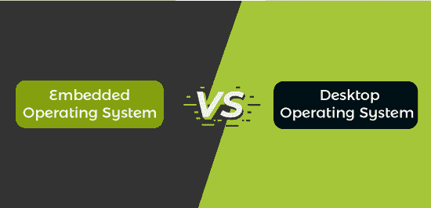

# 嵌入式操作系统与桌面操作系统的区别

> 原文：<https://www.javatpoint.com/embedded-operating-system-vs-desktop-operating-system>

在本文中，您将了解嵌入式操作系统和桌面操作系统之间的区别。但是在讨论差异之前，您必须了解嵌入式和桌面操作系统。

## 什么是嵌入式操作系统？

嵌入式操作系统是为提高嵌入式系统的功能效率而开发的一种计算机操作系统。就像你的台式电脑需要像 **Linux、Mac OS** 或 **Windows** 这样的操作系统来运行基本的应用程序一样，嵌入式系统需要一个支持其基本功能的操作系统。

例如，所有手机都有一个嵌入式操作系统软件，如安卓或 iOS，在手机开机时运行。没有操作系统，开发者不可能把一个应用程序实现到每一个有各种硬件的手机上。它使他们能够弥合所有差距，并创建一个专为操作系统设计的应用程序。在其他情况下，嵌入式操作系统被称为 RTOS(实时操作系统)。

### 嵌入式操作系统的优缺点

嵌入式操作系统有各种各样的优缺点。嵌入式操作系统的一些优点和缺点如下:

**优势**

1.  嵌入式系统通常成本很低。
2.  很容易管理。
3.  它有助于提高产品质量。
4.  它提供了更高的可靠性。
5.  它提供了更好的稳定性。
6.  它没有用户界面。
7.  它没有太多的信息储备。

**缺点**

1.  一旦建立了框架并将其集成到设备中，就很难更改操作系统。
2.  它的硬件有限。
3.  它的内存资源有限。
4.  当操作系统出现问题时，故障排除可能会很困难。
5.  一般操作系统只能运行一个或几个应用。

## 什么是桌面操作系统？

桌面操作系统是用户控制个人电脑(台式机、笔记本电脑)的环境。它有助于管理计算机硬件和软件资源。它支持基本功能，如任务调度、外围设备控制、打印、输入/输出和内存分配。操作系统是程序和计算机硬件之间的桥梁。

一些操作系统需要安装，而另一些可能预装在新计算机上。微软视窗、Linux 和苹果电脑是最受欢迎的桌面操作系统。现代操作系统使用图形用户界面。图形用户界面允许你用鼠标点击图标、按钮和菜单。屏幕上的一切都是用文字和图形的组合来显示的。

微软 Windows 操作系统最早发布于 20 世纪 80 年代中期**，最近的版本有 **Windows 11 (2021)、Windows 10 (2015)、Windows 8 (2012)、Windows 7 (2009)** 和 **Windows Vista (2007)** 。Windows 预装在新的操作系统中，这使得它成为世界上最受欢迎的操作系统。MacOS 是另一款由**苹果**开发的热门 OS，它预装在所有的 Macintosh 电脑上。MacOS 的一些热门版本有 **Mojave (2018 年)、High Sierra (2017 年)**和 **Sierra (2016 年)**。在全球所有操作系统中，MacOS 的市场份额不到 **10%** ，远低于微软 Windows(超过 **80%** )。**

 **### 桌面操作系统的优缺点

桌面操作系统有各种优点和缺点。桌面操作系统的一些优势如下:

**优势**

1.  操作系统为所有用户提供了一个用户友好的图形界面。它还提供了几个图标、菜单、按钮和各种导航。因此，用户可以容易地与计算机系统交互。
2.  操作系统允许用户通过调制解调器、打印机和播放器与其他用户共享数据或相关数据。此外，单个用户可以通过电子邮件同时与几个人共享相同的材料。此外，许多照片、软件和媒体文件可以使用操作系统从一个系统传输到另一个系统。
3.  操作系统是一种软件，必须定期更新才能跟上快速变化的功能。操作系统必须改进它们的基准，并通过其他应用程序和软件接收更新来处理计算机操作的所有方面，以提高它们的实用性。操作系统可以很容易地更新，没有任何困难。
4.  一个操作系统可以同时管理几个任务。它允许用户同时执行多个任务。不需要关闭一个窗口来打开另一个窗口。
5.  在计算机上，有大量的用户数据只能在操作系统的帮助下访问。除了存储和访问数据，操作系统的另一个重要职责是安全可靠地处理数据。

**缺点**

1.  有些操作系统比像 Linux 这样的开源平台更贵。虽然用户可以使用免费的操作系统，但它们通常比传统的操作系统更难操作。此外，具有图形用户界面功能和其他内置功能的操作系统价格昂贵，例如微软视窗。
2.  操作系统非常复杂，用于设计它们的语言并不简单或定义不明确。此外，用户可能不理解操作系统是否有问题。所以，不能很快解决。
3.  当存储内存被分成多个部分时，计算机就会出现碎片。当处理方法超过内存大小时，就会发生内部碎片。另一方面，当方法或过程消除时，就会发生外部碎片。
4.  如果中央操作系统出现故障，整个系统将停止运行，系统将无法工作。再者，操作系统是计算机系统的核心，没有操作系统就无法工作。

## 嵌入式和桌面操作系统的直接比较

在这里，您将学习嵌入式和桌面操作系统之间的面对面比较。嵌入式和桌面操作系统之间的不同之处如下:

| 嵌入式操作系统 | 桌面操作系统 |
| 第一个嵌入式操作系统是 1965 年发布的阿波罗制导计算机系统。 | 第一个桌面操作系统是 1960 年发布的 NLC(在线系统)。 |
| 运行该应用程序所需的时间最短。 | 运行该应用程序需要最长时间。 |
| 嵌入式操作系统成本低。 | 桌面操作系统的成本很高。 |
| 嵌入式操作系统的应用功能较少。 | 桌面操作系统有更多的应用功能。 |
| 它被开发成只执行一个任务。 | 它被开发来同时执行多个任务。 |
| 它的启动时间比桌面操作系统快。 | 它的启动时间比较慢。 |
| 它比桌面操作系统需要更少的存储空间。 | 它比嵌入式操作系统需要更多的存储空间。 |
| 它只使用闪存驱动器进行存储。 | 它使用硬盘和闪存驱动器进行存储。 |
| 在嵌入式操作系统中，网络浏览器加载网站所需的时间更少。 | 在桌面操作系统中，网页浏览器需要很长时间来加载网站。 |
| 重启的时间更短。 | 重启需要很长时间。 |
| 它易于使用和理解。 | 更难使用和理解。 |

## 结论

嵌入式操作系统和桌面操作系统的主要区别在于，应用程序(包括操作系统)通常被合并成一个可执行映像。与桌面操作系统不同，嵌入式系统通常根据用户的请求加载和执行单个应用程序。

* * ***