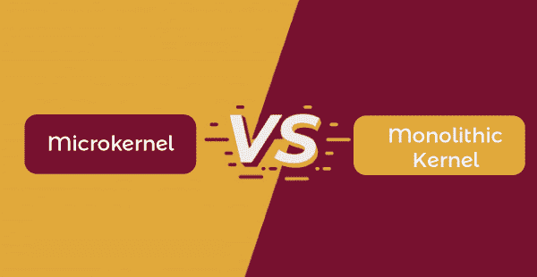

# 微内核与单片内核的区别

> 原文：<https://www.javatpoint.com/microkernel-vs-monolithic-kernel>

微内核和单片内核是操作系统中的两种内核。内核是操作系统的主要部分。因此，内核的重要代码存储在不同的内存空间中。内核是一个至关重要的组件，因为它维护整个系统的正常运行。它管理硬件和进程、文件处理以及其他一些功能。

在本文中，您将了解微内核和单片内核。但是在讨论差异之前，您必须了解微内核和单片内核。

## 什么是微内核？

微内核是一种允许定制操作系统的内核。它具有特权，提供低级地址空间管理以及**进程间通信(IPC)** 。此外，操作系统功能，如虚拟内存管理器、文件系统和中央处理器调度器，都建立在微内核之上。每个服务都有自己的地址空间来保证安全。此外，每个应用程序都有自己的地址空间。因此，应用程序、操作系统服务和内核之间存在保护。

当应用向操作系统服务请求服务时，操作系统服务相互通信，以便向应用提供所请求的服务。进程间通信可以帮助建立这种通信。总的来说，基于微内核的操作系统提供了高级别的可扩展性。还可以定制操作系统的服务来满足应用程序的需求。

### 微内核的优缺点

微内核有各种各样的优点和缺点。微内核的一些优点和缺点如下:

**优势**

1.  这些都是模块化的，几个模块可以在不修改内核的情况下被修改、重载、替换。
2.  微内核的体系结构很小并且是孤立的，但是它可能工作得更好。
3.  微内核系统是一种通用技术，其中由几个服务器实现的应用编程接口可以共存。
4.  系统可以更容易地扩展，因为它可以添加到系统应用程序中，而不会中断内核。
5.  它无需重新编译即可添加新功能。
6.  与单片系统相比，系统崩溃更少。

**缺点**

1.  当驱动程序作为进程运行时，微内核中需要上下文切换。
2.  微内核系统的性能可能是可变的，并导致问题。
3.  微内核服务比传统的单一系统更昂贵。

## 什么是单片内核？

单片内核管理系统应用程序和系统硬件之间的系统资源。与微内核不同，用户和内核服务运行在同一个地址空间中。它增加了内核大小，也增加了操作系统的大小。

单片内核通过系统调用提供 CPU 调度、设备管理、文件管理、内存管理、进程管理和其他操作系统服务。所有这些组件，包括文件管理和内存管理，都位于内核中。用户和内核服务使用相同的地址空间，从而产生一个快速执行的操作系统。这个内核的一个缺点是，如果系统的任何进程或服务失败，整个系统就会崩溃。必须修改整个操作系统，以便向单一内核添加新服务。

### 单片内核的优缺点

单片内核有各种各样的优点和缺点。单片内核的一些优点和缺点如下:

**优势**

1.  由于内存管理、文件管理、进程调度等，单片内核运行速度很快。
2.  所有的组件可以直接相互交互，也可以与内核交互。
3.  它是一个巨大的进程，完全在一个地址空间内执行。
4.  其结构简单易行。内核包含处理所需的所有组件。

**缺点**

1.  如果用户需要添加新服务，用户需要修改完整的操作系统。
2.  移植用单片操作系统编写的代码并不容易。
3.  如果任何服务失败，整个系统都会失败。

## 微内核和单片内核的主要区别

在这里，您将了解微内核和单片内核之间的主要区别。微内核和单片内核之间的不同之处如下:

1.  微内核是通过提供方法来实现操作系统的内核类型，包括低级地址空间管理、IPC 和线程管理。另一方面，单片内核是一种完整的操作系统在内核空间中运行的内核。
2.  微内核在不同的地址空间中运行用户和内核服务。另一方面，单体内核在同一个地址空间中运行内核和用户服务。在微内核中，只有像 IPC、内存管理和调度这样的基本过程发生在内核空间中。
3.  微内核的执行速度较慢，因为系统应用程序和硬件之间的通信是通过消息传递建立的。另一方面，单片内核的执行速度更快，因为系统调用建立了系统应用程序和硬件之间的通信。
4.  微内核使用消息队列来实现 IPC。另一方面，单片内核使用套接字和信号来实现 IPC。
5.  微内核的大小比单片内核小，因为只有内核服务在内核地址空间中运行。另一方面，由于用户和内核服务运行在同一个地址空间中，因此整体内核的大小更大。
6.  微内核比单片内核更安全，因为如果服务在微内核中失败，操作系统不会改变。另一方面，如果一个服务在单一内核中失败，整个系统都会失败。
7.  微内核很容易扩展，因为用户地址空间中添加了新的服务，这与内核空间是分开的，因此内核不需要更新。另一方面，如果在单一内核中使用新服务，则必须更新完整的内核。
8.  微内核设计需要更少的代码，导致更少的错误。相比之下，单一内核需要更多的代码，这会导致更多的错误。

## 微内核和单片内核的直接比较

在这里，您将学习微内核和单片内核之间的面对面比较。微内核和单片内核的主要区别如下:

| 特征 | 微内核 | 单片内核 |
| **定义** | 它是一种内核类型，通过提供低级地址空间管理、IPC 和线程管理来实现操作系统。 | 这是一种内核类型，其中完整的操作系统以内核速度运行。 |
| **尺寸** | 它的尺寸较小。 | 它比微内核大。 |
| **速度** | 它的进程执行较慢。 | 它的流程执行更快。 |
| **基础** | 它在不同的地址空间中实现内核和用户服务。 | 它在同一个地址空间中实现用户和内核服务。 |
| **安全** | 它比单片内核更安全。 | 它不如微内核安全。 |
| **稳定性** | 单个流程故障不会影响其他流程。 | 在单一内核中，如果一个服务失败，整个系统都会失败。 |
| **可延伸** | 很容易扩展。 | 很难延伸。 |
| **代码** | 编写微内核需要更多的代码。 | 编写单片内核需要更少的代码。 |
| **进程间** | 通信微内核使用消息队列来实现 IPC。 | 单片内核使用信号和套接字来实现 IPC。 |
| **可维护性易于维护。** | 维护需要额外的时间和资源。 |
| **调试** | 很容易调试。 | 很难调试。 |
| **例** | Symbian、L4Linux、K42、Mac OS X、pikeos、HURD 等。 | Linux、BSDs、Solaris、OS-9、DOS、OpenVMS 等。 |

## 结论

两种内核架构都有许多优点和局限性。因此，没有简单的解决方案来说明哪个更好，哪个必须使用。目标和需求应该选择内核风格。其他类型的内核有纳米内核、混合内核和外内核。

* * *