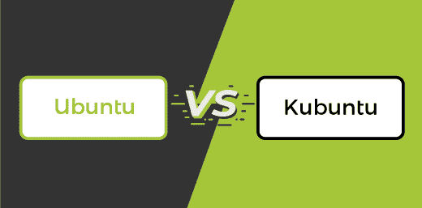

# Ubuntu 和 Kubuntu 的区别

> 原文： [https://www.javatpoint.com/ubuntu-vs-kubuntu](https://www.javatpoint.com/ubuntu-vs-kubuntu)

当今时代，许多操作系统在世界范围内越来越受欢迎。他们正在安装操作系统，并根据用户要求更换当前的操作系统版本。两者都是 Linux 操作系统，对程序员和商业用户来说都有一些惊人的功能。两个 Linux 操作系统的安装都非常容易。

在本文中，您将了解 Ubuntu 和 Kubuntu 之间的区别。但是在讨论差异之前，你必须了解 Ubuntu 和 Kubuntu。

## 什么是 Ubuntu？

Ubuntu 是一个免费的开源 Linux 操作系统。它通常设计用于个人电脑，也非常适合在服务器上使用。它被许多开发人员和测试人员使用，因为它是稳定、快速和安全的编程。希望玩游戏、使用 MS Office 和在 Photoshop 中创建设计的普通人不会喜欢 Ubuntu，因为它不提供 Windows 中的功能。

这个 Linux 操作系统是开源的，专业人士和社区都可以免费使用。它致力于开源开发原则，并鼓励开源用户加强和分享他们的工作。Ubuntu 还帮助政府在危机时期获得公众支持。出于安全考虑，大多数用户会通过 Windows 10 切换到 Ubuntu。

Windows **10** 用户抱怨安全和黑客漏洞，他们意识到大量的风险和感染，如勒索软件和恶意软件。虽然 Ubuntu 不完全是恶意软件安全的，但它会保护您的系统免受感染，并试图防止恶意软件渗透到您的系统中。安装 Ubuntu 时，使用完全安全，不会影响任何问题。然而，商业银行行业的人不喜欢 Ubuntu。

### Ubuntu 的优缺点

Ubuntu 有各种各样的优缺点。Ubuntu 的一些优点和缺点如下:

**优势**

1.  Ubuntu 在发布后已经有了非常简单的图形安装程序。与以前的操作系统相比，Ubuntu 的基本安装已经精简和完善。
2.  大多数程序员和开发人员都推荐 Ubuntu 用于他们的项目。他们中的许多人发现它是第一个能够执行程序而不会产生各种错误的操作系统。
3.  它不仅在开发商中受欢迎，而且在当地社区也很受欢迎。这款操作系统上线后，迅速获得了大量的关注者和用户。大型社区随着时间的推移连接到 Ubuntu，并提供强大的支持。
4.  它可以轻松处理和传输视频。
5.  它支持各种软件，包括火狐、VLC 播放器和其他各种软件。
6.  这是一个拥有大量开发者社区的免费开源操作系统。如果发布了新的更新，并且您遇到了软件问题，活动社区可以帮助您解决问题。
7.  更新这个软件会很简单。每当您收到关于重大更新的消息时，它会立即安装在您的电脑上。它简单、快速，并且不会干扰设备上的任何其他应用程序。
8.  它帮助您释放站点，而不是在后台执行或让您的设备落后。这种操作系统特别节省资源，因为与大多数其他软件相比，它缺少图形用户界面。

**缺点**

1.  要利用 Ubuntu，用户必须技术熟练。对于不熟悉命令行的人来说，Ubuntu 将很难使用。
2.  Ubuntu 也不支持几个流行的应用，比如 Photoshop 或者微软 Office。虽然这款软件在 Ubuntu OS 上有多种选择，但用户体验并不等同于 Windows。
3.  Ubuntu 的另一个缺点是它不支持 Windows 支持的所有硬件组件和软件程序。

## 什么是 Kubuntu？

Kubuntu 操作系统开发于 **2005** 作为 ubuntu 的变种，蓝色系统是这种社区驱动风格的发起人。这是一个开源操作系统，以其强大的功能而闻名。这是一个用于图形、电子邮件和生产力的流行操作系统。这是一个功能丰富的操作系统，被用作 macOS 和 Windows 的替代品。之所以使用它，是因为它的移动就绪 Linux 发行版功能，允许轻松连接到桌面到移动设备。

许多人开始使用 Kubuntu，因为它易于安装和使用。商业评论者也更喜欢 Kubuntu，因为它简化了商业运营，他们觉得 Kubuntu 比 Windows **10** 更能满足他们的商业需求。很多用户对 Kubuntu 和 ubuntu 很困惑，但这两者完全不同。

要使用 Kubuntu，必须满足许多需求。系统上至少应安装**内存**的 **1GB** 。Kubuntu 是初创公司的理想选择，用于各种任务。Kubuntu 的任务是摄影、生产力、图形、电子邮件、办公和音乐应用。它是一个比 Ubuntu 更好的操作系统。

### 库班图的特点

Kubuntu 有各种各样的特点。Ubuntu 的一些特性如下:

1.  在 Kubuntu 中，用户可以使用 Firefox 轻松浏览互联网。
2.  它在桌面操作系统上提供了一个简单的聊天选项。
3.  它包含各种视频和音乐功能。
4.  用户也可以浏览图像和文件。
5.  这是一个易于访问的开源 Linux 发行版。
6.  它包括一个生产力套件，用户可以快速打开或阅读文档。

## Ubuntu 和 Kubuntu 的主要区别

在这里，你将了解到 Ubuntu 和 Kubuntu 的主要区别。Ubuntu 和 Kubuntu 之间的各种差异如下:

1.  Ubuntu 是由丹尼斯·里奇和 T2·肯·汤普森设计的 Linux 操作系统。相比之下，Kubuntu 是由**蓝色系统**赞助的 Linux 操作系统。
2.  Ubuntu 使用的桌面是 GNOME 桌面。相比之下，Kubuntu 使用的桌面是 KDE 桌面。
3.  Ubuntu 的定制很少。相比之下，Kubuntu 有各种定制供使用。
4.  Ubuntu 提供了一些不错的吞吐量。相比之下，Kubuntu 提供了良好的吞吐量。
5.  GTK+工具包是 Ubuntu 的主要工具包。相比之下，QT 工具包是 Kubuntu 的主要工具包。
6.  安装 Ubuntu 的最低先决条件是英特尔 x86、ARM 和 AMD 64 主板架构。另一方面，Kubuntu 的最低需求是 8GB 硬盘、64MB 内存和分辨率为 640x480 的显卡。
7.  使用了 Ubuntu 的一些应用，包括 Rhythmbox、声音榨汁机、Gedit 和 Evolution。相比之下，与 Kubuntu 一起使用的应用程序是 Amarok、K3B 和 Kopete。
8.  Ubuntu 有一个 Linux 内核。相比之下，Kubuntu 有一个 ubuntu 内核。
9.  Gnome 桌面环境在 Ubuntu 中用作用户界面，它注重简单性和可用性。另一方面，在 Kubuntu 中，KDE 通常被称为 K 桌面环境，它在 Kubuntu 中被用作用户界面。

## 乌班图和库班图的面对面比较

在这里，您将学习 Ubuntu 和 Kubuntu 之间的面对面比较。Ubuntu 和 Kubuntu 的主要区别如下:

| 人的本质 | 库班图 |
| 这是一个由丹尼斯·里奇和肯·汤普森设计的 Linux 操作系统。 | 这是一个由蓝色系统赞助的 Linux 操作系统。 |
| 它的主要工具包是 GTK+工具包。 | 它的主要工具包是 QT。 |
| 它使用 GNOME 桌面。 | 它使用 KDE 台式机。 |
| 安装 Ubuntu 的最低先决条件是英特尔 x86、ARM 和 AMD 64 主板架构。 | Kubuntu 的最低需求是 8GB 硬盘、64MB 内存和分辨率为 640x480 的显卡。 |
| 使用了 Ubuntu 的一些应用，包括 Rhythmbox、声音榨汁机、Gedit 和 Evolution。 | Kubuntu 使用的一些应用程序是 Kopete、K3B 和 Amarok。 |
| 它有不错的吞吐量。 | 它有一些良好的吞吐量。 |
| Gnome 桌面环境在 Ubuntu 中用作用户界面，它注重简单性和可用性。 | KDE 通常被称为 K 桌面环境，它在 Kubuntu 中被用作用户界面。 |
| 它几乎没有定制。 | 它有许多定制。 |
| 这是一个开源操作系统。 | 这是一个社区驱动的开源操作系统。 |
| 它有一个 Linux 内核。 | 它有一个 Ubuntu 内核。 |

## 结论

这是 Kubuntu 和 ubuntu 之间的一个简短的比较，提供了所有必要的信息来澄清您对这两个 Linux 变体的任何疑问。两个 Linux 操作系统都是免费的和开源的，但是它们的图形用户界面不同，因为 Kubuntu 使用 KDE，而 ubuntu 使用 GNOME。不可否认 Ubuntu 是一个超群的 OS，但是 Kubuntu UI 扎实，性能也不错。

* * *