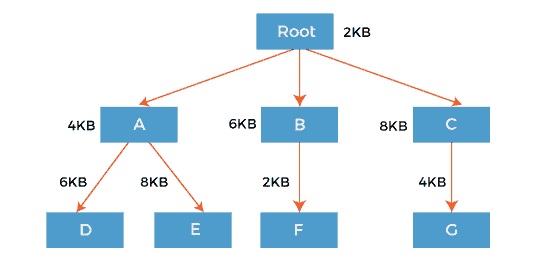
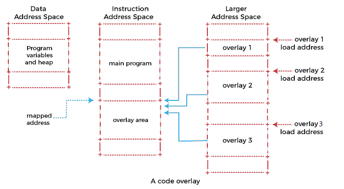

# 内存管理中的覆盖

> 原文：<https://www.javatpoint.com/overlays-in-memory-management>

计算机早期对程序员的主要限制之一是计算机内存的大小。如果程序大于可用内存，则无法加载，严重限制了程序大小。固定分区的主要问题是进程的大小必须受到分区最大大小的限制，这意味着一个进程永远不能跨越另一个进程。

显而易见的解决方案是增加可用的内存量，但这将显著增加计算机系统的成本。为了解决这个问题，早期的人们使用了一些称为 ***叠加*** 的解决方案。

***叠加*** 的概念是，每当进程运行时，它不会同时使用整个程序。它将只使用它的一部分。然后叠加概念说，无论你需要什么零件，你都要加载它，一旦零件完成，你就卸载它，这意味着把它拉回来，得到你需要的新零件并运行它。

形式上，“将程序代码或其他数据的一个块*转移到内存中，替换已经存储的内容的过程”。*

 *有时，与最大分区的大小相比，程序的大小会更大。那么，在这种情况下，你应该去覆盖。


所以覆盖是一种技术，通过只保留那些在任何给定时间需要的指令和数据来运行一个比物理内存大的程序。将程序分成模块，这样就不需要所有模块同时在内存中。在内存管理中，覆盖在以下步骤中工作，例如:

1.  程序员把程序分成许多逻辑部分。
2.  程序的一小部分必须一直保留在内存中，但剩下的部分(或覆盖)只有在需要的时候才会被加载。
3.  覆盖的使用允许程序员编写比物理内存大得多的程序，尽管内存的使用取决于程序员而不是操作系统。

### 覆盖示例

叠加最好的例子是汇编程序。假设汇编程序有两次通过，两次通过意味着在任何时候它只做一件事，要么是第一次通过，要么是第二次通过。这意味着它将首先完成第一遍，然后完成第二遍。让我们假设可用的主内存大小为 150 千字节，总代码大小为 200 千字节。

```

Pass 1.......................70KB
Pass 2.......................80KB
Symbol table............30KB
Common routine......20KB

```

由于总代码大小为 200KB，主内存大小为 150KB，所以不可能一起使用 2 遍。所以，在这种情况下，我们应该使用叠加技术。

*   根据叠加概念，将只使用一个通道，两个通道总是需要一个符号表和通用例程。
*   如果覆盖驱动程序是 10KB，那么最小分区大小是多少？
*   对于第一遍，所需的总内存为= (70KB + 30KB + 20KB + 10KB) = 130KB。
*   对于通道 2，所需的总内存为= (80KB + 30KB + 20KB + 10KB) = 140KB。
*   因此，如果我们有一个最小 140KB 大小的分区，我们可以非常容易地运行这段代码。

**叠加驱动:**用户的责任是负责叠加。操作系统不会提供任何东西。这意味着用户甚至应该写第一遍需要什么部分，一旦第一遍结束，用户应该写代码拉出第一遍并加载第二遍。用户在这个过程中的责任被称为 ***叠加司机*** 。覆盖驱动将帮助我们移出和移入代码的各个部分。

### 覆盖的使用

构建覆盖程序包括手动将程序划分为独立的目标代码块，称为 ***覆盖*** ，以树形结构布局。 ***【同胞】*** 段，这些处于相同深度级别的段共享相同的内存，称为 ***覆盖*** 或 ***目的区域*** s .覆盖管理器，或者是操作系统的一部分，或者是覆盖程序的一部分，在需要时将所需的覆盖从外部内存加载到其目的区域。链接器通常为覆盖提供支持。

例如，程序的覆盖树如下所示:



使用覆盖概念，我们不需要将整个程序放在主内存中。只是我们需要在那个时候有需要的部分。要么我们需要根-A-D，要么根-A-E，要么根-B-F，要么根-C-G 部分。

根+A+D = 2KB + 4KB + 6KB = 12KB

根+A+E = 2KB + 4KB + 8KB = 14KB

Root+B+F = 2KB + 6KB + 2KB = 10KB

Root+C+G = 2KB + 8KB + 4KB = 14KB

因此，如果我们有一个 14KB 大小的分区，那么我们可以运行其中的任何一个。

### 叠加是如何工作的

假设您有一台计算机，它的指令地址空间只有 64 千字节长，但内存却比其他计算机多得多，例如特殊指令、段寄存器或内存管理硬件。假设你想采用一个大于 64kb 的程序在这个系统上运行。

一种解决方案是识别程序中相对独立的模块(覆盖)，它们不需要直接相互调用。将覆盖图从主程序中分离出来，并将它们的机器代码放在更大的内存中。把你的主程序放在指令存储器中，但至少要留足够的空间来容纳最大的覆盖。

要调用位于覆盖中的函数，您必须首先将该覆盖的机器代码从大内存复制到指令内存中为其留出的空间中，然后跳转到那里的入口点。



上图显示了一个具有独立数据和指令地址空间的系统。程序将其代码从较大的地址空间复制到指令地址空间，以映射覆盖。由于此处显示的覆盖都使用相同的映射地址，因此一次只能映射一个。

加载到指令存储器中并准备使用的覆盖图称为 ***映射的*** 覆盖图。其 ***映射地址*** 是其在指令存储器中的地址。指令内存中不存在(或仅部分存在)的覆盖称为*未映射，其 ***加载地址*** 为其在较大内存中的地址。映射地址也称为 ***虚拟内存地址*** (VMA)，加载地址也称为 ***加载内存地址*** (LMA *)* 。*

 *不幸的是，覆盖并不是使程序适应有限指令存储器的完全透明的方式。它们引入了一组新的全局约束:

*   在调用或返回覆盖图中的函数之前，您的程序必须确保覆盖图已实际映射。否则，调用或返回会将控制权转移到正确的地址，但在错误的覆盖中，您的程序可能会崩溃。
*   如果映射覆盖图的过程在您的系统上很昂贵，您需要仔细选择您的覆盖图，以最大限度地减少它们对程序性能的影响。
*   加载到系统上的可执行文件必须包含每个覆盖层的指令，出现在覆盖层的加载地址，而不是其映射地址。然而，每个覆盖层的指令必须被重新定位，并且其符号被定义为好像覆盖层位于其映射的地址。您可以使用 GNU 链接器脚本为您的程序片段指定不同的加载和重定位地址。
*   将可执行文件加载到系统中的过程必须将它们的内容加载到更大的地址空间以及指令和数据空间中。

### 覆盖的优点

内存管理中的覆盖具有以下优势，例如:

*   降低内存需求。
*   减少时间要求。

### 覆盖层的缺点

覆盖也有一些缺点，例如:

*   程序员必须指定重叠图。
*   程序员必须知道内存需求。
*   重叠的模块必须完全分离。
*   覆盖结构的编程设计是复杂的，并非在所有情况下都是可能的。

* * ***