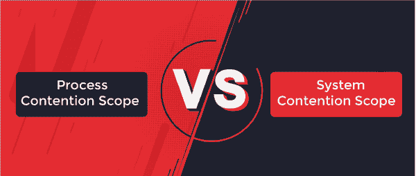

# 进程争用范围和系统争用范围的区别

> 原文：<https://www.javatpoint.com/process-contention-scope-vs-system-contention-scope>

在本文中，您将了解**进程争用范围(PCS)和系统争用范围(SCS)之间的区别。**但是在讨论差异之前，您必须了解进程争用范围和系统争用范围。

## 什么是进程争用范围？

在操作系统中，内核线程由操作系统调度，并由线程库控制，以便用户级线程运行可用的轻量级进程。进程争用范围(PCS)按优先级执行，这意味着调度程序选择或检查优先级最高的线程先运行。

程序员指定用户级线程优先级，并且不被线程库修改。还有各种线程库允许程序员调整线程的优先级。

## 什么是系统争用范围？

它是操作系统中可用的两种线程调度方案之一。内核使用这种策略来确定应该将哪个内核级线程调度到 CPU 中。它使用系统争用范围，这意味着系统中的所有线程都在争夺 CPU。这通常被称为系统争用的范围。

在使用一对一方法的系统(如 Windows、Solaris 和 Linux)中，仅使用系统争用范围来调度线程。

## 进程争用范围和系统争用范围的主要区别

在这里，您将了解进程争用范围和系统争用范围之间的主要区别。进程争用范围和系统争用范围之间的各种差异如下:

1.  进程争用范围通常称为未绑定线程上的本地调度。另一方面，系统争用范围通常被称为绑定线程上的全局调度。
2.  在进程争用范围的上下文中，在等同于进程的线程之间存在对 CPU 使用的竞争。另一方面，在系统争用范围的上下文中，操作系统中的所有线程之间都会发生对 CPU 使用的竞争。
3.  在进程争用范围的上下文中，线程库完全控制在轻量级进程上调度哪个用户级线程。另一方面，在系统争用的情况下，操作系统提供内核级线程，其中内核决定哪些线程应该被调度到 CPU 中。
4.  多对多和多对一模型用于进程争用范围。另一方面，系统争用范围使用一对一模型。
5.  进程争用范围或本地争用范围指的是与进程内其他用户线程共享一个内核线程的用户级线程。另一方面，系统争用范围也称为全局争用范围，是一个用户线程直接映射到一个内核线程。
6.  进程争用范围比系统争用范围便宜。另一方面，由于高处理成本，系统争用范围是高度可预测的。
7.  线程在进程争用范围内共享一个或多个可访问的轻量级进程。另一方面，系统争用范围线程共享独立的轻量级进程。
8.  进程争用范围用于 Windows、Solaris 和 Linux 线程。另一方面，系统竞争范围用于 Linux 线程。

## 进程争用范围和系统争用范围之间的直接比较

在这里，您将了解进程争用范围和系统争用范围之间的直接比较。进程争用范围和系统争用范围之间的各种面对面比较如下:

| 流程连接范围 | 系统争用范围 |
| 它通常被称为本地调度。 | 它通常被称为全局调度。 |
| 它使用多对多和多对一模型。 | 它只使用了一对一的模式。 |
| 它比系统争用范围更便宜。 | 由于加工成本高，它是高度可预测的。 |
| 它用于 Windows、Solaris 和 Linux 线程中。 | 它在 Linux 线程中使用。 |
| 线程在进程争用范围内共享一个或多个可访问的轻量级进程。 | 它的线程共享独立的轻量级进程。 |
| 线程库完全控制在轻量级进程上调度哪个用户级线程。 | 操作系统提供内核级线程，其中内核决定哪些线程应该调度到中央处理器中。 |
| 在等同于进程的线程之间存在 CPU 使用的竞争。 | 操作系统中的所有线程都在争夺 CPU 的使用。 |
| 它指的是与进程中的其他用户线程共享一个内核线程的用户级线程。 | 它是直接映射到一个内核线程的用户线程。 |
| 它使用 N : 1 线程模型关系。 | 它使用与内核线程的 1 : 1 线程模型关系。 |

## 结论

进程竞争范围(PCS)和系统竞争范围(SCS)都是线程调度。进程争用范围执行多对一和多对多线程。另一方面，系统争用范围只执行一对一的线程。

* * *