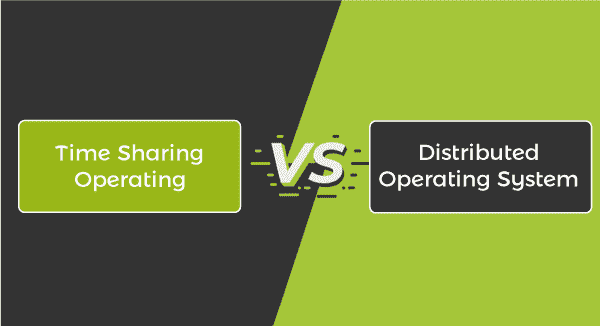

# 分时操作系统和分布式操作系统的区别

> 原文：<https://www.javatpoint.com/time-sharing-vs-distributed-operating-system>

在本文中，您将了解到**分时**和**分布式操作系统**的区别。但是在讨论差异之前，您必须了解分时和分布式操作系统及其优缺点。

## 什么是分时操作系统？

分时操作系统使众多用户能够同时共享计算机。每个操作或命令都会减小共享系统的大小，只为每个用户使用少量的 CPU 时间。由于系统经常从一个用户切换到另一个用户，每个用户都有这样的印象，即整个系统都专用于他们的使用，尽管许多用户共享该系统。

分时操作系统使用中央处理器调度和多程序设计，同时给每个用户一小部分共享机器。在内存中，每个用户至少有一个不同的程序。当一个程序被加载到内存中并执行时，它会运行一小段时间，在输入/输出完成之前或之后。通常在 **10** 到 **100 毫秒**的范围内。用户得到中央处理器关注的这一小段时间被称为时间片、时隙和时间段。它比多道程序操作系统更复杂。在这两种情况下，多个作业必须同时保存在内存中。因此，系统必须具有内存管理和安全性。这些作业可能必须从主内存中换入和换出磁盘，以确保良好的响应时间，现在它充当主内存的备份存储。实现这一点的常见方法是虚拟内存，这是一种允许您执行可能不完全在内存中的任务的机制。

### 分时操作系统的优缺点

分时操作系统有各种各样的优点和缺点。这些措施如下:

**优势**

1.  它有助于减少中央处理器空闲时间。
2.  它提供快速响应。
3.  它减少了文书工作。
4.  它避免了软件的重复。
5.  许多应用程序可能会同时执行。
6.  每项任务都有平等的机会。

**缺点**

1.  数据通信发生在分时操作系统中。
2.  它在数据通信方面有问题。
3.  它有一个可靠性的问题。
4.  它的安全性、数据完整性和用户程序较少。

## 什么是分布式操作系统？

分布式操作系统是一个概念，其中分布式应用程序通过通信在几个链接的系统上运行。分布式操作系统是一种网络操作系统修改，它支持网络计算机之间更多的通信和集成。

它使用单个通信通道来连接几台机器。此外，这些系统中的每一个都配备有处理器和存储器。这些中央处理器也可以通过高速总线或电话线进行通信。通过单一信道通信的各个系统被认为是独立的实体。它们也被称为松耦合系统。

它由通过局域网/广域网线路连接在一起的几台计算机、节点和站点组成。它支持将整个系统分布在几个中央处理器上，并支持多种实时产品和用户。分布式操作系统可以共享计算机资源和输入/输出文件，同时也为用户提供虚拟机抽象。

### 分布式操作系统的优缺点

分布式操作系统有各种各样的优缺点。这些措施如下:

**优势**

1.  它有助于减少数据处理时间。
2.  它提供了比单一系统更好的性能。
3.  用户可以非常容易地添加多个资源。
4.  这是一个开放系统，因为它可以在本地和远程访问。
5.  它可以从一个站点到另一个站点共享所有资源，包括网络接口、CPU、计算机和磁盘节点，从而提高整个系统的数据可用性。
6.  它提供了更好的便携性。
7.  大多数分布式操作系统由多个节点组成，这些节点相互作用以使它们具有容错能力。即使单台机器出现故障，系统也能继续运行。

**缺点**

1.  由于共享，它存在安全问题。
2.  存在过载问题。
3.  它的维护非常昂贵，因为它分布在不同的服务器上。
4.  它可能只支持几个软件。
5.  由于网络庞大，一些数据包可能会损坏。
6.  如果主处理器出现故障，整个网络将停止运行。

## 分时操作系统和分布式操作系统的主要区别

分时操作系统和分布式操作系统之间有各种主要区别。分时操作系统和分布式操作系统之间的一些主要区别如下:

1.  分时操作系统使众多用户能够同时共享计算机。另一方面，分布式操作系统是一个概念，其中分布式应用程序运行在通过通信链接在一起的几个系统上。
2.  分时操作系统中多个用户共享计算机资源。相比之下，分布式操作系统通过单个通信通道连接多台计算机。
3.  分时操作系统取决于不同进程之间的时间切换。相比之下，分布式操作系统依赖设备在输入/输出中断等任务之间切换。
4.  分时操作系统同时执行多个应用程序。另一方面，分布式操作系统允许许多应用程序在通过通信链接在一起的几个系统上执行。
5.  分时操作系统的例子有 **Windows、Linux、Unix、Multics、**另一方面，分布式操作系统的例子有 **Solaris、AIX、OSF 等**。
6.  分时操作系统有助于减少中央处理器的空闲时间。另一方面，分布式操作系统有助于减少数据处理时间。
7.  在分时操作系统中，多个用户可以在他们的终端中使用一个中央处理器。另一方面，多个用户可以使用通过分布式操作系统中的通信链接在一起的多个 CPU。

## 分时操作系统和分布式操作系统的直接比较

分时操作系统和分布式操作系统之间有各种面对面的比较。分时操作系统和分布式操作系统的一些主要面对面比较如下:

| 分时操作系统 | 分布式操作系统 |
| 它允许许多用户同时共享计算机。 | 它处理一组独立的、可通信的和联网的系统，并使它们看起来像一个普通的集中式操作系统。 |
| 它的可移植性不如分布式操作系统。 | 它比分时操作系统有更好的可移植性。 |
| 这取决于不同进程之间的时间切换。 | 它依赖于设备在输入/输出中断等任务之间切换。 |
| 它同时执行多个应用程序。 | 它允许许多应用程序通过通信在几个系统上执行。 |
| 它有助于减少中央处理器空闲时间。 | 它有助于减少数据处理时间。 |
| 在分时操作系统中，多个用户可以在他们的终端中使用一个中央处理器。 | 在分布式操作系统中，多个用户可以使用通过通信链接在一起的多个 CPU。 |
| 分时操作系统的例子有 Windows、Linux、Unix、Multics 等。 | 分布式操作系统的例子有 Solaris、AIX、OSF 等。 |

* * *